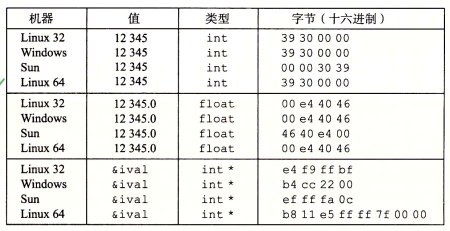

___when coding, i find to understand basic computer knowledge vaguelly, so i read this book, 深入理解计算机系统. now i make a note about what i learned.___


<p align="center"> Catalog </p>


<p align="center"> Content </p> </br>   

## 第一章 计算机系统漫游   
1. 计算机系统是由硬件和系统软件组成    
2. 源程序实际上就是一个由值0和1组成的位（又称为比特）序列，8个为被组织成一组，成为字节。每个字节表示程序中的某些文本字符。   
3. 编译系统如下图所示：     
   
4. 解释上面一条    
```C源代码
#include <stdio.h>
int main()
{
    print("hello, world\n");
    return 0;
}
```

- __预处理阶段__。预处理器根据以字符#开头的命令，修改原始的C程序。比如hello.c中的第一行的#include<stdio.h>tdio.h的内容，并把它直接插入程序文本中。结果就得到了另一个C程序，通常以.i作为文件扩展名。   
- __编译阶段__。编译器(ccl)将文本文件hello.i翻译成文本文件hello.s，它包括一个 __汇编程序__。改程序包括函数main的定义，如下图所示：    
```汇编程序
main:
    subq $8, %rsp
    movl $.LC0, %edi
    call puts
    movl $0, %eax
    addq $8, %rsp
    ret
```
- __汇编阶段__。接下来，汇编器(as)将hello.s翻译成机器语言指令，把这些指令打包成一种叫做__可重定位目标程序__的格式，并将结果保存在目标文件hello.o中。hello.o文件是一个二进制文件，它包括17个字节是函数main的指令编码。如果我们在文本编辑器中打开hello.o文件，将看到一堆乱码。     
- __链接阶段__。hello程序调用了printf函数，它是每个C编辑器都提供的标准C库中的一个函数。printf函数存在于一个名为printf.o的单独的预编译好了的目标文件中，而这个文件必须以某种方式合并到我们的hello.o程序中。连接器(ld)就负责处理这种合并。结果就得到hello文件，它是一个可执行目标文件，可以被夹在到内存中，有系统执行。    
5. 系统的硬件组成   
下面的解释是Intel系统产品族的模型：     
- __总线__ 
贯穿整个系统的是一组电子管道，称为总线，它携带信息字节并负责在各个部件间传递。通常总线被设计成传送订场的字节块，也就是字(word)。字中的字节数(即字长)是一个基本的系统参数，各个系统都不相同。    
- __I/O设备__ I/O设备是系统与外部世界的联系通道。书中的示例系统包括四个I/O设备：作为用户输入的键盘和鼠标，作为用户输出的显示器，以及用于长期存储数据和程序的磁盘驱动器(简言之就是磁盘)。最开始，可执行程序hello存放在磁盘上。 每个I/O设备都通过一个控制器或者适配器与I/O总线相连接。控制器和适配器之间的区别在于他们的封装方式。控制器是I/O设备本身或者系统的主板上面的芯片组。而适配器则是一块插在主板插槽上的卡。无论何如，他们的功能都是在I/O总线和I/O设备之间传递信息。如下图：     
   
    > CPU: 中央处理单元
    > ALU: 算术/逻辑单元
    > PC: 程序计数器
    > USB: 通用串行总线


## 第二章 信息的表示和处理   
1. 大多数计算机使用8位的块，或者字节，作为最小的可寻址的内存单位，而不是访问内存中的单独的位。机器级程序将内存视为一个非常大的字节数组，成为虚拟内存。    
2. 字   
> 每台计算机都有一个字长，指明整数和指针数据的标称大小，因为虚拟地址是以这样的一个字来编码的，所以字长决定的最重要的系统参数就是虚拟地址空间的最大大小。也就是说，对于一个字长为$\omega$位的机器而言，虚拟地址的范围为$0{\sim}{2^{\omega-1}}$，程序最多访问$2^{\omega}$个字节。32位字长限制虚拟地址空间为4千兆字节(4GB)。   
3. 大多数64位机器也可以运行32位机器编译的程序，这是一种向后兼容。
```
gcc -m32 proc
```
该程序就可以在32位或64位正确运行。如果用如下程序指令编译:
```
gcc -m64 prog.c
```
那么只能在64位机器上运行。   
4. 为了避免由于依赖“典型”大小和不同编译器设置带来的奇怪行为(int类型在不同的机器上有不同的字节)，ISO C99引入了一类数据类型，其数据大小是固定的，不随编译器和机器设置而变化，其中就有数据类型int32\_t和int64\_t，他们分别是4个字节和8个字节。使用确定大小的证书类型是程序员准确控制数据表示的最佳途径。
，他们分别是4个字节和8个字节。使用确定大小的证书类型是程序员准确控制数据表示的最佳途径。，他们分别是4个字节和8个字节。使用确定大小的证书类型是程序员准确控制数据表示的最佳途径。，他们分别是4个字节和8个字节。使用确定大小的证书类型是程序员准确控制数据表示的最佳途径。，他们分别是4个字节和8个字节。使用确定大小的证书类型是程序员准确控制数据表示的最佳途径。，他们分别是4个字节和8个字节。使用确定大小的证书类型是程序员准确控制数据表示的最佳途径。
5. 对于跨越多字节的程序对象，我们必须建立两个规则：
> 1. 这个对象的地址是什么
> 2. 在内存中如何排列这些字节
在所有的机器上，多字节对象都被存储为连续的字节序列，对象的地址为所使用字节的最小地址。例如，假设一个类型为int的变量x的地址为0x100，也就是说地址表达式&x的值是0x100。那么(假设数据类型int为32位表示)x的4字节将被存储在内存的0x100、0x101、0x102和0x103的位置。   
6. 考虑一个$\omega$,其位表示为$[x\_{\omega-1}, x\_{\omega-2}, \cdots, x\_1, x\_0]$, 其中$x\_{\omega-1}$是最高有效位，而x\_0是最低有效位。最低有效字节在最前面的方式成为小端法；最高有效字节在最前面的方式成为大端法。   
假设变量x的类型为int，位于地址0x100处，它的十六进制为0x01234567，地址范围0x100~0x103的字节顺序依赖于机器的类型：  

7. 不同数据值得字节表示。出了字节顺序以外，int和float的结果都是一样的。但是指针值与机器相关。
<div align=center>
    
</div>
2. C语言中数字数据类型的字节数   
\begin{array}{|c|c|c|}
\hline
\text{C声明}            & \text{32位机器} & \text{64位机器} \\\\
\hline
\text{char}             & 1               & 2               \\\\
\hline
\text{short int}        & 2               & 2               \\\\
\hline
\text{int}              & 4               & 4               \\\\ 
\hline
\text{long int}         & 4               & 4               \\\\
\hline
\text{long long int}    & 8               & 8               \\\\
\hline
\text{char$^{\ast}$}    & 4               & 8               \\\\
\hline
\text{float}            & 4               & 4               \\\\
\hline
\text{double}           & 8               & 8               \\\\
\hline
\end{array}

3. swap函数
> 对于任一个维向量$\vec{a}$, 有$\vec{a} \cdot \vec{a}=0$。应用这一属性，使用这一性质完成swap函数。
```
void InplaceSwap(int *x, int *y)
{
    *y = *x ^ *y;
    *x = *x ^ *y;
    *y = *x ^ *y;
}
```
4. 逻辑运算和位级运算的区别   
> 逻辑运算符&&和||与他们对应的位级运算&和|之间第二个重要的区别是，如果对第一个参数求职就能确定表达式的结果，那么逻辑运算符就不会对第二个参数求值。  
5. 计算机支持两种形式的右移：逻辑右移和算术右移。
> 逻辑右移在左端补k个0，得到的结果是$[0, \cdots, 0, x\_{n-1}, x\_{n-1}, \cdots, x\_{k}]$。算术右移是在左端补k个最高有效位的值，得到的结果是$[x\_{n-1}, \cdots, x\_{n-1}, x\_{n-1}, x\_{n-2}, \cdots, x\_{k}]$。   
\begin{array}{|c|c|}
\hline
\text{操作}             & \text{值} \\\\
\hline
\text{参数x}            & \text{[00110000] [01010000]} \\\\
\hline
\text{x >> 4(逻辑右移)} & [\color{#A00}{0000}0110] [\color{#A00}{0000}1001] \\\\
\hline
\text{x >> 4(算术右移)} & [\color{#A00}{0000}0110] [\color{#A00}{1111}1001] \\\\
\hline
\end{array}   
6. 移位运算，移动k位，这里k很大
```
int lval = 0xFEDCBA98 << 32;
int aval = 0xFEDCBA98 << 36;
unsigned uval = 0xFEDCBA98u >> 40;
```
在许多机器上，当移动一个$\omega$位的值时，移位指令只考虑位移量的低$\log\_{2}{\omega}$位，因此实际上位移量就是通过计算k mod $\omega$得到的。在一台采用这个规则的32位机器上，上面三个移位运算分别是移动0、4、8位，得到的结果是：
```
lval 0xFEDCBA98
aval 0xFFEDCBA9
uval 0x00FEDCBA
```
不过这种行为对于C程序来说是没有保证的，所以移位数量应该保持小于字长。   
7. 无符号数的编码   
> 对于$\vec{x}=[x\_{\omega-1}, x\_{\omega-2}, \cdots, x\_{0}]$，$\vec{x}$的无符号表示为：
\begin{equation}
B2U\_{\omega}{\vec{x}}=\sum\_{i=0}^{\omega-1}{x\_{i}2^{i}}
\label{eq:B2U}
\end{equation}   
举个例子：  
$$
\begin{split}
B2U\_{4}([0001]) = 0\cdot2^{3}+0\cdot2^{2}+ \\\\
& 0\cdot2^{1}+1\cdot2^{0} = 0+0+0+1 = 1   \\\\
B2U\_{4}([0101]) = 0\cdot2^{3}+1\cdot2^{2}+ \\\\
& 0\cdot2^{1}+1\cdot2^{0} = 0+4+0+1 = 5   \\\\
B2U\_{4}([0101]) = 0\cdot2^{3}+1\cdot2^{2}+ \\\\
& 0\cdot2^{1}+1\cdot2^{0} = 0+4+0+1 = 5    \\\\
B2U\_{4}([0101]) = 0\cdot2^{3}+1\cdot2^{2}+ \\\\
& 0\cdot2^{1}+1\cdot2^{0} = 0+4+0+1 = 5
\end{split}\tag{2}\label{eg:2}
$$
8. 计算机负数表示
> 计算机最常见的有符号数的计算机表示方式就是补码，在这个定义中，将字的最高有效位解释为负权，用$B2T\_{\omega}$表示：
$$
B2T\_{\omega}=-x\_{\omega-1}2^{\omega-1}+\sum\_{i=0}^{\omega-2} {x\_{i}2^{i}} \tag{3}\label{eg:3}
$$
最高有效位$x\_{\omega-1}$也称为符号位，它的权重为$-2^{\omega-1}$，符号位被设置为1时，表示值为负，而当设置为0时，值为非负。举个例子：
$$
\begin{split}
B2T\_{4}([0001]) = -0\cdot2^{3}+0\cdot2^{2}+0\cdot2^{1}+1\cdot2^{0} = 0+0+0+1 = 1 \\\\
B2T\_{4}([0101]) = -0\cdot2^{3}+1\cdot2^{2}+0\cdot2^{1}+1\cdot2^{0} = 0+4+0+1 = 5 \\\\
B2T\_{4}([1011]) = -1\cdot2^{3}+0\cdot2^{2}+1\cdot2^{1}+1\cdot2^{0} = 0+0+0+1 = -5 \\\\
B2T\_{4}([1111]) = -1\cdot2^{3}+1\cdot2^{2}+1\cdot2^{1}+1\cdot2^{0} = 0+0+0+1 = -1
\end{split}\tag{4}\label{eg:4}
$$
在公式\eqref{eg:4}中。让我们考虑一下$\omega$补码所能表示的值的范围。它能表示的最小值是位向量$[10\ldots0]$，最小值为$TMin\_{m}=-2^{\omega-1}$，而最大值是位向量$[01\ldots1]$(清楚具有负权的位，而设置其他的所有位),其整数值为$TMax\_{\omega}=sum\_{\omega-2}^{i=0} {2^{\omega-1}-1}$。以长度4为例子：
$$
\begin{split}
& TMin\_{4} = B2T\_{4}([1000])=-2^{3}=-8 \\\\
& TMax\_{4}=B2T\_{4}([0111])= 2^{2}+2^{1}+2^{0}=4+2+1=7
\end{split}\tag{5}\label{eg:5}
$$
9. 有符号和无符号数之间的转换
> 举个例子：
```
short int v = =-12345;
unsigned short uv = (unsigned short)v;
print("v=%d, uv=%u\n", v, uv);
```
在一台采用补码的机器上，上述代码会产生如下输出：</br>
v=-12345, uv=53191</br>
我们看到，强制类型转换的结果保持位值不变，只是改变了解释这些位的方式。比如-12345的16位补码表示与53191的16位无符号表示是完全一样的。讲short int强制类型转换位unsigned short 改变数值，但是不改变位表示。</br>
类似的：
```
unsigned u = 4294957295u;
int tu = (int)u;
printf("u=%u, ti=%d\n", u, tu);
```
在一台采用补码的机器上，上述代码会产生如下输出：</br>
u=4294967295, tu=-1</br>

10. 有符号数字x和与之对应的无符号数$T2U\_{\omega}(x)$之间的关系  
我们计算$B2U\_{\omega}(\vec{x})-B2T\_{\omega}(\vec{x})$之差，从0到$\omega-2$的位的加权和讲相互抵消掉，剩下一个值：$B2U\_{\omega}(\vec{x})-B2T\_{\omega}(\vec{x})=x\_{\omega-1}(2^{\omega-1}-(-2^{\omega-1}))=x\_{\omega-1}2^{\omega}$。这就得到一个关系：$B2U\_{\omega}(\vec{x})=x\_{\omega-1}2^{\omega}+B2T\_{\omega}(\vec{x})$。如果令$\vec{x}=T2B\_{\omega}{x}$，我们就得到以下的公式：   
$$
B2U\_{\omega}(T2B\_{\omega}(x))=T2U\_{\omega}(x)=x\_{\omega-1}2^{\omega}+x \tag{6}\label{eg:6}
$$
这个关系对于证明无符号和补码运算之间的关系是很有用的。在x的补码表示中，位$x\_{\omega-1}$决定了x是否为负，得到：   
$$
T2U\_{\omega}(x) = 
\begin{cases}
& x+2^{\omega}, & \text{x$\lt$0} \\\\
& x, & \text{x$\ge$0}
\tag{7}\label{eg:7}
\end{cases}
$$
在公式\eqref{eg:7}中。  
11. 扩展一个数字的位表示   
讲一个无符号数转换为一个更大的数据类型，我们需要简单的在表示的开头添加0， 这种运算称为零扩展。讲一个补码数字转换为一个更大的数据类型可以执行符号扩展，规则是在表示中添加最高有效位的值得副本。如果我们原始值得位表示为$[x\_{\omega-1},x\_{\omega-2},\ldots,x\_{0}]$。那么扩展后$[x\_{\omega-1},\ldots,x\_{\omega-1}, x\_{\omega-2}, \ldots, x\_{0}]$。   
要证明该式：   
$$
B2T\_{\omega+\kappa}([\underbrace{x\_{\omega-1},\ldots,x\_{\omega-1}}\_{k次},x\_{\omega-1}, x\_{\omega-2}, \ldots, x\_{0}])=B2T\_{\omega}([x\_{\omega-1},x\_{\omega-2},\ldots,x\_{0}])
\tag{8}\label{eg:8}
$$
证明：   
$$
\begin{split}
B2T\_{\omega+\kappa}([x\_{\omega-1},x\_{\omega-1}, x\_{\omega-2}, \ldots, x\_{0}])=B2T\_{\omega}([x\_{\omega-1},x\_{\omega-2},\ldots,x\_{0}])
\end{split}\tag{9}\label{eg:9}
$$
用等式\eqref{eg:3}展开左边的表达式，得到：   
$$
\begin{split}
B2T\_{\omega+1}([x\_{\omega-1},x\_{\omega-1}, x\_{\omega-2}, \ldots, x\_{0}])= \\\\
& =-x\_{\omega-1}2^{\omega}+\sum\_{i=0}^{\omega-1} {x\_{i}2^{i}} \\\\
& =-x\_{\omega-1}2^{\omega}+x\_{\omega-1}2^{\omega-1}+\sum\_{i=0}^{\omega-2} {x\_{i}2^{i}} \\\\
& =-x\_{\omega-1}(2^{\omega}-2^{\omega-1})+\sum\_{i=0}^{\omega-2} {x\_{i}2^{i}} \\\\
& =-x\_{\omega-1}2^{\omega-1}+\sum\_{i=0}^{\omega-2} {x\_{i}2^{i}} \\\\
& =B2T\_{\omega}([x\_{\omega-1}, x\_{\omega-2}, \ldots, x\_{0}])
\end{split}\tag{10}\label{eg:10}
$$
12. 截断数字   
例子：   
```
int x=53191;
short sx=(short)x;//x=-12345
int y=sx;//x=-12345
```
在一台典型的32位机器上，当把x强制类型转换为short，我们就将int阶段为16位的short int。就像前面看到的，这个16位模式就是-12345的补码表示。当我们把它强制类型转换为int，符号扩展把高16位设置为1。从而生成-12345的32位补码表示。   
将一个$\omega$位的数$\vec{x}=[x\_{\omega-1}, x\_{\omega-2}, \ldots, x\_{0}]$截断为一个k为数字时，我们会丢弃高$\omega-k$位，得到一个位向量$\vec{x}=[x\_{k-1}, x\_{k-2}, \ldots, x\_{0}]$。截断一个数字可能会改变它的值--溢出的一种形式。对于一个无符号数字x，截断它到k为得结果就相当于计算x mod($2^{k}$)。  
$$
\begin{split}
B2U\_{\omega}([x\_{\omega-1}, x\_{\omega-2}, \ldots, x\_{0}]) mod 2^{k} \\\\
& = [\sum\_{i=0}^{\omega-1} {x\_{i}2^{i}}] mod 2\_{i} \\\\
& = [\sum\_{i=0}^{k-1} {x\_{i}2^{i}}] mod 2\_{i} \\\\
& = \sum\_{i=0}^{k-1} {x\_{i}2^{i}} \\\\
& = B2U\_{k}([x\_{k-1}, x\_{k-2}, \ldots, x\_{0}])
\end{split}\tag{11}\label{eg:11}
$$
在这段推导中，我们利用的属性就是：对于任何i$\ge$k,$2^{i}$mod$2^{k}$=0和$\sum\_{i=0}^{k-1} {x\_{i}2^{i}}\le\sum\_{i=0}^{k-1} {2^{i}}=2^{k}-1\lt2^{k}$。x mod $2^{k}$，能够被一个位级表示为$[x\_{k-1}, \ldots, x\_{0}]$的无符号表示。不过，我们将被截断的数字视为有符号的。这将得到数值U2T\_{k}(x mod 2^{k}})。  
总而言之，无符号数的截断结果是：   
$$
\begin{split}
B2U\_{k}([x\_{k-1}, x\_{k-2}, \ldots, x\_{0}])=B2U\_{\omega}([x\_{\omega-1}, x\_{\omega-2}, \ldots, x\_{0}]) mod 2^{k}
\end{split}\tag{12}\label{eg:12}
$$
有符号数的截断结果是：   
$$
\begin{split}
B2T\_{k}([x\_{k-1}, x\_{k-2}, \ldots, x\_{0}])=U2T\_{k}(B2U\_{\omega}([x\_{\omega-1}, x\_{\omega-2}, \ldots, x\_{0}]) mod 2^{k})
\end{split}\tag{13}\label{eg:13}
$$
