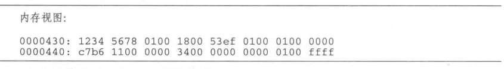
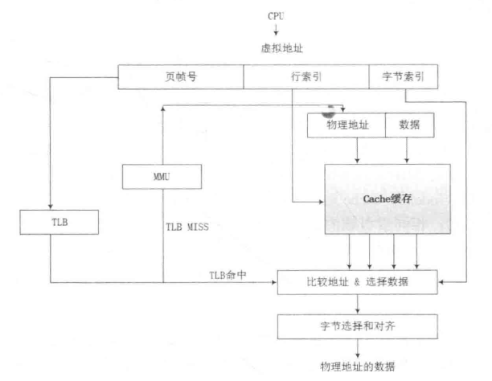
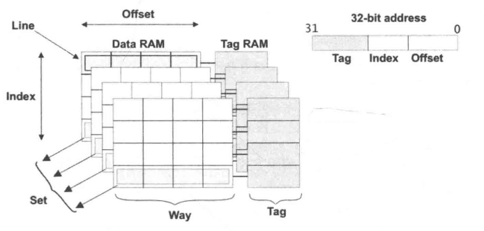
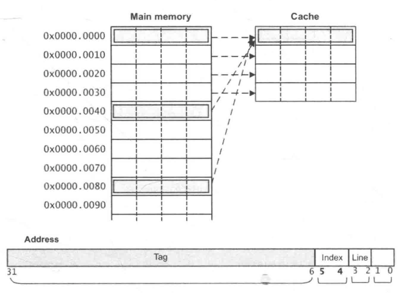
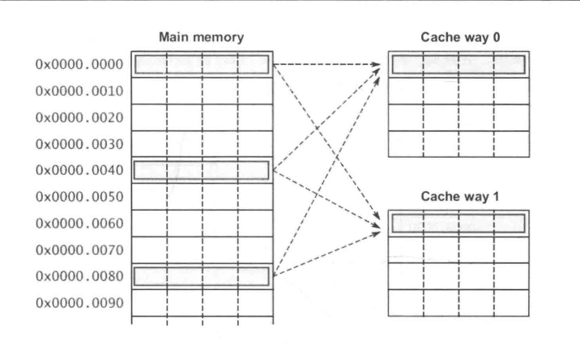
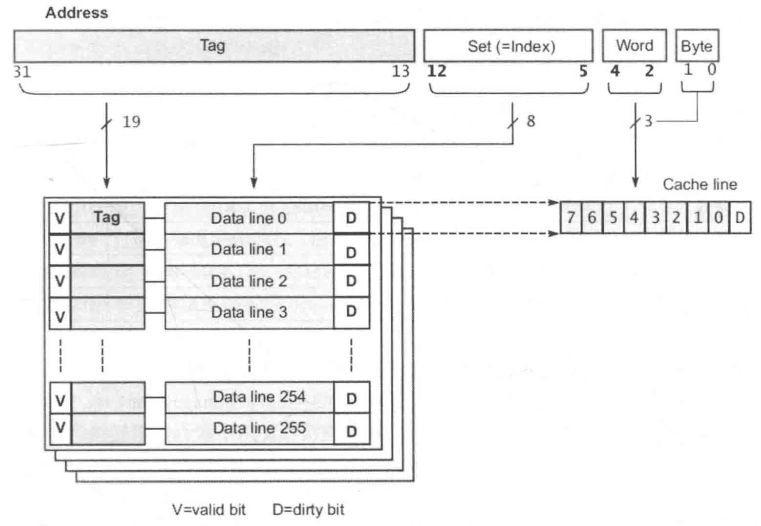
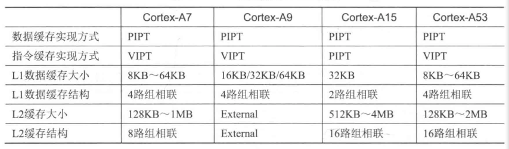
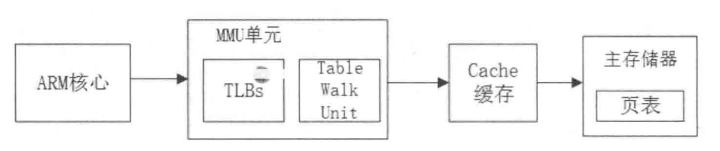

___this file is for 奔跑把linux内核总结___

##  第一章 处理器架构
1.  请简述精简指令集RISC和复杂指令集CISCO的区别。   
    20世纪70年代，IBM的John发现，处理器提供了大量指令集和复杂寻址方式并不会被编译器生成的代码用到：20%的简单指令经常被用到，占程序总指令数的80%，而指令集其余80%的复杂指令很少被用到，只占程序总指令数的20%，给予这种思想，将指令集和处理器进行重新设计，在新的设计中只保留了常用的简单指令，这样处理器不需要浪费太多晶体管去做那些复杂又很少使用的复杂指令。通常，简单指令大部分时间都能在一个cycle内完成，基于这种思想的指令集叫做RISC(Reduced Instruction Set Computer)指令集，以前的指令集叫做CISC(Complex Instruction Set Computer)指令集。   
    IBM和David、John是研究RISC研究的先驱，Power处理器来自IBM，ARM/SPARC处理器受到伯克利RISC的影响，MIPS来自斯坦福。当下还在是用的最出名的CISCO指令集是Intel/AMD的x86指令集。 
    RISC处理器通过更合理的微架构在性能上超越了当时传统的CSIC处理器，在再最初的较量中，Intel处理器败下来，服务器市场的处理器大部分被RISC阵营占据。Intel的David和他的同事一起设计了Pentium Pro处理器，x86指令集被解码成类似RISC指令的微操作指令，以后执行的过程采用RISC内核的方式。CISCO这个古老的架构通过巧妙的设计，又一次焕发生机，Intel的x86处理器的性能逐渐超过同期的RISC处理器，抢占了服务器市场，导致其他的处理器厂商只能向低功耗或者嵌入式方向发展。  
    RISC在思想上更加先进。Intel的CSIC的指令集向前兼容，打败所有的RISC厂商。不过在手机移动业务方面，以ARM为首的厂商占得先机。  
2.  请简述数值0x12345678在大小端字节序处理器的存储中的存储方式。  
    在计算机系统中是以字节为单位的，每个地址单元都对应着一个字节，一个字节为8个比特位。但是在32位处理器中，C语言中除了8比特的char类型之外，还有16比特的short类型，32位bit的int类型。另外对于位数大于8位的处理器，例如16位或者32位的处理器，由于寄存器大于一个字节，那么必然存在这如何安排多个字节的问题，因此导致了大端存储模式和小端存储模式。例如一个16比特的short型变量X，在内存中的地址为0x0010，X的值为0x1122，那么0x11位高字节，0x22位低字节。对于大端模式，就将0x11放在低地址；0x22放在高地址 中。小段模式则刚好相反。很多ARM处理器默认是用小端模式，有些ARM处理器还可以由硬件来选择是小端模式还是大端模式。Cortex-A系列的处理器可以通过软件来配置大小端模式。大小端模式是在处理器Load/Store访问内存时用于描述寄存器的字节序和内存中的字节序之间的关系。  
    大端模式：指数据的高字节保存在内存的低地址中，而数据的低字节保存在内存的高地址中。例如：  
       
    在大端模式下，前32位：12 34 56 78.  
    因此，大端模式下地址的增长顺序与值的增长顺序相同。  
    小端模式：指数据的高字节保存在内存的高地址中，而数据的低字节保存在内存的低地址中，例如：  
      
    因此，小端模式下地址的增长顺序与值的增长顺序相反。
    如何检查处理器是大端模式还是小端模式？联合体Union的存放顺序是所有成员都从低地址开始存放的，利用该特性可以轻松获取CPU对内存采用大端模式还是小端模式读写。   
    ```
    int check_cpu(void) {
      union w {
        int a;
        char b;
      } c;
      c.a = 1;

      return (c.b == 1);
    }
    ```
    如果输出结果是true，则是小端模式，否则是大端模式。    
3.  请简述在你所熟悉的处理器（比如双核Cortex-A9）中一条存储读写指令的执行全过程。   
    经典处理器架构的流水线是五级流水线：取指、译码、发射、执行、写回。  
      现代处理器在设计上都采用了超标量体系结构和乱序执行技术，极大地提高了处理器计算能力。超标量技术能够在一个时钟周期内执行多个指令，实现指令级的并行，有效提高了ILP指令级的秉性效率，同也增加了整个cache和memory层次结构的实现难度。  
    一条存储读写指令的执行全过程很难用一句话来回答，在一个支持超标量和乱序执行技术的处理器当中，一条存储读写指令的执行过程被分解为若干步骤。指令寿险进入流水线的前端，包括预取和译码，经过分发和调度后进入执行单元，最后提交执行结果。所有的指令采用顺序方式通过前段，并采用乱序的方式进行发射，然后乱序执行，最后用顺序的方式提交结果，并将最终结果更新到LSQ部件。LSQ部件是指令流水线的一个执行部件，可以理解为存储子系统的最高层，其上接收来自CPU的存储器指令，其下连接着存储器的子系统。其主要功能是将来自CPU的存储器请求发送到存储器子系统，并处理其下存储器子系统的应答数据和消息。  
    很多程序员对乱序执行的理解有误差。对于一串给定的指令序列，为了提高效率，处理器会找出非真正数据以来和地址以来的指令，让他们并行执行。但是在提交执行结果的时候，是按照指令次序的。总的来说，顺序提交指令，乱序执行，最后顺序提交结果。例如有两条没有数据以来的数据指令，后面那条指令的读数据先被返回，它的结果也不能先回写到最终寄存器，而是必须等到前一条指令完成之后才可以。  
    对于读指令，当处理器在等待数据从缓存或者内存返回时，他处于什么状态呢？是等在那不动个，还是继续执行别的命令？对于乱序执行的处理器，可以执行后面的指令；对于顺序执行的处理器，会使流水线停顿，直到读取的数据返回。  
    如图所示，在x86微处理器经典架构中，存储指令从L1指令cache中读取指令，L1指令cache会做指令加载、指令预取、指令预解码、以及分支预测、然后进入取指、译码单元，会把指令解码成macro-ops微操作指令。然后由dispatch部件分发到Integer Unit或者FloatPoint Unit。Integer Unit由Integer Scheduler和Execution Unit组成，Execution Unit包含算数逻辑单元（ALU）和地址生成单元（AGU），在ALUM计算完成之后进入AGOU，计算有效地址完毕后，将结果发送到LSQ部件中，LSQ部件寿险根据处理器系统要求的内存一致性模型确定访问时序。另外LSQ还需要处理存储器指令间的依赖关系，最后LSQ需要准备L1 cache是用的地址，包括有效地址的计算和虚实地址转换，将地址发送到L1 Data Cache中。  
        
    如图所示，在ARM Cortex-A9处理器中，存储指令首先通过主存储器或者L2 cache加载到L1指令cache中。在指令预取阶段，主要是做指令预取和分支预测，然后指令通过Instruction Queue队列被送到解码器进行指令的解码工作。解码器支持两路解码，可以同事解码两条指令。在寄存器重命名阶段会做寄存器重命名，避免及气质听不必要的顺序化操作，提高处理器的指令级秉性能力，在指令分发阶段，这里支持4路猜测发射和乱序执行，然后再执行单元中乱序执行。存储指令会计算有效地址并发射到内存系统中的LSU部件，最终LSU部件会访问L1数据cache。在ARM中，只有cacheable的内存地址才需要访问cache。   
        
    在多处理器环境下，还要考虑Cache的一致性问题。L1和L2 Cache控制器需要保证擦车的一致性，在Cortex-A9中，cache的一致性是由MESI协议来实现的。Cortex-A9处理器内置了L1 Cache模块，由SCU单元来实现Cache的一致性管理。L2 Cache需要外界芯片。在最糟糕情况下需要访问主存储器，并将数据重新传递给LSQ，完成一次存储器读写的全过程。   
    部分术语简单解释：  
    +  超标量体系结构：早起的弹发射结构微处理器的流水线设计目标是做到每个周期能平均执行一条指令，但是这一目标不能满足处理器性能增长的要求，为了提高处理器的性能，要求处理器具有每个周期能发射执行多条指令的能力。因此超标量体系结构是描述一种微处理器设计理念，它能够在一个始终周期执行多个指令。  
    +  乱序执行：指CPU采用了允许将多条指令不按照程序规定的顺序分开发送给各个相应电路单元处理的技术，避免处理器在计算对象不可获取时的等待，从而导致流水线停顿。  
    +  寄存器重命名：现代处理器的一种技术，用来避免机器指令或者微操作的不必要的顺序化执行，从而提高处理器的指令级并行的能力。它在乱序执行的流水线中有两个作用，一是消除指令之间的寄存器读后写相关和写后写相关。二是当指令执行发生例外或者转移指令猜测错误而取消后面的指令时，可用来保证现场的精确。其思路时当一条指令写一个结果寄存器时不直接写到这个结果寄存器，二是先写到一个中间寄存器过渡，当这条指令提交时再写到结果寄存器中。  
    +  分支预测：当处理一个分支指令时，有可能会产生跳转，从而打断流水线执行的处理，因为处理器无法确定该指令的下一条指令，知道分支指令执行完毕。流水线越长，处理器等待时间便越长，分支预测技术就是为了解决这一问题而出现的。因此分支预测时处理器在程序分支执行前预测其结果的一种机制。在ARM中，是用全局分支预测器，该预测器由转移目标缓冲器、全局历史缓冲器、MicroBTB，以及Return Stack组成。  
    +  指令译码器：指令由操作码和地址码组成。操作码表示要执行的操作性质，即执行什么操作；地址码时操作码执行时的操作对象的地址。计算机执行一条指定的指令时，必须首先分析这条指令的操作码是什么，以决定操作的性质和方法，然后才能控制计算机其他各个部件协同完成指令表达的功能，这个分析工作由译码器来完成。例如Cortex-A57可以支持3路译码器，即同事执行3跳指令译码，而Cortex-A9处理器只能同时执行2跳指令。  
    +  调度单元：调度器负责把指令或者微操作指令派发到相应的执行单元去执行，例如，Cortex-A9处理器的调度器单元由4个接口和执行单元链接，因此每个周期可以同时派发4条指令。  
    +  ALU算数逻辑单元：ALUM是处理器的执行单元，主要是进行算数运算，逻辑运算和关系运算的部件。  
    +  LSQ/LSU部件：LSQ部件是指令流水线的一个执行部件，其主要功能是将来自CPU的存储器子系统的应答数据和消息。    
4.  请简述内存屏障产生的原因。  
    程序在运行时的实际内存访问顺序和程序代码飙血的访问顺序不一致，会导致内存乱序访问。内存乱序访问的出现是为了提高程序运行时的性能。内存乱序访问主要发生在如下两个阶段：  
    +  编译时，编译器优化导致内存乱序访问。   
    +  运行时，多CPU间交互引起的内存乱序访问。  
    编译器会把符合人了isi考的逻辑代码（例如C语言）翻译成CPU运算规则的汇编指令，编译器了解底层CPU的思维逻辑，因此他会在翻译成汇编时进行优化。例如内存访问指令的重新排序，提高指令级秉性效率。然而，这些优化可能会违背程序员原始的代码逻辑导致发生一些错误。编译时的乱序访问可以通过volatile关键字来规避。  
    ```
    #define barrier() __asm__ __volatile__("" ::: "memory")
    ```
    `barrier()`函数告诉编译器，不要为了性能优化而将这些代码重新排序。   
    由于现代处理器普遍采用超标量技术、乱序发射以及乱序执行等技术来提高指令级并行的效率，因此指令的执行序列在处理器的流水线中有可能被打乱，与程序代码编写时序列的不一致。另外现代处理器采用多级存储结构，如何保证处理器对存储子系统访问的正确性也是一大挑战。  
    例如，在一个系统中有n个处理器$P_{1}$~$P_{n}$，假设每个处理器包含$S_{i}$个存储操作，那么从全局来看可能的存储器访问序列有多重组合。为了保证内存访问的一致性，需要按照某种规则来选出合适的组合。为了保证这个规则叫做内存一致性模型。这个规则需要保证正确性的前提，同时也要保证多处理器访问较高的并行度。  
    在一个单核处理器系统中，访问内存的正确性比较简单。每次存储器度操作所获得的结果时最近写入的结果，但是在多处理器并发访问存储器的情况下就很难保证正确性了。我们很容易想到是用一个全局时间比例部件来决定存储器访问时序，从而判断最近访问的数据，这种内存一致性访问模型是严格一致性内存模型，也称为Atomic Consistency。全局时间比例方法实现的代价比较大，那么退而求其次，采用每个处理器的本地时间比例部件的方法来确定最新数据的方法被称为顺序一致性内存模型。处理器一致性内存模型时进一步弱化，仅仅要求来自同一个处理器的写操作具有一致性的访问杰克。  
    以上这些内存一致性模型时针对存储器读写指令展开的，还有一类目前广泛是用的模型，这些模型是用内存同步指令，也称为屏障指令。在这种模型下，存储器访问指令被分割为数据指令和同步指令两大类，若一致性内存模型就是给予这种思想。  
    1986年，Dubois等发表的论文描述了弱一致性内存模型的定义：  
    +  对同步变量的访问是顺序一致的。   
    +  在所有之前的写操作完成之前，不能访问同步变量。   
    +  在所有之前同步变量的访问完成之前，不能访问（读或者写）数据。   
    弱一致性内存模型要求同步访问是顺序一致的，在一个同步访问可以被执行之前，所有之前的数据访问必须完成。在一个正常的数据访问可以被执行之前，所有之前的同步访问必须完成，这实质上把一致性问题留给了程序员来决定。  
    ARM的Cortex-A系列处理器实现了弱一致性内存模型，同事也提供了3跳内存屏障指令。  
5.  ARM有几条Memory barrier的指令？分别有什么区别？   
    从ARMv7指令集开始，ARM提供3跳内存屏障指令。   
    +  数据存储屏障(Data Memory Barrier, DMB)  
       数据存储隔离，DMB指令保证：仅当所有在它前面的存储器访问操作都执行完毕后，才提交在他后面存取访问操作指令。当位于此指令钱的所有内存访问军完成时，DMB指令才会完成。 
    +  数据同步屏障(Data synchronization Barrier, DSB)  
       数据同步隔离，比DMB要严格一些，仅当所有在它前面的存储访问操作指令都执行完毕后，才会执行在它后面的指令，即任何指令都要等待DSB前面的存储访问完成。位于此指令前的所有缓存，如分支预测和TLB(Translation Look-aside Buffer)维护操作全部完成。  
    +  指令同步屏障(Instruction synchronization Barrier, ISB)   
       指令同步隔离。它最严格，冲洗流水线和预取buffers后，才会从cache或者内存中预取ISB指令之后的指令，ISB通常用来保证上下文切换的效果，例如更改ASID（Address Space Identifier）、TLB维护操作和C15寄存器的修改等等。   
    内存屏障指令使用例子：    
    eg1:假设有两个CPU核A、B，同时访问Addr1，和Addr2。 
    ```
    Core A:
      STR R0, [Addr1]
      LDR R1, [Addr2]

    Core B:
      STR R2, [Addr2]
      LDR R3, [Addr1]
    ```
    对于上面的代码片段，没有任何的同步措施。对于Core A、寄存器R1、Core B和寄存器R3，可能得到如下结果：  
    +  A得到旧的值，B也得到旧的值。 
    +  A得到旧的值，B得到新的值。 
    +  A得到新的值，B得到旧的值。 
    +  A得到新的值，B得到新的值。 
    eg2:假设CoreA写入新数据到Msg地址，CoreB需要判断flag标识后才能读入新数据。   
    ```
    Core A:
      STR R0, [Msg] @写新数据到Msg地址
      STR R1, [Flag] @Flag标识新数据可以度

    Core B:
      Poll_loop:
        LDR R1, [Flag]
        CMP R1, #0 @判断flag有没有置位
        BEQ Poll_loop
        LDR R0, [Msg] @读取新数据
    ```
    在上面的代码片段中，CoreB可能读不到最新数据，因为CoreB可能因为乱序执行的原因先读入Msg，然后读取Flag。在弱一致性内存模型中，处理器不知道Msg和Flag存在数据依赖性，所以程序员必须是用内存屏障指令来显式地告诉处理器这两个变量有数据以来关系。CoreA需要在两个存储指令之间插入DMB指令来保证两个store存储指令的执行顺序。CoreB需要在“LDR R0, [Msg]”之前插入DMB指令来保证直到flag置位后才读入Msg。   
    eg3: 在以恶搞设备驱动中，写入一个命令到一个外设寄存器中，然后等待状态的变化。   
    ```
    STR R0, [Addr] @写一个命令到外设寄存器
    DSB
    Poll_loop:
      LDR R1, [Flag]
      CMP R1, #0 @等待状态寄存器的变化
      BEQ Poll_loop
    ```
    在STR存储指令之后插入DSB指令，强制让命令完成，然后执行读取Flag的判断循环。  
6.  请简述cache的工作方式。   
    处理器访问主存储器是用地址编码方式。cache也是用类似的编码方式，因此处理器是用这些编码地址可以访问各级cache。如图所示：  
         
    处理器在访问存储器时，会把地址同时传递给TLB（Translation Lookaside Buffer）和cache。_TLB时一个用于存储虚拟地址到物理地址转换的小缓存_，处理器先是用EPN（effective page number），在TLB中进行查找最终的RPN（Real Page Number）。如果这期间发生TLB miss，将会带来一系列严重的系统惩罚，处理器需要查询页表。假设这里TLB hit，此时很快获得何时的RPN，并得到相应的物理地址（Physical Address，PA）。    
    同事，处理器通过cache编码地址的索引域（cache line index）可以很快找到相应的cache line 组。但是这里的cache block的数据不一定是处理器所需要的，因此有必要进行一些检查，将cache line中存放的地址和通过虚实地址转换得到的物理地址进行比较。如果相同并且状态位匹配，那么就会发生cache命中（cache hit），那么处理器经过字节选择和便宜（Byte Select and Align）部件，最终就可以获取所需要的数据。如果发生cache miss，处理器需要用物理地址进一步访问主存储器来获得最终数据，数据也会填充到相应的cache line。上述描述的时VIPT(virtual index physical tag)的cache组织方式。   
    如图所示，是cache的基本的结构图。   
       
    +  cache地址编码：处理器访问cache时的地址编码，分成三个部分，分别时偏移域(offset)、索引域(index)、标记域(tag)。   
    +  cache line: cache中最小的访问单元，包含一小段主存储器中的数据，常见的cache line大小时32 bytes或者64 bytes等等。   
    +  索引域(index)：cache地址编码的一部分，用于索引和查找是在cache中的哪一行。    
    +  组(set): 相同索引域的cache line组成一个组。  
    +  路(way)：在组相连的cache中，cache被分成大小相同的几个块。  
    +  标记(tag)：cache地址编码的一部分，用于判断cache line存放的数据是否和处理器想要的一致。   
7.  cache的映射方式有full-associative（全关联）、direct-mapping（直接映射）和set-associative（组项链）3中方式，请简述他们之间的区别。为什么现代的处理器都是用组相连的cache映射方式？  
    +  直接映射   
       根据每个组(set)的告诉缓存行数，cache可以分成不同的类。当每个组只有一行cache line时，称为直接映射告诉缓存。   
       如图所示，下面用衣蛾简单小巧的cache来说明，这个cache只有4行cache line，每行有4个字（word，一个字时4个bate），共64bytes。这个cache控制器可以是用两个比特位（bits[3:2]）来选择cache line中的字，以及是用另外两个比特位（bits[5:4]）作为索引（index），选择4个cache line中的一个字，其余的比特位用于存储标记值（tag）。    
       在这个cache中查询，当索引域和标记域的值和查询的地址相等，并且有效位显示这个cache line包含有效数据时，则发生cache命中，那么可以是用偏移域来寻址cache line中的数据。如果cache line包含有效数据，但是标记域时其他地址的值，那么这个cache line需要被替换。因此在这个cache中，主存储器中所有bit[5:4]相同值的地址都会映射到同一个cache line中，并且同一时刻再有衣蛾cache line，因为cache line被频繁换入患处，会导致严重的cache颠簸(cache thrashing)。   
           
       假设在下面的代码皮那段中，result、data1和data2分别指向0x00,0x40,0x80地址，他们都会是用同一个cache line。   
       ```
       void add_array(int* data1, int* data2, int* result, int size) {
         int i;
         for (i = 0; i < size; ++i) {
           result[i] = data1[i] + data2[i];
         }
       }
       ```
       +  当第一次读data2即0x40地址时，因为不在cache里面，所以读取0x40到0x4f地址的数据填充到cache line中。   
       +  当读data2即0x80地址的数据时，数据不在cache line中，需要把从0x80到0x8f地址的数据填充到cache line中，因为是指0x80和0x40映射到同一个cahce line，所以cache line发生替换操作。   
       +  result写入到0x00地址时，同样发生了cache line替换操作。   
       +  所以这个代码片段发生严重的cache颠簸，性能会很糟糕。  
    +  组相连 
       为了解决直接映射告诉缓存中的cache颠簸问题，组相连的cache结构在现代处理器中得到广泛的应用。   
       如图所示，下面以一个2路组相连的cache为例，每个路（way）包括4个cache line，那么每个组（set）有两个cache line可以提供cache line替换。    
          
       地址0x00、0x40或者0x80的数据可以映射到同一个组中任意一个cache line。当cache line要发生替换操作时，就有50%的概率可以不被替换，从而减小了cache颠簸。   
8.  在一个32KB的4路组相连的cache中，其中cache line为32Byte，请画出这个cache的cache line、way和set的示意图。   
    在Cortex-A7和Cortex-A9的处理器上可以看到32KB大小的4路组相连的cache。下面来分析这个cache的结构图。   
    cache的总大小为32KB，并且是4路（way），所以每一路的大小为8KB：    

    > way_size = 32 / 4 = 8(KB)   

    cache Line 的大小为32Byte，所以每路包含的cache line数量为：   

    > num_cache_line = 8KB / 32B = 256    

    所以在cache编码地址Address中，bit[4:]用于选择cache line 中的数据，其中bit[4:2]可以用于寻址8个字，bit[1:0]可以用于寻址每个字中的字节。bit[12:5]用于索引选择每一路cache line，其余的bit[31:13]用作标记位（tag），如图所示：  
        
9.  ARM9处理器的Data Cache阻止方式是用VIVT，即虚拟Index虚拟tag，而在Cortex-A7处理器中使用PIPT，即物理Index物理Tag，请简述PIPT比VIVT有什么优势？   
    处理器在进行存储器访问时，处理器访问地址是虚拟地址，经过TLB和MMU的映射，最终变成了物理地址。那么查询cache组是用虚拟地址，还是物理地址的索引域呢？当找到cache组时，我们时用虚拟地址还是物理地址的标记域来匹配cache line呢？    
    cache可以设计成通过虚拟地址或者物理地址来访问，这个在处理器设计时就确定下来了，并且对cache的管理有很大的影响。cache可以分成如下几类：   
    +  VIVT（Virtual Index Virtual Tag）：是用虚拟地址索引域和虚拟地址的标记域。    
    +  VIPT（Virtual Index Physical Tag）：是用虚拟地址索引域和物理地址的标记域。   
    +  PIPT（Physical Index Physical Tag）：是用物理地址所以in雨和物理地址的标记域。    
    在早期的ARM处理器中采用VIVT的方式,即处理器输出的虚拟地址同事会发送到TLB/MMU单元进行地址翻译，以及在cache中进行索引和查询cache组。这样cache和TLB/MMU可以同事工作，当TLB/MMU完成地址翻译后，再用物理标记域来匹配cache line。采用VIPT方式的好处之一是在多任务操作系统中，修改了虚拟地址到物理地址映射关系，不需要把相应的cache进行无效的操作。    
    ARM Cortex-A系列处理器的数据cache开始采用PIPT的方式。对于PIPT方式，索引域和标记域都采用物理地址，cache中只有一个cache组与之对应，不会产生告诉缓存别名问题。PIPT的方式在芯片设计里的逻辑比VIPT要复杂得多。   
    采用VIPT方式也有可能导致告诉缓存别名的问题。在VIPT中，使用虚拟地址的索引域来查找cache组，这时有可能导致多个cache组映射到同一个物理地址上。以Linux kernel为例子，他是以4KB大小为一个页面进行管理的，对于一个页来说，虚拟地址和物理地址的低12bit（bit[11:0]）是一样的。因此不同的虚拟地地址映射到同一个物理地址，这些虚拟页面的低12位是一样的。如果索引域位于bit[11:0]范围内，那么就不会发还是呢个告诉缓存别名。例如cache line为32Byte，那么数据偏移域offset占用5bit，有128个cache组，那么索引域占用7bit，这种情况下刚好不会发生别名。另外对于ARM Corex-A系列处理器来说，cache总大小是可以在芯片上集成配置的。如下表，列举了Cortex-A系列处理器的cache配置情况：   
        
10.  请画出在二级叶彪架构中虚拟地址到物理地址查询页表的过程。     
     如下图所示，ARM处理器的内存管理单元(Memory Management Unit, MMU)包括TLB和Table Walk Unit两个部件。TLB时一块高速缓存，用于缓存页表转换的结果，从而减少内存访问的时间。一个完整的页表翻译和查找的过程叫做页表查询(Translation table walk)，页表查询的过程由硬件自动完成，但是页表的维护需要软件来完成。页表查询是一个相对耗时的过程，理想的状态下是TLB里面存有页表相关信息。当TLB Miss时，才会去查询叶彪，并且开始读入页表的内容。    
        
     +  ARMv7-A架构的页表   
        ARMv7-A架构支持安全扩展，其中Cortex-A15开始支持大物理地址快站和虚拟化扩展，使得MMU的实现比以前的ARM处理器要复杂的多。    
        如图所示，如果使能了安全扩展，ARMv7-A处理器分成安全世界和非安全世界。如果处理器使能了虚拟化扩展，俺么处理器会在非安全世界中增加了一个Hyp模式。在非安全世界中，运行特权被划分为PL0、PL1、PL2.    
        -  PL0等级： 这个特权等级运行在用户模式，用于运行用户程序，他是没有系统特权的，比如没有权限访问处理器内部的硬件资源。   
        -  PL1等级：这个等级包括ARMv6架构的System模式、SVC模式、FIQ模式、IRQ模式、Undef模式、Abort模式。Linux内核运行在PL1等级，应用程序运行在PL0等级。如果使能了安全扩展，那么安全模式里面还有个Monitor模式也是运行在secure PL1等级，管理安全世界和非安全世界的状态转换。    
        -  PL2等级：如果使能了虚拟化扩展，那么超级管理程序就运行这个等级，他会运行在Hyp模式，管理GuestOS之前的切换。    
        等当处理器使能了虚拟化扩展，MMU的工作会变得更加复杂。我们这里值讨论处理器没有使能安全扩展和虚拟化扩展的情况，ARMv7处理器的耳机也表根据最终页的大小可以分为如下4中情况：   
        -  超级大段：支持16MB大小的超级大块。   
        -  段：支持1MB大小的段。    
        -  大页面：支持64KB大小的大页。   
        -  页面4KB的页，Linux内核默认是用4KB的页。    
        如果支持超级大段和段映射，那么只需要一级页表即可。如果要支持4KB页面或者64KB大页面的映射，那么需要用到二级页表。不同大小的映射，一级或者二级页表中的页表项的内容也不一样。如下图，以4KB页的映射为例子：    
            
        当TLB Miss时，处理器查询叶彪的过程如下：    
        +  处理器根据页表基地址控制器TTBCR和虚拟地址来判断是用哪个页表基地址寄存器，是TTBR0还是TTBR1，页表基地址寄存器中存放着一级页表的基地址。   
        +  处理器根据虚拟地址的bit[31:20]作为索引值，在一级页表中找到页表项，一级页表一共有4096个页表项。   
        +  第一级页表的表项中存放有二级页表的物理基地址。处理器根据虚拟地址的bit[19:12]作为索引值，在二级页表中找到相应的页表项，二级叶彪有256个页表项。    
        +  二级页表的页表项里面存放有4KB页的物理基地址，因此处理器就完成了页表的查询和翻译工作。    
        如图所示，4KB映射的一级页表的表项，bit[1:0]表示是一个页映射的表项，bt[31:10]指向二级页表的物理基地址。   
            
        如图所示的4KB映射的二级页表的表项，bit[31:12]指向4KB大小的页面的物理基地址。    
            
     +  ARMv8-A架构的页表   
        ARMv8-A架构开始支持64bit操作系统。从ARMv8-A架构的处理器可以同事支持64bit和32bit应用程序，为了兼容ARMv7-A指令集，从架构上定义了AArch64架构和AArch32架构。    
        AArch64架构和ARMv7-A架构一样支持安全扩展，和虚拟化扩展。安全扩展把ARM的世界分成了安全世界和非安全世界。AArch64架构的异常等级确定了其运行特权级别，类似ARMv7架构中特权等级，如图所示：   
        -  EL0：用户特权，用于运行普通用户程序。    
        -  EL1：系统特权，通常用于运行操作系统。    
        -  EL2：运行虚拟化扩展的Hypervisor。    
        -  EL3：运行安全世界中的Secure Monitor。    
        在AArch64架构中的MMU支持单一阶段的地址页表转换，同样也支持虚拟化扩展中的两阶段的页表转换。    
        -  单一阶段页表：虚拟地址翻译成物理地址。   
        -  两阶段页表（虚拟化扩展）：     
           阶段1： 虚拟地址翻译成中间物理地址（Intermediate Physical Address, IPA）   
           阶段二：中间物理地址IPA翻译成最终物理地址PA。    
        在AArch64架构中个，因为地址总线带宽最多48位，所以虚拟地址VA被划分为两个空间，每个空间最大支持256TB。    
        -  低位的虚拟地址空间位于0x0000_0000_0000_0000到0x0000_FFFF_FFFF_FFFF。如果虚拟地址最高位bit63等于0，那么就是用这个虚拟地址空间，并且使用它TTBR0（Translation Table Base Register）来存放页表的基地址。  
        -  高位的虚拟地址空间位于0x0000_0000_0000_0000到0x0000_FFFF_FFFF_FFFF，如果虚拟地址最高位bit63等于1，那么就是用这个虚拟地址空间，并且是用TTBR1来存放页表的基地址。   
            
        如图所示，AArch64架构处理地址映射图，其中页面是4KB的小页面，AArch64架构中的页表支持如下特性：   
          
        -  最多可以支持4级页表。    
        -  输入地址最大有效位宽48bit。  
        -  输出地址最大有效位宽48bit。    
        -  翻译的最小粒度可以是4KB、16KB、64KB。    
11.  在多核处理器，cache的一致性是如何实现的？请简述MESI协议的含义。    
     告诉缓存一致性（cache coherency）产生的原因是在一个处理器系统中不同CPU核上的数据cache核内存可能具有同一个数据的多个副本，在仅有一个CPU核的系统中不存在一致性问题。维护cache一致性的关键是跟踪每个cacheline的状态，并根据处理器的读写操作，和总线上的相应传输来更新cache line在不同CPU核上的数据cache中的状态，从而维护cache一致性。    
     cache一致性有软件和硬件两种方式，有的处理器架构提供显式操作cache的指令，例如PowerPC，不过现在大多数处理器架构采用硬件方式来维护。在处理器中通过cache一致性协议来实现，这些协议维护一个有限状态机，根据存储器读写指令或者总线上的传输，进行状态迁移和相应的cache操作来保证cache一致性。不需要软件介入。    
     cache一致性协议主要有两大类别，一类是监听协议，每个cache都要被监听或者监听其他cache的总线活动。另外一类是目录协议，全局统一管理cache的状态。    
     1983nian ,James提出了Writer-Once总线监听协议，后来演变成目前最流行的MESI协议。总线监听协议依赖于这样的事实，即所有的总线传输失误对于系统内所有的其他单元是可见的，因为总线是一个给予广播通信的戒指，因而可以由每个处理器的cache来进行监听。不同的协议需要不同的通信量，要求太多的通信量会浪费总线带宽，使总线争用变多，留下来给其他部件使用的带宽就减少。因此芯片设计人员常识将保持一致性的协议所需要的总线通信量减少到最少，或者常识优化某些频繁执行的操作。    
     目前，ARM或者x86等处理器广泛是用类似MESI协议来维护cache一致性。MESI协议的得名源于该协议是用的修改态、独占态、共享态、失效态这4中状态。cache line中的状态必须是上述4中状态中的一种。MESI协议还有一些变种，例如MOESI协议。   
     cache line中有两个标识dirty和valid。他们很好的描述了cache和内存之间的数据管理，例如数据是否有效、数据是否被修改过，在MESI协议中，每个cache line有4个状态，可用2bit表示。如下图，分别表示MESI协议4个状态的说明和MESI协议各个状态的转换关系。    
        
        
     +  修改和独占状态的cache line，数据都是独有的，不同点在于修改状态的数据时脏的，和内存不一致，而独占态的数据时干净的，和内存一致。拥有修改态的cache line 会在某个合适的时候，把该cache line写回内存中，其后的状态变成共享态。    
     +  共享状态的cache line，数据和其他cache共享，只有干净的数据才能被多个cache共享。    
     +  I的状态表示这个cache line无效。   
     +  MOESI协议增加了一个O(Owned)状态，并在MESI协议上重新定义了S状态，而E、M和I状态与MESI协议的对应的状态相同。    
     +  O位，O位为1，表示在当前cache行中包含的数据时当前处理器系统的数据复制，而且在其他CPU中可能具有该cache行的副本，状态为S。如果主存储器的数据在多个CPU的cache中都有具有副本时，有且仅有一个CPU的cache行状态为O，其他的CPU的cache行状态只能为S。与MESI协议中的S状态不同，状态为O的cache行中的数据与存储器中的数据不一致。    
     +  S位。在MOESI协议中，S状态的定义发生了细微的变化。当一个cache行状态为S时，其包含的数据并不一定与存储器一致。如果在其他CPU的cache中不存在状态为O的副本时，该cache行中的数据与存储器一致；如果在其他CPU的cache中存在状态为O的副本时，cache行中的数据与存储器不一致。    
12.  cache 在Linux内核中有哪些应用？    
     cache line 的空间都很小，一般也就32Byte。CPU的cache时线性排列的，也就是说一个32Byte的cache line 与32 Byte的地址对齐，另外相邻的地址会在不同的cache line中错开，这里时值32*n的相邻地址。   
     cache在linux内核中有很多巧妙的应用，暂时总结如下：   
     +  内核中常用的数据结构通常是和L1 cache对其的。例如，mm_struct  fs_cache等数据结构，例如struct zone  struct irqaction  softirq_vec[]   irq_stat[]   struct worker_pool等等。   
     +  cache和内存交换的最小单位时cache line，若结构体没有和cache line 对齐，那么一个结构体有可能占用多个cache line，在SMP中会对系统性能有不小的影响。举个例子，现在有结构体C1和结构体C2，缓存道L1 Cache时没有按照cache line对齐，因此他们有可能同时占用了一条cache line，即C1的后半部分和C2的前半部分在一条cache line中。根据cache一致性协议，CPU0修改结构体C1的时会导致CPU1的cache line失效，同理CPU1对结构体C2修改也会导致性能下降。这种现象叫做“cache line伪共享”，两个CPU原本没有共享访问，因为要共同访问同一个cache line，产生了事实上的共享。解决上述问题对的一个方法是让结构体按照cache line对齐，典型地以空间换时间。 include/linux/cache.h文件定义了有关cache相关的操作，其中__cacheline_aligned_in_smp的定义也在这个文件中，他和L1_CACHE_BYTES对齐。    
     +  数据结构中频繁访问的成员可以单独占用一个cache line， 或者相关的成员在cache line 中彼此错开，以提高访问效率。例如，struct zone数据结构中zone->lock和zone->lru_lock这两个频繁被访问的锁，可以让他们各自是用不同的cache line，以提高获取锁的效率。    
        再比如，struct worker_pool数据结构中的nr_running成员就独占了一个cache line，避免多个CPU同事读写该成员时引发其他临近的成员颠簸现象。    
     +  slab的着色区域。    
     +  自旋锁的实现。在CPU系统中，自旋锁的激烈争用过程导致严重的CPUcache line boundcing现象。    
13.  请简述ARM big.LITTLE架构，包括总线连接和cache管理等等。    
     ARM提出了大小核的概念，即big.LITTLE架构中包含了一个由大核组成的集群（Cortex-A57）和小核（Cortex-A53）组成的集群，每个集群都属于传统的同步频率架构，工作在相同的频率和电压下。大核为高性能核心，工作在较高的电压和频率下，小号更多的能耗，适用于计算繁重的任务。常见的大核处理器有Cortex-A15  Cortex-A57  Cortex-A72  Cortex-A73。小核性能虽然较低，但是功耗比较低，在一些计算负载不大的任务中，不用开启大核，直接用小核，的常见的小核处理器有Cortex-A7和Cortex-A53。   
     [4核A15和4核A7的系统总线框图](../pictures/23.jpg 4核A15和4核A7的系统总线框图)    
     +  CCI-400模块：用于管理大小核架构中缓存一致性的互连模块。CCIC-400只能支持两个CPU簇，而最新狂的CCI-500可以支持6个CPU簇。   
     +  DMC-400：内存控制器   
     +  NIC-400：用于AMBA总线协议的连接，可以支持AXIS、AHB和APB总线的连接。   
     +  MMU-400：系统内存管理单元。   
     +  Mali-T604：图形加速控制器。   
     +  GIC-400：中断控制器。   
     ARM CoreLink CCI-400模块用于维护大小核集群的数据互连一致性。大小核集群作为主设备，通过支持ACE协议的从设备接口连接到CCI-400上，他可以管理大小核集群中的cache一致性和实现处理器间的数据共享。此外，它还支持3个ACE-Lite从设备姐阔，可以支持一些IO主设备，例如GPU Mali-T604。通过ACE-Lite协议，GPU可以监听处理器的cache，CCI-400还支持3个ACE-Lite主设备接口，例如通过DMC-400来连接LP-DDR2/3或者DDR内存设备，以及通过NIC-400总线来连接一些外设，例如DMA设备和LCD等等。   
     ACE协议，全称为AMBA AXIS Coherency extension协议，是AXIS4协议的扩展协议，增加了很多特性来支持系统级硬件的一致性。模块之间恭喜那个内存不需要软件敢于，硬件直接管理和维护各个cache之间的一致性，还可以大大减少软件的负载，最大效率地使用cache减少对内存的访问，进而降低系统功耗。   
14.  cache  coherency和memory consistency有什么区别。   
     cache coherency 告诉缓存一致性关注的时同一个数据在多个cache和内存中的一致性问题，解决告诉缓存一致性的方法主要是总线监听协议，例如MESI协议等等。而memory consistency关注的时处理器系统对多个地址进行存储器访问序列的正确性，学术上对内存访问模型提出了很多，例如严格一致性内存模型，处理器一致性内存模型，以及弱一致性内存模型等。弱内存访问模型在现在处理器中得到广泛的应用，因此内存屏障指令也得到了广泛应用。    
15.  请简述cache的write back有哪些策略。    
     在处理器内核中，一条存储器读写指令经过取指、译码、发射、执行等一系列操作之后率先到达LSU部件。LSU部件包括Load Queue 和Store Queue，是指令流水线的一个执行部件，是处理器存储子系统的最顶层，连接指令流水线和cache的一个支点。存储器读写指令通过LSU之后，会到达L1 cache控制器。L1 cache控制器首先发起探测操作，对于度操作，发起cache读探测操作并将待会数据，写操作发起cache写探测操作。写探测操作之前需要准备号待写的cache line，探测工作返回时将会带回数据。当存储器写指令获得最终数据并进行提交从安坐之后才会将数据写入，这个写入可以write through 或者 write back。   
     对于写操作，在上述的探测过程中，如果没有找到相应的cache block，那么就是write miss，否则就是write hit。对于write miss的处理策略是write-allocate，即L1 cache控制器将分配一个新的cache line，之后和获取的数据进行合并，然后写入L1 cache中。    
     如果探测的过程是write hit，那么真正写入有两种模式：    
     +  write through(直写模式)：进行写操作时，数据同事写入当前的cache、下一级cache或者主存储器中。write through策略可以降低cache一致性的实现难度，其中最大的缺点时小号比较多的总线带宽。   
     +  write back(回写模式)：在进行写操作时，数据直接写入当前cache，而不会继续传递，当该cache line被替换出去时，被改写的数据才会更新到下一级cache或者主存储器中。该策略增加了cache一致性的实现难度，但是有效降低了总线带宽的需求。    
16.  请简述cache line的替换策略。   
     由于cache的容量远小于主存储器，当cache miss发生时，不仅仅意味着处理器需要从主存储器中获取数据，而且需要将cache的某个cache line替换出去。在cache 的tag阵列中，除了具有地址信息之外还有cache block的状态信息。不同的cache一致性策略是用的cache状态信息并不相同。在MESI协议中，一个cache block通常含有M、E、S和I这4个状态位。    
     cache 的替换策略有随即法(Random policy)、先进先出法(FIFO)和最近最少是用算法(LRU)。   
     +  随即法：随机地确定替换的cache block，由一个随机数产生器来生成随机数确定替换快，这种方法简单，抑郁实现，但是命中率较低。    
     +  先进先出法：选择最先调入的那个cache block进行替换，最先调入的块又肯呢个被多次命中，但是被有限替换，因而不符合局部性规律。    
     +  最近最少是用算法：LRU算法根据各块是用的情况，总是选择最近最少是用的块来替换，这种算法较好地反映了程序局部型规律。    
     +  在Cortex-A57处理器中，L1 cache采用LRU算法，而L2 cache采用随机算法。在最新的Cortex-A72处理器中，L2 cache采用伪随机算法或者伪LRU算法。    
17.  多进程间频繁切换对TLB有什么迎新爱过？先睇啊处理器是如何面对这个问题的？   
     在现代处理器中，软件是用虚拟地址访问内存，而处理器的MMU单元负责把虚拟地址转换成物理地址，为了完成这个映射过程，软件和硬件共同来维护一个多级映射的页表。当处理器发现页表中无法映射到对应的物理地址时，会出发一个却也异常，挂起出错的进程，操作系统软件需要处理这个却也异常。我们之前提到过二级页表的查询过程，为了完成虚拟地址到物理地址的转换，查询页表需要两次访问内存，即一级页表和二级页表都是存放在内存中的。    
     TLB（Translation Look-aside Buffer）专门用于缓存内存中的页表项，一般在MMU单元内不能。TLB时一个很小cache，TLB表项数量比较少，每个TLB表项包含一个页面的相关信息，例如有效位、虚拟页号、修改位、物理页帧号等等。当处理器要访问一个虚拟地址时，寿险会在TLB中查询。如果TLB表象中没有相应的表项，称为TLB Miss，那么就需要访问页表计算除相应的物理地址。如果TLB表项中有相应的表项，那么直接从TLB表项中获取物理地址，称为TLB命中。   
     TLB内部存放的基本单位，是TLB表项，TLB容量越大，所能存放的TLB表项就越多，TLB命中率就越高，但是TLB的容量是有限的。目前linux内核默认采用4KB，如果一个程序是用512个小页面，即2MB大小，那么至少需要512个TLB表项才能保证不会出现TLB Miss的情况。但是如果是用2MB大小的大页，那么只需要要给TLB表项就可以保证不会出现TLB Miss的情况。对于消耗内存以GB为单位的大型应用程序，还可以使用1GB为单位的大页，从而减少TLB Miss的情况。    
18.  请简述MUMA架构的特点   
     现在绝大多数ARM系统都采用UMA的内存架构（Uniform Memory Architechture），即呢iucn是同意结构和统一寻址。对称多处理器（symmetric Multiple Processing, SMP）系统大部分都采用UMA内存架构。因此在UMA架构的系统中有如下特点。    
     +  所有硬件资源都是共享的。每个处理器都能访问到系统中的内存和外设资源。    
     +  所有处理器都是平等关系。    
     +  同一寻址访问内存。    
     +  处理器和内存通过内部的一条总线连接在一起。    
     如下图，SMP系统相对比较简洁，但是缺点也很明显。因为所有对等的处理器都通过一条总线连接在一起，随着处理器数量的增多，系统总线称为系统的最大瓶颈。    
        
     NUMA系统是从SMP系统演化过来的。如上图所示，NUMA系统由多个内存节点组成，整个内存体系可以作为一个整体，任何处理器都可以访问，只是处理器访问本地内存节点拥有更小的延迟和更大的带宽，处理器访问远程内存节点的速度要慢一些。每个处理器除了拥有本地的内存之外，还可以拥有本地总线，例如PCIE、STAT等等。    
     现在的x86的正营的服务器芯片也总爱一惊支持NUMA架构了，例如Intel的至强服务器。对于ARM阵营，2016年，Cavium公司发布的给予ARMv8-A架构的服务器芯片“ThunderX2”也开始支持NUMA架构。    
19.  ARM从Cortex系列开始性能有了质的飞跃，比如Cortex-A8/A15/A53/A72，请说说Cortex系列在芯片设计方面做了哪些重大改进？    
## 第二章 内存管理    

