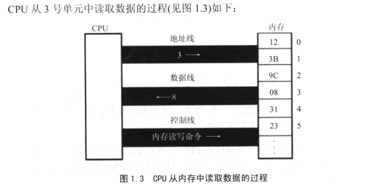

___王爽汇编原理笔记___      

## section 1    
1.  汇编语言的主体是汇编指令。汇编指令和机器指令的差别在于指令的表示方法上。      
2.  汇编语言由一下3类指令组成：    
    + 汇编指令：机器码的助记符，有对应的 _机器码_。  
    + 伪指令：没有对应的机器码，由编译器执行，计算机并不执行。      
    + 其他符号：如“+，-，*，/”等等，由编译器识别，没有对应的机器码。    
3.  指令和数据时应用上的概念。在内存或者磁盘上，指令和数据没有任何区别，都是二进制信息，区别在于CPU在 _工作的时候_ 把有的信息看作指令，有些信息看作数据。      
4.  CPU 要想读写数据，必须与外部期间进行3类信息的交互：     
    + 存储单元的地址(地址信息)。    
    + 器件的选择 -> 读或者写（控制信息）。      
    + 读或者写数据（数据信息）。      
5.  CPU 通过地址地址总线、控制总线和数据总线将地址、数据和控制信息传送到器件上。      
         
    + CPU 通过地址将地址信息3发出。   
    + CPU通过控制线发出内存读命令，选中存储芯片，并通知它。将要从中读取数据。    
    + 存储器将3号单元中的数据08通过数据线送入CPU。    
