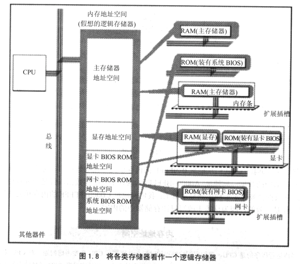

## section 1 基础知识     

1.  汇编语言的主体是汇编指令。汇编指令和机器指令的差别在于指令的表示方法上。      
2.  汇编语言由一下3类指令组成：    
    + 汇编指令：机器码的助记符，有对应的 _机器码_。  
    + 伪指令：没有对应的机器码，由编译器执行，计算机并不执行。      
    + 其他符号：如“+，-，*，/”等等，由编译器识别，没有对应的机器码。    
3.  指令和数据时应用上的概念。在内存或者磁盘上，指令和数据没有任何区别，都是二进制信息，区别在于CPU在 _工作的时候_ 把有的信息看作指令，有些信息看作数据。      
4.  CPU 要想读写数据，必须与外部器件进行3类信息的交互：     
    + 存储单元的地址(地址信息)。    
    + 器件的选择 -> 读或者写（控制信息）。      
    + 读或者写数据（数据信息）。      
5.  CPU 通过地址地址总线、控制总线和数据总线将地址、数据和控制信息传送到器件上。      
         
    + CPU 通过地址将地址信息3发出。   
    + CPU通过控制线发出内存读命令，选中存储芯片，并通知它。将要从中读取数据。    
    + 存储器将3号单元中的数据08通过数据线送入CPU。    
    写操作与度操作步骤相思，向3号单元写入数据26.      
    + CPU通过地址线将地址信息3发出。      
    + CPU通过控制线发出内存写命令，选中存储器芯片，并通知它，要向其中写入数据。      
    + CPU通过数据线将26送入到内存3号单元中。      
    要让一个计算机工作，应该向它输入能够驱动它进行工作的电平信息（机器码）。其对应的汇编指令为`MOV AX, [3]`     
6.  CPU 是通过地址总线来指定存储器单元的。地址总线上能够传递多少个不同的信息，CPU就可以对多少个存储单元进行寻址。   
7.  一个CPU有N根地址线，怎可以说这个CPU的地址总线的宽度为N，这样的CPU最多可以寻找2的N次方个内存单元。      
8.  CPU 对外部器件的控制是通过控制总线来进行的，在这里控制总线是个总成，控制总线是一些不同控制线的集合。有多少根控制总线，就意味着CPU提供了对外部器件的多少控制。前面所讲的内存读或者写是由几根控制线综合发出的。其中有一根名为读信号的输入控制线负责由CPU向外传送读信号，CPU向该控制线上输出低电平表示将要读数据。有一根名为写信号的输出的控制线则负责传送写信号。      
9.  在每台PC机上，都有一个主板，主板上有核心器件和一些主要器件，这些器件通过总线（地址总线、数据总线、控制总线）相连接。这些器件有：CPU、存储器、外围芯片组、扩展插槽等等。扩展插槽一般有RAM内存条和各类接口卡。     
10. 计算机系统中，所有可用程序控制其工作的蛇别，必须受到CPU的控制。CPU对外部都不能直接控制，如显示器、音响、打印机等等。直接控制这些设备进行工作的时插在扩展插槽上额接口卡。扩展插槽通过总线与CPU相连接，所以接口卡也通过总线同CPU相连接。CPU可以直接控制这些接口卡，从而实现CPU对外设的间接控制。简单将，就是CPU通过总线向接口卡发出命令，接口卡根据CPU的命令控制外设进行工作。      
11.  一台PC机器，装有多个存储芯片，这些存储器芯片从物理上链接上看是独立的，不同的器件。从读写属性上看分为两类：随机存储器（RAM）和只读存储器（ROM）。它们有以下两点相同：      
    + 都和CPU的总线相连接。   
    + CPU对他们进行读或者写的时候都通过控制线发出内存读写命令。     
  这就是说，CPU在操纵和控制它们的时候，都把他们当作内存看待，把它们当作总的一个由若干存储单元组成的逻辑存储器。这个逻辑存储器就是我们所说的内存地址空间。      
           
