## section 2 寄存器（CPU 工作原理）     

1.  8086 CPU 有14个寄存器，每个寄存器有一个名称，这些寄存器是：AX, BX, CX, DX, SI, DI, SP, BP, IP, CS, DS, SS, ES, PSW。    
2.  AX, BX, CX, DX四个寄存器通常用来存放一般性的数据，被称为通用寄存器。      
3.  通用寄存器分为独立使用的8位寄存器。     
    + AX被分为 AH 和 AL。     
    + BX被分为 BH 和 BL。     
    + CX被分为 CH 和 CL。     
    + DX被分为 DH 和 DL。     
4.  假设AX寄存器中的数据为C5H。执行程序 `add al 93H` 。理论上相加所得的值为158H。但是 `al` 是8位寄存器，只能存放两个十六进制的数据，所以最高位1丢失。 `ax` 中的数据为 0058H。这里的丢失是指进位值不能在8位寄存器中保存。此时的 `al` 是作为独立的8位寄存器是用的，和 `ah` 没有关系，CPU在执行这条指令的时候认为两者是不相关的寄存器。        
5.  8086 CPU 有20位地址总线，可以传送20位地址，达到1MB的寻址能力。它采用一种在内部用两个16位地址合成的方法形成一个20位的物理地址。    
    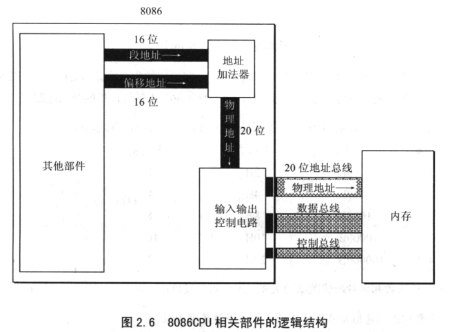       
6.  当8086CPU要读写内存的时候：   
    + CPU中的相关部件提供两个16位地址，一个称为段地址，另一个称为偏移地址。      
    + 段地址和偏移地址通过内部总线送入一个称为地址加法器的部件。    
    + 地址加法器将两个16位地址合称为一个20位的物理地址。    
    + 地址加法器通过内部总线将20位物理地址送入输入输出控制电路，输入输出控制电路将20位物理地址送上地址总线。      
    + 20位物理地址总线传送到存储器。    
7.  地址加法器采用 __物理地址=段地址*16+偏移地址__ 的方法用段地址和偏移地址合成物理地址。其本质1含义是：CPU在访问内存时，用一个基础地址（段地址*16）和一个相对于基础地址的偏移地址相加，给出内存单元的物理地址。更一般地，8086CPU的这种寻址功能是“基础地址+偏移地址=物理地址”寻址模式的一种具体实现方案。 __段地址*16__ 可以看作是基础地址。     
8.  __段地址__ 这个名称虽然包含段的概念，但是 __不要误认为__ 内存被分为一个个的段，每个段有一个段地址。内存 __并没有__ 分段，段的划分来自于 __CPU__。由于8086CPU使用“基础地址+偏移地址=物理地址”的方式给出内存单元的物理地址，使得我们可以用分段的方式来管理内存。比如地址10000H-100FFH单元可以组成一个段，10000H作为基础地址，段地址为1000H，大小为100H；我们也可以认为10000H-10007FH、10080H-100FFH的内存单元组成两个段，他们的基础地址为分别为10000H和100080H，段地址为1000H和1008H，大小都是80H。    
    有两点需要注意：    
    + 段地址*16必然是16的倍数，所以一个段的起始地址必然是16的倍数。
    + 16位地址的寻址能力是64KB，所以一个段的长度最大是64KB。       
9.  CPU可以使用不同的段地址和偏移地址形成同一个物理地址。     
10.  8086CPU 有4个段寄存器：CS、DS、SS、ES。当8086CPU要访问内存时由这4个段寄存器提供内存单元的段地址。     
11.  CS和IP是8086CPU中最关键的寄存器。它只是了CPU当前要读取指令地址。CS是代码段寄存器，IP是指令指针寄存。设CS内容是M，IP内容是N，8086CPU将从内存M*16+N单元开始，读取一条指令并执行。也可以这么说，CPU将CS:IP指向的内容当作指令执行。     
12.  8086CPU读取、执行指令工作原理：      
     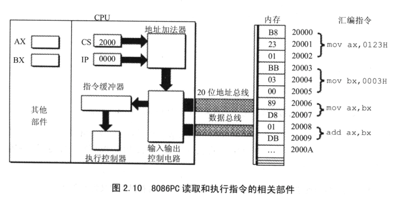       
     + 8086CPU当前状态：CS内容2000H，IP内容0000H。    
     + 内存20000H~20009H单元存放着可执行的机器码。    
     + 不同的指令所占字节数不同，以上分别为3B、3B、2B、2B。     
13.  以下展示了8086CPU读取、执行一条指令的过程。    
     + 初始状态     
     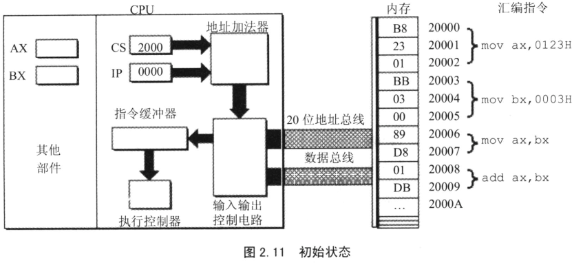        
     + CS、IP中的内容送入地址加法器      
     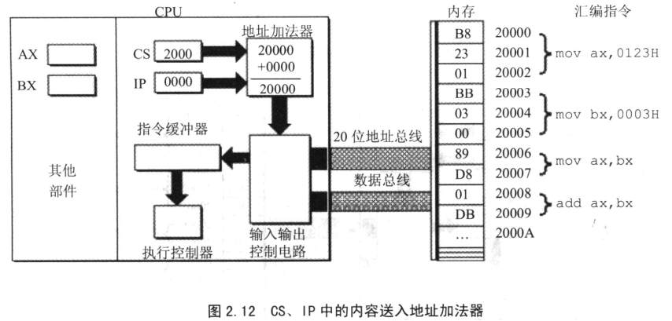        
     + 由地址加法器将物理地址送入输入输出控制电路       
     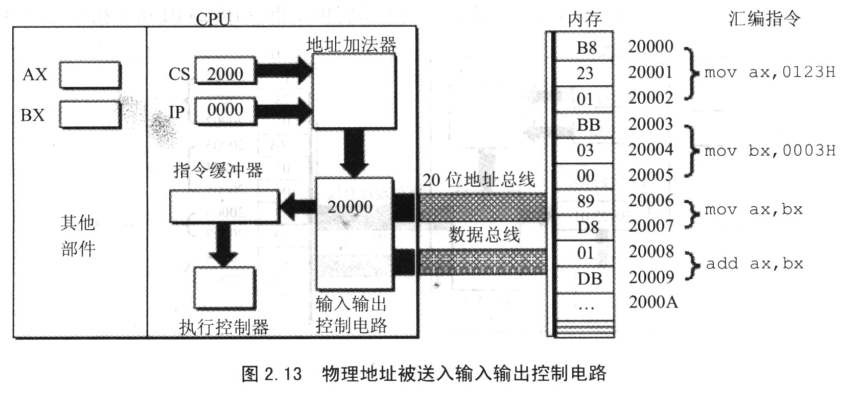      
     + 输入输出控制电路将物理地址20000H送上地址总线。     
     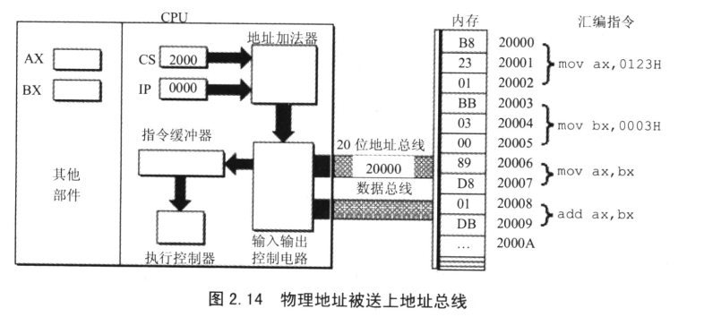      
     + 机器指令被送入CPU      
     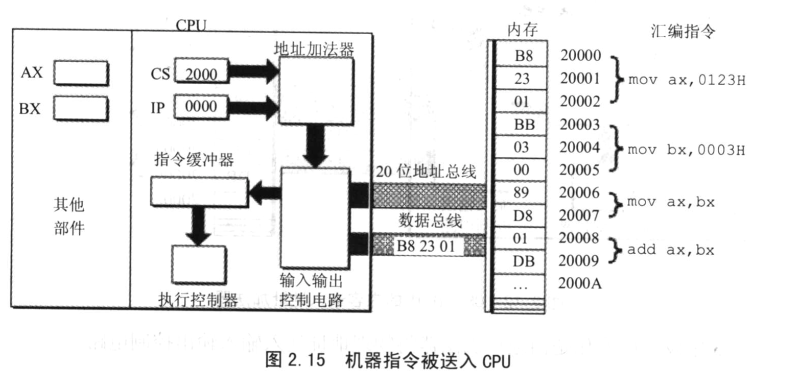     
     + 输入输出控制电路将机器指令 `B8 23 01` 送入到指令缓冲器   
     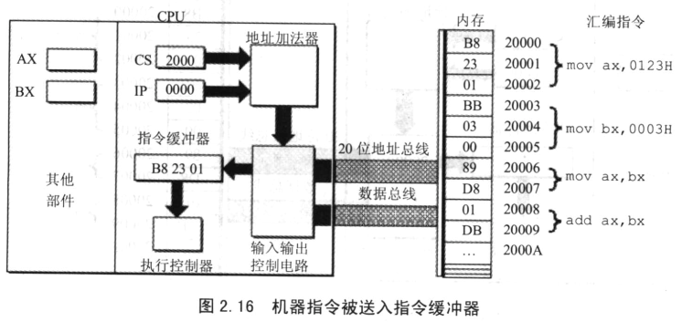    
     + 读取一条指令后，IP中的值自动增加，以使CPU可以读取吓一跳指令。因当前读入的指令 `B8 23 01` 长度为3个字节，所以IP中的值加3.   
     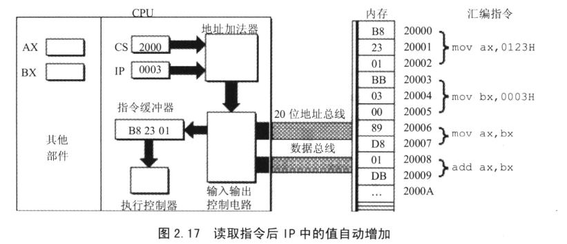      
     + 执行控制器执行指令 `B2 23 01(mov ax 0123H)`      
     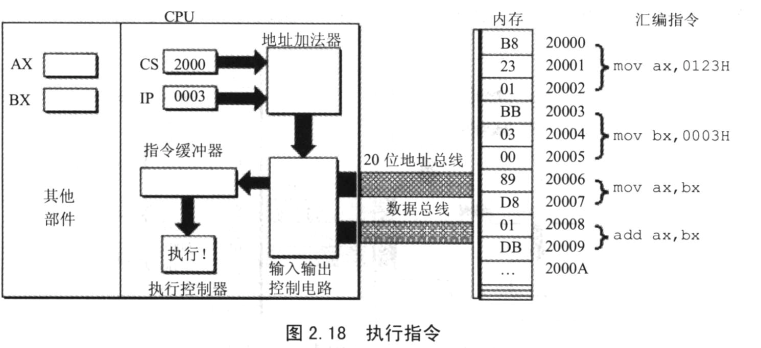      
     + 指令 `B8 23 01` 被执行后 `AX` 中的内容为 `0123H`，此时CPU将从内存单元2000:0003读取指令     
     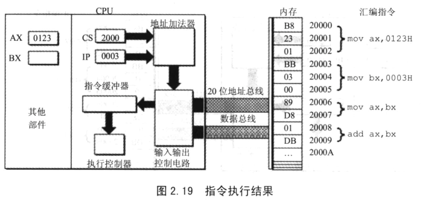     
     + 初始情况二，这时CS:2000H，IP:0003H，将从内存2000H*16+0003H处读取指令 `BB 03 00`。     
     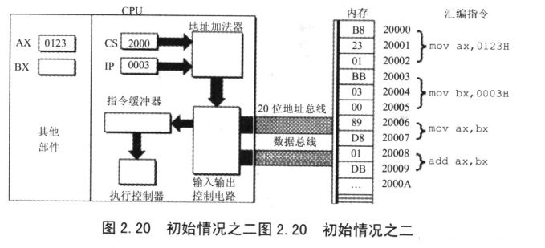      
     + CPU从内存20003H处读取指令 `BB 03 00` 入指令缓冲器，IP中的值加3。     
     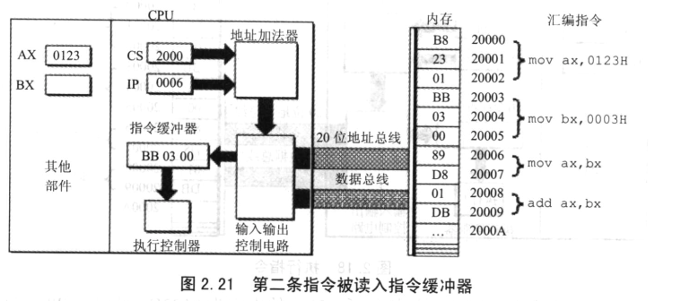      
     + 执行指令 `BB 03 00(mov bx, 0003H)` 的情况，`BX` 中的内容为0003H      
     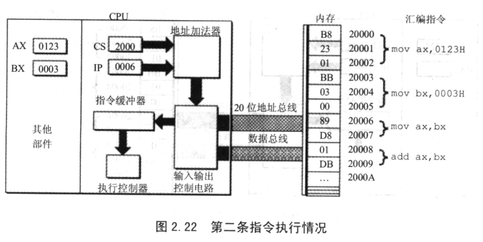      
     + CPU 从内存20006H处读取指令 `89 D8` 入指令缓冲器，IP中的值加2.      
     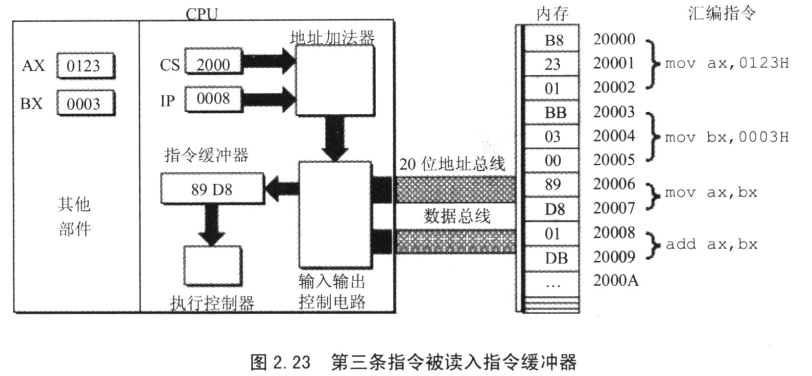      
     + 执行指令 `89 D8(mov ax, bx)` 后的情况， `AX` 中的内容为0003H     
     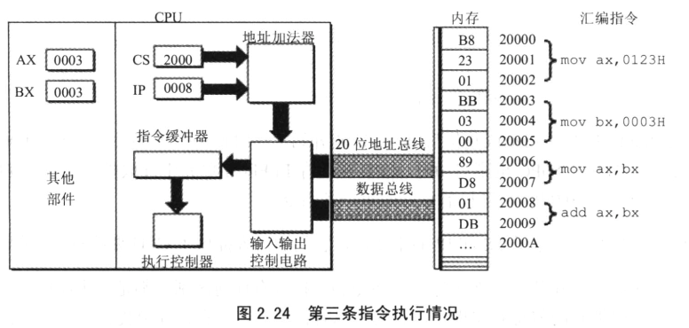      
     + 第四条指令被读入指令缓冲器     
     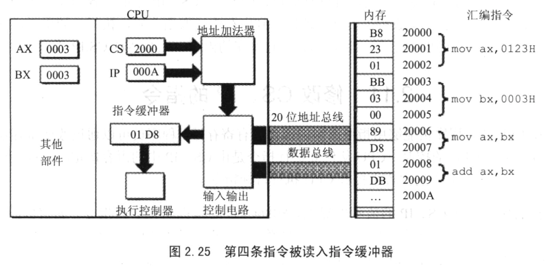      
     + 第四条指令执行情况     
           
    以上简要描述：      
    1.  从CS:IP指向内存单元读取指令，读取的指令进入指令缓冲器。   
    2.  IP=IP+所读取指令的长度，从而指向下一条指令。    
    3.  执行指令。转到步骤1     
14.  在8086CPU加电启动或者复位后（即CPU刚开始工作时），CS和IP被设置为CS=F000H, IP=FFFFH，即在8086PC机刚启动时，CPU从内存FFFF0H单元中读取指令执行，FFFF0H单元中的指令时8086PC机开机后执行的第一条指令。      
15.  在内存中，指令和数据没有任何区别，都是二进制信息。那CPU根据什么将内存中的信息看作指令？CPU将CS:IP指向的内存单元中的内容看作指令。CPU将CS、IP中的内容当作指令的段地址和偏移地址，用他们合成指令的物理地址，当内存中读取指令码。      
16.  在CPU中，程序员能够用指令读写的部件只有寄存器，程序员可以通过改变寄存器中的内容实现对CPU的控制。CPU从何处执行指令是由CS、IP中的内容决定的，程序员可以通过改变CS、IP中的内容来控制CPU执行目标指令。但是，`mov` 指令不能用于设置CS、IP的值，因为8086CPU没有提供这样的功能。8086CPU为CS、IP提供了另外的指令来改变它们的值。能够改变CS、IP的内容的指令被统统称为转移指令。      
17.  `jmp` 的格式：`jmp 段地址:偏移地址`。指令的功能为：用指令中给出的段地址修改CS，偏移地址修改IP。如果仅仅想要修改IP的内容，可用指令 `jmp 某一合法寄存器` 完成。      
18.  对于8086PC机，在编程时，可以将一组内存单元定义为一个段。可以将长度为N(N<=64KB)的一组代码，存在一组地址连续、起始地址为16的倍数的内存单元中。    
19.  如何使得代码段中的指令被执行呢？将一段内存当作代码段，仅仅是我们编程的一种安排，但是CPU只会执行CS:IP指向的内存单元中的内容为指令。所以，要让CPU执行我们放在代码段中的指令，必须要将CS:IP只系那个所定义的代码段中的第一条指令的首地址。         
