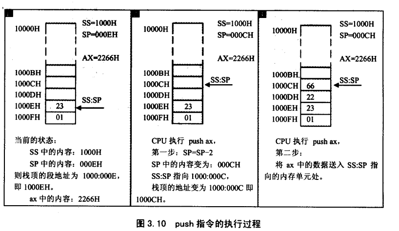
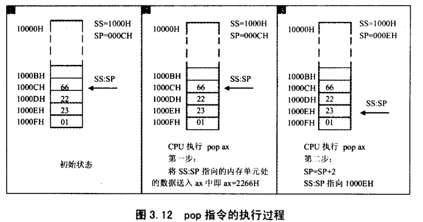

## 第三章 寄存器（内存访问）      
1.  CPU要读写一个内存单元的时候，必须要先给出内存单元的地址。在8086PC中，内存地址由段地址和偏移地址组成。8086CPU中有一个DS寄存器，通常用来存放要访问数据的段地址。      
2.  `[...]` 表示一个内存单元，`[...]` 中的值表示内存单元的偏移地址。指令执行时，8086CPU自动取出 `DS` 中的数据为内存单元的段地址。    
3.  8086CPU的段寄存器不支持将数据直接送到段寄存器的操作。只能用一个寄存器来进行中转。为什么呢？这就是8086CPU硬件设计的问题。    
4.  从寄存器到内存单元：`mov 内存单元地址，寄存器名`      
5.  __mov 指令有以下几种形式__:       
    + `mov 寄存器，数据     比如：mov ax, 8`    
    + `mov 寄存器，寄存器   比如：mov ax, bx`     
    + `mov 寄存器，内存单元 比如：mov ax, [0]`      
    + `mov 内存单元，寄存器 比如：mov [0], ax`      
    + `mov 段寄存器，寄存器 比如：mov ds, ax`     
    + `mov 寄存器，段寄存器`      
    + `mov 段寄存器，内存单元`      
    + `mov 内存单元，段寄存器`      
6.  __add、sub指令有以下几种形式__:     
    + `add 寄存器，数据     比如：add ax, 8`    
    + `add 寄存器，寄存器   比如：add ax, bx`     
    + `add 寄存器，内存单元 比如：add ax, [0]`      
    + `add 内存单元，寄存器 比如：add [0], ax`      
    + `sub 寄存器，数据     比如：sub ax, 9`    
    + `sub 寄存器，寄存器   比如：sub ax, bx`     
    + `sub 寄存器，内存单元 比如：sub ax, [0]`      
    + `sub 内存单元，寄存器 比如：sub [0], ax`      
    + 段寄存器与内存单元、其他寄存器的操作待验证。      
7.  可以将一组内存单元定义为一个段，我们可以将一组长度为N(N<=64KB)、地址连续、起始地址为16的倍数的内存单元当作专门存储数据的内存空间，从而定义了一个数据段。      
8.  8086CPU提供入栈和出栈指令。最基本的两个是 `push` 和 `pop`。8086CPU的入栈和出栈操作都是以字为单位的。      
9.  抛出两个问题：      
    + CPU如何知道一段地址，比如10000H-1000FH这段空间被当做栈来使用？     
    + `push ax` 等入栈指令执行时，要将寄存器中的内容放入当前栈顶单元的上方，成为新的栈顶元素；`pop ax` 等指令执行时，要从栈顶单元中取出数据，送入寄存器中，显然 `push, pop` 在执行的时候必须知道哪个单元是栈顶单元。但是怎么知道呢？       
10.  现在存在的问题是：CPU如何知道栈顶的位置？8086CPU中，有两个寄存器，段寄存器SS和寄存器SP，栈顶的段地址存放在SS中，偏移地址存放在SP中，__任意时刻，SS:SP指向栈顶元素__。push指令和pop指令执行时，CPU从SS和SP中得到栈顶地址。      
11.  push ax的执行，由以下两步完成：      
     + SP=SP-2，SS:SP指向当前栈顶前面的单元，以当前栈顶前面的单元为新的栈顶。     
     + 将ax中的内容送入SS:SP指向的内存单元处，SS:SP此时指向新栈顶。     
           
     8086CPU中，入栈时，栈顶从高地址向低地址方向增长。    
12.  例子：将10000H-1000FH这段空间当作栈，初始状态栈是空的，此时，SS=1000H，SP？        
     分析：SP=0010H，如下：     
     SS=1000H，栈空间大小为16字节，栈最底部的字单元地址为1000:000E。栈为空，就相当于栈中唯一的元素出栈，出栈后，SP=SP+2，SP原来为000EH，加上2后SP=10H，所以，当栈为空的时候，SS=1000H，SP=10H。     
     任意时刻，SS:SP指向栈顶元素，当栈为空的时候，栈中没有元素，也就不存在栈顶元素，所以SS:SP只能指向栈的最底部单元下面的单元，该单元的偏移地址为栈最底部的字单元的偏移地址+2，栈最底部字单元的地址为1000:000E，所以栈空时，SP=0010H。      
13.  pop ax功能：     
     + 将SS:SP指向的内存单元除的数据送入ax中      
     + SP=SP+2，SS:SP指向当前栈顶下面的单元，以当前栈顶下面的单元为新的栈顶。   
           
14.  如何能够保证在入栈、出栈时，栈顶不会超出栈空间？抱歉，8086没有办法。       
15.  push 和 pop 指令的格式可以是如下形式：     
     ```
     push 寄存器; 将一个寄存器中的数据入栈
     pop 寄存器; 出栈，用一个寄存器接收出栈的数据

     push 段寄存器; 将一个段寄存器中的数据入栈
     pop 段寄存器; 出栈，用一个段寄存器接收出栈的数据

     push 内存单元; 将一个内存字单元除的字入栈（栈操作以字为单位）
     pop 内存单元; 出栈，用一个内存字单元接收出栈的数据
     ```
