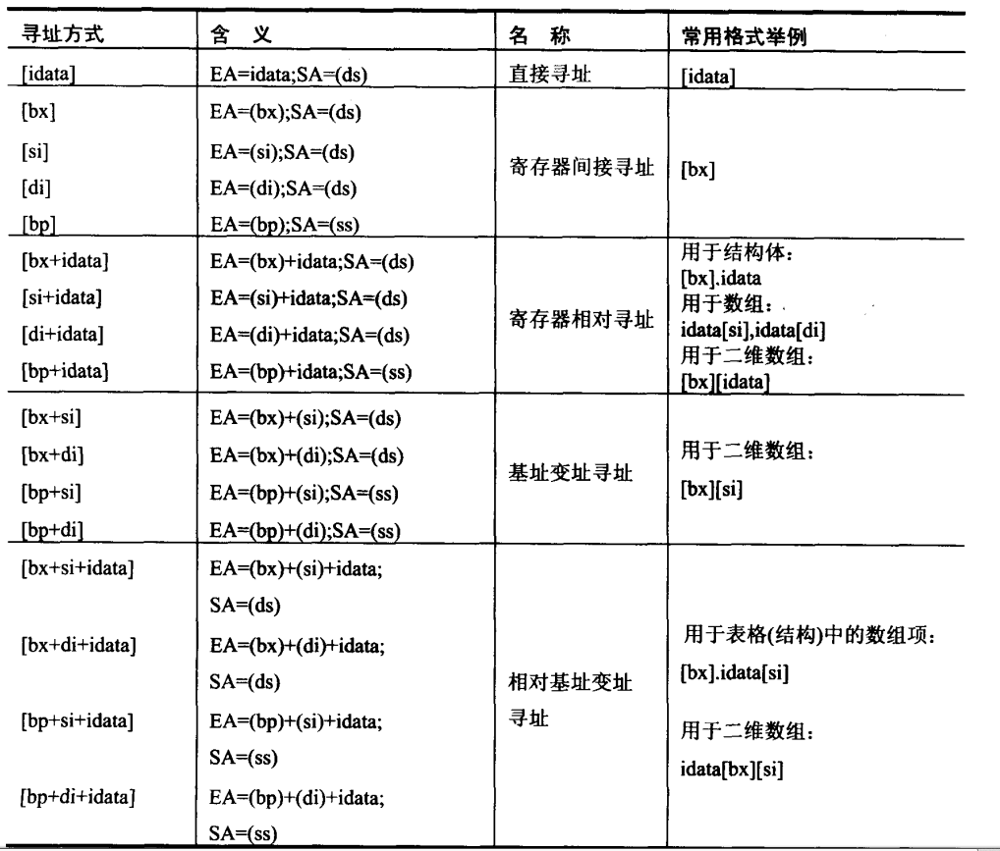

## 第八章 数据处理的两个基本问题    
1.  本书是用两个描述性的符号 `reg` 来标识一个寄存器，用 `sreg` 表示一个段寄存器。     
2.  在8086CPU中，只有这4个寄存器可以用在“[]”中来进行内存单元的寻址。这四个寄存器是 __bx, si, di, bp__。 比如：      
    ```
    mov ax, [bx]      ;right
    mov av, [bx+si]   ;right
    mov ax, [bx+di]   ;right
    mov ax, [bp]      ;right
    mov ax, [bp+si]   ;right
    mov ax, [bp+di]   ;right
    mov ax, [cx]      ;wrong
    mov ax, [ax]      ;wrong
    mov ax, [dx]      ;wrong
    mov ax, [ds]      ;wrong
    ```
    在“[]”中，这四个寄存器可以单个出现，或者只能以四种组合出现：bx和si，bx和di，bp和si，bp和di。      
    ```
    mov ax, [bx]          ;right
    mov ax, [si]          ;right
    mov ax, [di]          ;right
    mov ax, [bp]          ;right
    mov ax, [bx+si]       ;right
    mov ax, [bx+di]       ;right
    mov ax, [bp+si]       ;right
    mov ax, [bp+di]       ;right
    mov ax, [bx+si+idata] ;right
    mov ax, [bx+di+idata] ;right
    mov ax, [bp+si+idata] ;right
    mov ax, [bp+di+idata] ;right
    mov ax, [bx+bp]       ;right
    mov ax, [si+di]       ;right
    ```
    只要在“[]”中是用寄存器bp，而指令中没有显性地给出段地址，段地址默认就在ss中：      
    ```
    mov ax, [bp]            ;(ax)=((ss)*16+(bp))
    mov ax, [bp+idata]      ;(ax)=((ss)*16+(bp)+idata)
    mov ax, [bp+si]         ;(ax)=((ss)*16+(bp)+(si))
    mov ax, [bp+si+idata]   ;(ax)=((ss)*16+(bp)+(si)+idata)
    ```
3.  绝大部分机器指令都是进行数据处理的指令，处理大致可以分为三类：读取、写入、运算。在机器指令这一层来讲，并不关心数据的值是多少，__而关心指令执行前一刻__，它将要处理的数据所在的位置。指令在执行前，索要处理的数据可以在三个地方：CPU内部、内存、端口。          
4.  指令举例：      
    |机器码|汇编指令|指令执行前数据的位置|
    |:----:|:----:|:----:|
    |8E1E0000|mov bx, [0]|内存，ds:0单元|
    |89C3|mov bx, ax|CPU内部，ax寄存器|
    |BB0100|mov bx, 1|CPU内部，指令缓冲器|
5.  立即数 对于直接包含在机器指令中的数据（执行前在CPU的指令缓冲器中），在汇编语言中称为立即数，在汇编指令中直接给出。    
    ```
    mov ax, 1
    add bx, 2000H
    or bx, 00010000b
    mov ax, 'a'
    ```
6.  指令要处理的数据在寄存器中，在汇编指令中给出相应的寄存器名。    
    ```
    mov ax, bx
    mov ds, ax
    push bx
    mov ds:[0], bx
    push ds
    mov ss, ax
    mov sp, ax
    ```
7.  当数据存放在内存中的时候，可以用多重方式来给定这个内存单元的偏移地址，这种定位内存单元的方法一般被称为寻址方式。    
8.  寻址方式小结      
          
9.  在没有寄存器名存在的情况下，用操作符 `X ptr` 指明内存单元的长度，X在汇编指令中可以为word或者byte。比如 `mov word ptr ds:[0] 1`，比如：`mov byte ptr ds:[0], 1`。在没有寄存器参与的内存单元访问指令中，用 `word ptr` 或者 `byte ptr` 显性地指明索要访问的内存单元的长度是很必要的。否则，CPU无法得知所要访问的单元是字单元，还是字节单元。有些指令默认了访问的时字单元还是字节单元，比如：push [1000H]就不用指明访问的是字单元还是字节单元，因为push指令只进行字操作。        
10.  div指令 div是除法指令，使用div做除法的时候：   
     + 除数：有8位和16位两种，在一个寄存器或者内存单元中    
     + 被除数：默认放在AX 或者 DX和AX中，如果除数为8位，被除数则为16位，默认在AX中存放；如果除数为16位，被除数则为32位，在DX和AX中存放，DX存放高16位，AX存放低16位。    
     + 结果：如果除数为16位，则AL存储除法操作的商，AH存储除法操作的玉树；如果除数为16位，则AX存储除法操作的商，DX存储除法的余数。      
     ```
     格式：
     div reg
     div 内存单元

     div byte ptr ds:[0]      ; (al)=(ax)/((ds)*16+0)的商；(ah)=(ax)/((ds)*16+0)的余数
     div word ptr es:[0]      ; (ax)=[(dx)*10000H+(ax)]/((es)*16+0)的商；(dx)=[(dx)*10000H+(ax)]/((es)*16+0)的余数
     div byte ptr [bx+si+8]   ; (al)=(ax)/((ds)*16+(bx)+(si)+8)的商；(ah)=(ax)/((ds)*16+(bx)+(si)+8)
     div word ptr [bx+si+8]   ; (ax)=[(dx)*10000H+(ax)]/((ds)*16+(bx)+(si)+8)的商；(dx)=[(dx)*10000H+(ax)]/((ds)*16+(bx)+(si)+8)的余数
     ```
