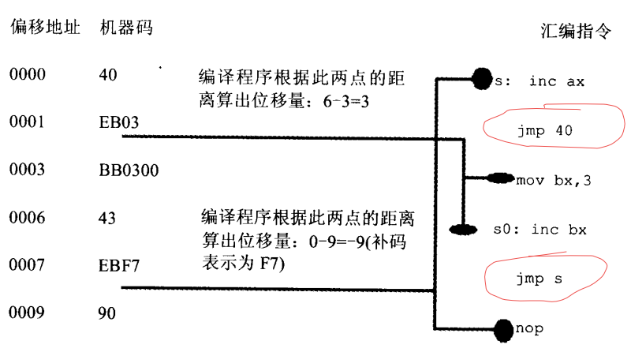

## 转移指令的原理     
1.  可以 __修改IP，或者同时修改CS和IP的指令统称为转移指令__，概括的说，转移指令就是可以控制CPU执行内存中某处的代码的指令。      
2.  8086CPU的转移行为有以下几类：   
    + 只修改IP时，称为段内转移，比如：`jmp ax`。    
    + 同时修改CS和IP时，称为段间转移，比如： `jmp 1000:0`。    
    由于转移指令对IP的修改范围不同，段内转移又分为：短转移和近转移。    
    + 短转移IP的修改范围为：-128-127。    
    + 近转移IP的修改范围为：-32768-32767。    
    8086CPU的转移指令分为以下几类：   
    + 无条件转移指令（如：jmp）   
    + 条件转移指令
    + 循环指令（如：loop）    
    + 过程    
    + 中断      
    这些指令转移的前提条件可能不同，但是转移的基本原理是相同的。      

3.  操作符的 offset 在汇编语言中是由编译器处理的符号，它的功能是取得标号的偏移地址：      
    ```
    assume cs:codesg
    codesg segment
      start: mov ax, offset start     ; 相当于mov ax, 0
          s: mov ax, offset s         ; 相当于mov ax, 3
    codesg ends
    end start
    ```
    offset 操作符取得了标号start和s的偏移地址0和3，所以指令：`mov ax, offset start` 相当于指令 `mov ax, 0` 是代码段中的标号，它所标记的指零是代码段中的第一条指令，偏移地址是0。`mov ax, offset s` 相当于 `mov ax, 3`，因为s是代码段中的标号，它所标记的指令时代码段中的第二条指令，第一条指令长度为3字节，则s的便宜地址为3。     
4.  `jmp` 为无条件转移指令，可以只修改IP，也可以同时修改CS和IP。`jmp` 指令要给出两种信息：      
    + 转移的目标地址    
    + 转移的举例（段间转移、段内短转移、段内近转移）      
5.  `jmp short 标号（转到标号处执行指令）`，这种格式的 `jmp` 指令实现的时段内短转移，他对IP的修改范围为-128-127，也就是说它能够向前转移128字节，向后转移127字节。`jmp`指令中的short符号，说明指令进行的时短转移。jmp指令中的标号是代码段中的标号，指明了指令要转移的目的地，转移指令结束后，CS：IP应该指向标号处的指令。CPU 在执行jmp指令的时候并不需要转移的目的地址。__此处具体原理参考书上__。`jmp short 标号` 指令所对应的机器码中，并不包含转移的目的地址，而包含的时转移的位移。这个位移，是编译器根据汇编指令中的"标号"计算出来的：      
          
    实际上，指令 `jmp short 标号` 的功能为: (IP)=(IP)+8位位移。    
    + 8位位移=“标号”除的地址-jmp指令的第一个字节的地址。    
    + short指明此处的位移为8位位移。    
    + 8位位移的范围-128-127，用补码表示。   
    + 8位位移由编译程序在编译时算出。   
6.  `jmp near ptr 标号` 与 `jmp short 标号` 功能相近，他实现的是段内近转移。指令 `jmp near ptr 标号` 的功能为：(IP)=(IP)+16位位移：     
    + 16位位移=指令“标号”除的地址-jmp指令后的第一个字节的地址    
    + near ptr 指明此处的位移为16位位移，进行的时段内近位移      
    + 16位位移的范围为-32768-32767，用补码表示      
    + 16位位移由编译程序在编译时算出      
7.  jmp指令对应的机器指令中并没有转移的目的地址，而是相对于当前IP的转移位移。指令 `jmp far ptr 标号` 实现的时段间转移，又称为远转移：    
    (CS)=标号所在段的段地址；(IP)=标号在段中的偏移地址。    
    `far ptr` 指明了指令用标号的段地址和偏移地址修改CS和IP。    
8.  `jmp 16位寄存器`：(IP)=(16位寄存器)     
9.  转移地址在内存中的jmp指令有两种格式：     
    + jmp word ptr 内存单元地址（段内转移），功能是从内存单元地址处开始存放这一个字，是转移的目的偏移地址。内存单元地址可用寻址方式的任一格式给出。      
    ```
    mov ax, 0123H
    mov ds:[0], ax
    jmp word ptr ds:[0]
    ```
    执行后，(IP)=0123H。      
    ```
    mov ax, 0123H
    mov [bx], ax
    jmp word ptr [bx]
    ```
    执行后，(IP)=0123H      
10.  jmp dword ptr 内存单元地址（短剑转移），功能是从内存单元地址处开始存放着两个字，高地址处的字是转移的目的段地址，低地址处是转移的目的偏移地址。(CS)=(内存单元地址+2)；(IP)=(内存单元地址)。比如：    
     ```
     mov ax, 0123H
     mov ds:[0], ax
     mov word ptr ds:[2], 0
     jmp dword ptr ds:[0]
     ```
     执行后，(CS)=0，(IP)=0123H，CS:IP指向0000:0123。再如：    
     ```
     mov ax, 0123H
     mov [bx], ax
     mov word ptr [bx+2], 0
     jmp dword ptr [bx]
     ```
     执行后，(CS)=0，(IP)=0123H，CS:IP指向0000:0123。   
11.  jcxz指令为有条件转移指令，所有的有条件转移指令都是短转移，再对应的机器码中包含转移的位移，而不是目的地址。对IP的修改范围都为：-128-127。指令的格式：`jcxz 标号（如果(cx)=0, 转移到标号处执行）`。操作：当(cx)=0时，(IP)=(IP)+8位位移。8位位移=“标号”处的地址-jcxz指令后的第一个字节的地址。8位位移的范围为-128-127，用补码表示。8位位移由编译程序在编译时算出。当(cx)不等于0时，什么也不做（程序向下执行）。`jcxz 标号` 的功能相当于 `if ((cx)==0) jmp short 标号`。     
12.  loop 指令为循环指令，所有循环指令都是 __短转移__，在对应的机器码中包含转移的位移，而不是目的地址。对IP的修改范围都为：-128-127。      
     指令格式：loop 标号（(cx)=(cx)-1，如果(cx)不等于0，转移到标号处执行）。    
     操作：   
     + (cx)=(cx)-1    
     + 如果(cx)不等于0，(IP)=(IP)+8位位移   
     8位位移=“标号”处的地址-jcxz指令后的第一个字节的地址      
     8位位移的范围为-128-127，用补码表示      
     8位位移由编译程序在编译时算出      
     如果 (cx)=0，什么也不做（程序向下执行）      
     `loop 标号`的功能相当于：    
     (cx)--;    
     if ((cx) 不等于 0) jmp short 标号;        
13.  根据位移进行转移的意义   
     ```
     jmp short 标号
     jmp near ptr 标号
     jcxz 标号
     loop 标号
     ```
     以上等几种汇编指令，他们对IP的修改是根据转移目的地址和转移起始地址之间的位移来进行的，在他们对应的机器码中不包含转移的目的地址，而包含的时目的地址的位移。    
14.  例子：   
     ```
     汇编指令             机器码
     mov cx, 6            B9 06 00
     mov ax, 10           B8 10 00
     s: add ax, ax        01 C0
     loop s               E2 FC
     ```
     这段程序装在内存中的不同位置都可以正确执行，因为 `loop s` 在执行时只涉及到s的位移（-4，前移4个字节，补码表示为FCH），而不是s的地址。如果 `loop s` 的机器码中包含的时s的地址，则就对程序段在内存中的便宜地址有了严格的限制，因为机器码中包含的是s的地址，如果s处的指令不在目的地址处，程序的执行就会出错。而 `loop s` 的机器码中包含的时转移的位移，就不村咋i这个问题了，因为，无论s的指令的实际地址是多少，咯哦哦片指令的转移位移是不变的。      
