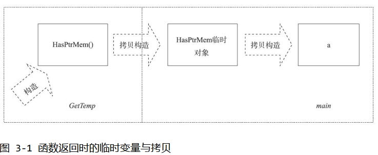
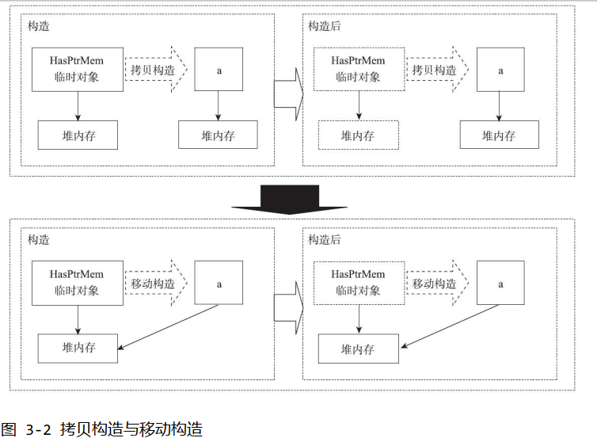
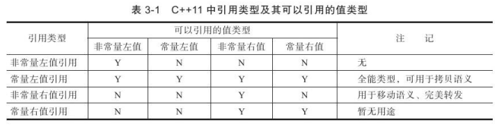
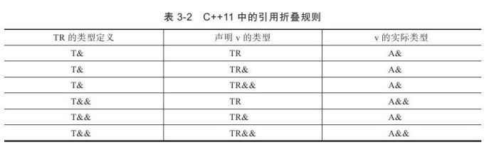

1.  继承构造函数    
    以前我们这样使用：    
    ```
    struct A {
      A(int i) {}
      A(double d, int i) {}

      A(float f, int i, const char* c) {}
    };

    struct B: public A{
      B(int i) : A(i) {}
      B(double d, int i): A(d, i) {}
      B(float f, int i, const char* c): A(f, i, c) {}

      virtual void extra_inter_face();
    }
    ```
    以前我们的继承初始化要这么写，虽然B只添加了一个接口。在以前的C++中要在构造B的时候想要拥有A这样多的构造方法的话，就必须“透传”各个接口。事实上C++11已经有了一个好用的规则，就是如果派生类要是用积累的成员函数的话，可以通过`using`来完成：     
    ```
    #include <iostream>

    using namespace std;

    struct Base {
      void f(double i){
        cout << "Base" << i << endl;
      }
    };

    struct Derived: Base {
      using Base::f;

      void f(int i) {
        cout << "Derived: " << i << endl;
      }
    };

    int mian()
    {
      Base b;
      b.f(4.5); //Base:4.5
      Derived d;
      d.f(4.5); //Base: 4.5
    }
    ```
    上面的代码中，如果没有`using Base::f`，事实上我们隐藏了`Base::f(double)`，但是现在使用了这个`using`，在Derived里面，就有了两个f函数(相当于重载)。这样的思想也扩展到了构造函数中，子类可以通过是用`using`声明来继承基类的构造函数：     
    ```
      struct A {
      A(int i) {}
      A(double d, int i) {}

      A(float f, int i, const char* c) {}
    };

    struct B: public A{
      using A::A; //继承构造函数

      virtual void extra_inter_face();
    }
    ```
    这里我们就可以通过`using A::A`的声明，把基类中的构造函数_悉数_集成到派生类B中。这样上面的”透传“构造函数就不在需要了。而且更为精巧的是，C++11标准继承构造函数被设计为跟派生类中的各个类默认函数(默认构造、析构、拷贝构造)一样，是隐式声明的。这意味着如果一个继承构造函数不被相关代码，编译器不会为其产生真正的函数代码。      
    不过继承构造函数只会初始化基类的成员变量，对于派生类中的成员变量则无能为力，不过我们可以是用类成员的初始化表达式，为派生类成员变量设定一个默认值还是没有问题的：    
    ```
    struct A {
      A(int i) {}
      A(double d, int i) {}

      A(float f, int i, const char* c) {}
    };

    struct B: public A{
      using A::A; //继承构造函数

      int d{0};
    }

    int main()
    {
      B b(356); // b.d被初始化为0
    }
    ```
    有的时候，基类构造函数的参数会有默认值。对于继承构造函数来将，参数的默认值是不会被继承的。事实上， 默认值会导致基类产生多个构造函数的版本， 这些函数版本都会被派生类继承：     
    ```
    struct A {
      A (int a = 3, double = 2.4) {}
    };

    struct B : A {
      using A::A;
    };
    ```
    基类的构造函数`A(int a = 3, double = 2.4)`有一个接受两个参数的构造函数，且两个参数俊有默认值，那么A到底可能有多少个可能的构造函数的版本呢？    
    事实上，B可能从A中继承来的候选继承构造函数有如下一些：    
    +  A(int = 3, double = 2.4) //这是使用两个参数的情况
    +  A(int = 3) //这是减掉一个参数的情况
    +  A(const A&) //这是默认的复制构造函数
    +  A() //这是不适用参数的情况    
    相应地，B中构造函数将会包括以下一些：   
    +  B(int, double) //这是继承构造函数
    +  B(int) //这是减少掉一个参数的继承构造函数
    +  B(const B&) //这是复制构造函数，这不是继承来的
    +  B() //这是不包含参数的默认构造函数
    可以看到，参数默认值会导致多个构造函数版本产生，因此程序员在是用有参数默认值的构造函数的基类的时候，__必须小心__。    
    有的时候，我们会遇到继承构造函数”冲突“的情况，这通常繁盛在派生类有多个基类的时候。多个基类中的部分构造函数可能导致派生类中的继承构造函数的函数名、参数都相同。那么继承类中的冲突的继承构造函数将会导致不合法的派生类代码：    
    ```
    struct A {
      A(int) {};
    };
    struct B {
      B(int) {};
    };

    struct C: A, B {
      using A::A;
      using B::B;
    };
    ```
    A和B的构造函数会导致C中重复定义相同类型的继承构造函数。可以通过显示定义继承类的冲突的构造函数，阻止隐式生成相应的继承构造函数来解决冲突：      
    ```
    struct C: A, B {
      using A::A;
      using B::B;

      C(int) {}
    };
    ```
    另外，如果基类的构造函数被声明为私有成员函数，或者派生类是从基类中___虚继承___的，那么就不能在派生类中声明继承构造函数。此外，如果一旦使用类继承构造函数，编译器就不会再为派生类生成默认构造函数了。如以下，变量b的定义应该是不能够通过编译的：      
    ```
    struct A {
      A(int) {}
    };

    struct B: A {
      using A::A;
    };

    B b; //B没有默认构造函数
    ```
2.  委派构造函数    
    委派构造函数也是C++11中对C++的构造函数的一项改进，其目的是为了减少程序员写构造函数的时间。    
    ```
    class Info {
    public:
      Info(): type(1), name('a') {
        init_rest();
      }

      Info(int i): type(i), name('a') {
        init_rest();
      }
      Info(char e): type(1), name(e) {
        init_rest();
      }

    private:
      void init_rest();

      int type;
      char name;
    };
    ```
    上面代码，可以看到，除了初始化列表有所不同，其他部分3个构造函数基本上是相似的，因此其代码有很多重复，改进：    
    ```
    class Info {
    public:
      Info() {
        init_rest();
      }

      Info(int i): type(i) {
        init_rest();
      }
      Info(char e): name(e) {
        init_rest();
      }

    private:
      void init_rest();

      int type{1};
      char name{'a'};
    };
    ```
    这样虽然简单了不少，但在现实变成中，构造函数中的代码会更长，比如可能还需要调用一些基类的构造函数，那么能不能在一些构造函数中，连`init_rest`都不用调用呢？     
    这是可以的。但是前提是我们能够将一个构造函数设定为”基准版本“，比如本例的`Info`版本的构造函数，而其他构造函数可以通过委派”基准版本“来进行初始化：      
    ```
    Info() { init_rest(); }
    Info(int i) {
      this->Info(); 
      type = i;
    }
    Info (char e) {
      this->Info();
      name = e;
    }
    ```
    这里我们通过this指针调用基准版本的构造函数，不过可惜的时，一般的编译器都会阻止`this->Info()`的编译。原则上，编译器不允许在构造函数中调用构造函数，即使参数看起来不相同。      
    ```
    Info() { init_rest(); }
    Info(int i) {
      new(this)->Info(); 
      type = i;
    }
    Info (char e) {
      new(this)->Info();
      name = e;
    }
    ```
    这里我们是用了placement new来强制在本对象地址（this指针所指地址）上调用类的构造函数。这样我们就可以绕过编译器的检查，从而在2个构造函数中调用我们的”基准版本“。这种方法看起来不错，却是在已经初始化一部分的对象上再次调用构造函数。因此这个方法虽然能够有效，却是一个危险的做法。    
    在C++11中，我们可以是用委派构造函数来达到期望的效果，C++11中委派构造函数是在构造函数的初始化列表位置进行构造的、委派的：      
    ```
    class Info {
    public:

      Info() { init_rest(); }
      Info(int i): Info() {
        type = i;
      }
      Info (char e): Info() {
        name = e;
      }

    private:
      void init_rest();

      int type{1};
      char name{'a'};
    };
    ```
    我们在初始化列表的位置，调用了”基准版本”的构造函数Info()。这里我们为了区分被调用者和调用者, 称在初始化列表中调用“基准版本”的构造函数为委派构造函数。而被调用的“基准版本”则为目标构造函数。在C++11，所谓委派构造，就是指委派函数将构造的任务委派给了目标构造函数来完成这一类的构造的方式。      
    委派构造函数只能在函数体内为成员变量赋初值，这是由于委派构造函数不能有初始化列表造成的。在C++中，构造函数不能同时”委派“和是用初始化列表，所以如果委派构造函数要给变量赋值只能放在函数体中。这样的话，上面的代码就不那么令人满意了，因为初始化列表的初始化方式总是先于构造函数完成的（实际上在编译完成时就已经决定了）。不过我们可以稍微改造一下目标函数，使得委派构造函数依然可以在初始化列表中初始化所有成员：      
    ```
    class Info {
    public:

      Info(): Info(1, 'a') {}
      Info(int i): Info(i, 'a') {}
      Info (char e): Info(1, e) {}

    private:
      Info(int i, char e): type(i), name(e) { //其他初始化 }

      int type{};
      char name{};
    };
    ```
    在构造函数比较多的时候，我们可能拥有不止一个委派构造函数，而一些目标构造函数很可能也是委派构造函数，这样以来，在委派构造函数中就会形成链状委派构造关系：      
    ```
    class Info {
    public:

      Info(): Info(1) {} //委派构造函数
      Info(int i): Info(i, 'a') {} //既是目标构造函数，也是委派构造函数
      Info (char e): Info(1, e) {}

    private:
      Info(int i, char e): type(i), name(e) { //其他初始化 } //目标构造函数

      int type{};
      char name{};
    };
    ```
    这样写是可以的，但是要注意别形成___环___。    
    委派构造的一个实用的应用就是是用构造模板寒素产生目标构造函数：      
    ```
    #include <list>
    #include <vector>
    #include <deque>

    class TDConstructed {
      template<typename T>
      TDConstructed(T first, T last): l(first, last) {}
      list<int> l;

    public:
      TDConstructed(vector<short> &v): TDConstructed(v.begin(), v.end()) {}
      TDConstructed(deque<int> &d): TDConstructed(d.begin(), d.end()) {}
    }
    ```
    T会被分别推导为`vector<short>::iterator`和`deque<int>::iterator`两种类型。      
    此外，在异常处理方面，如果在委派构造函数中是用try的话，那么目标构造函数中产生的异常，都可以在委派构造函数中被捕获到：      
    ```
    #include <iostream>

    class DCExcept {
    public:
      DCExcept(double d) {
        try: DCExcept(1, d) {
          std::cout << "Run the body." << std::endl;
        }
        catch (...) {
          std::cout << "caught exception." << std::endl;
        }
      }
    private:
      DCExcept(int i, double d) {
        std::cout << "going to throw!" << std::endl;>
        throw 0;
      }

      int type;
      double data;
    };

    int main()
    {
      DCExcept a(1.2);
    }
    ```
    在目标构造函数中`DCExcept(int, double)`抛出了一个异常，并在委派构造函数`DCExcept(int)`中进行捕获。结果为：     
    ```
    going to throw!
    caught exception.
    terminate called after throwing an instance of 'int'
    Aborted
    ```
    可以看到，由于在目标构造函数中抛出异常，委派构造函数部分的代码没有被执行，这样的设计是合理的，因为如果函数体依赖于目标构造函数构造的结果，那么当目标构造函数构造发生异常的情况下，还是不要执行委派构造函数函数体中的代码比较号。      

3.  右值引用：移动语义和完美转发      
    1.  指针成员与拷贝构造    
        编写C++有一条规则，就是在一个类中包含了一个指针成员的话，就要特别小心拷贝构造函数的编写，因为一不小心，就会出现内存泄漏：      
        ```
        #include <iostream>

        class HasPtrMem {
        public:
          HasPtrMem(): d(new int(0)) {}
          HasPtrMem(const HasPtrMem& h):d(new int(*h.d)) {} //拷贝构造函数，从堆中分配内存，并用*h.d初始化

          ~HasPtrMem() { delete d; }

          int* d;
        };

        int main()
        {
          HasPtrMem a;
          HasPtrMem b(a);

          std::cout << *a.d << std::endl;
          std::cout << *c.d << std::endl;>
        } //正常析构
        ```
        这里的a.d和b.d没有指向同一块内存，可以正常析构，但是如果时默认拷贝构造函数的话，就会指向同一块内存。这样就会出现问题。      
    2.  移动语义    
        不过有的时候我们不需要这样的拷贝构造语义：    
        ```
        #include <iostream>

        class HasPtrMem {
        public:
          HasPtrMem(): d(new int(0)) {
            std::cout << "Construct: " << ++n_cstr << std::endl;
          }

          HasPtrMem(const HasPtrMem& h): d(new int(*h.d)) {
            std::cout << "Copy Construct: " << ++n_cptr << std::endl;
          }

          ~HasPtrMem() {
            std::cout << "Destruct: " << ++n_dstr << std::endl;
          }

          int* d;
          static int n_cstr;
          static int n_dstr;
          static int n_cptr;
        };

        int HasPtrMem::n_cstr = 0;
        int HasPtrMem::n_cptr = 0;
        int HasPtrMem::n_dstr = 0;

        HasPtrMem get_temp() {
          return HasPtrMem();
        }

        int main() 
        {
          HasPtrMem a = get_temp();
        }
        ```
        输出为：      
        ```
        Construct:1
        Copy construct:1
        Destruct:1
        Copy construct:2
        Destruct:2
        Destruct:3
        ```
             
        我们是否可以在临时对象构造a的时候不分配内存，即不适用所谓的拷贝构造语义呢？可以的，在C++11中，我们可以看以下示意图：    
                
        ```
        #include <iostream>

        class HasPtrMem {
        public:
          HasPtrMem(): d(new int(3)) {
            std::cout << "Construct: " << ++n_cstr << std::enl;
          }

          HasPtrMem(const HasPtrMem& h): d(new int(*h.d)) {
            std::cout << "Copy construct: " << ++n_cptr << std::endl;
          }

          HasPtrMem(HasPtrMem&& h): d(h.d) { //移动构造函数
            h.d = nullptr; //将临时值成员置空
          }

          ~HasPtrMem() {
            delete d;
            std::cout << "Destruct: " << ++n_dstr << std::endl;
          }

          int *d;
          static int n_cstr;
          static int n_dstr;
          static int n_cptr;
          static int n_mvtr;
        };

        int HasPtrMem::n_cstr = 0;
        int HasPtrMem::n_cptr = 0;
        int HasPtrMem::n_dstr = 0;
        int HasPtrMem::n_mvtr = 0;

        HasPtrMem get_temp() {
          HasPtrMem h;
          std::cout << "Resource from" << __func__ << ":" << hex << h.d << std::endl;
          return h;
        }
        ```
        移动构造函数接受一个所谓的”右值引用“的参数。在这里可以暂时理解为临时变量的引用。在这里，临时对象会立即被析构掉，如果不改变h.d(临时对象的指针成员)的话，则临时对戏那个会析构掉本是我们”偷“来的内存。    打印以上的结果：      
        ```
        Construct:1
        Resource from get_temp:0x603010
        Move construct:1
        Destruct:1
        Move construct:2
        Destruct:2
        Resource from main:0x603010
        Destruct:3
        ```
        可以看到，这里没有调用拷贝构造函数，而是调用了两次移动构造函数。    
        移动构造函数何时会被触发？一旦我们用到的是个临时变量，那么移动构造语义就可以得到执行。那么在C++中如何判断产生了临时对象？如何将其用于移动构造函数？是否只有临时变量可以用于移动构造？    
    3.  左值、右值与右值引用      
        一个最典型的判别左值右值的方法是，在赋值表达式中，出现在等号左边的就是”左值“，出现在等号右边的就称为”右值“。比如a = b + c;中，a就是左值，b+c就是右值。这种识别左值和右值的方法在C++中依然有效。不过C++中还有一个被管饭认同的说法是，可以取地址、有名字的就是左值，不能取地址、没有名字的就是右值。在C++11中，右值：将亡值和纯右值。其中纯右值就是C++98标准中的右值的概念，比如非引用返回的函数返回的临时变量值，就是一个纯右值。一些运算表达式，比如1+3产生的临时变量值，也是纯右值。而不跟对戏那个关联的字面量值，比如：2、'c'、true，也是纯右值。此外，类型转换函数的返回值、lambda表达式等也是右值。    
        而将亡值是C++11新增的跟右值引用相关的表达式，这样表达式通常是将要被移动的对象（移为他用），不如返回右值引用`T&&`的函数返回值、std::move的返回值，或者转换为T&&的类型转换函数的返回值。而剩余的，可以标识函数、对象的值都是左值。在C++11中，所有的值必属于三者之一。     
        在C++11中，右值引用就是对一个右值进行引用的类型。事实上，由于右值通常不具有名字，我们也只能通过引用的方式找到他的存在：`T&& a = return_r_value();`在这个表达式中，我们假设函数返回一个右值，我们就声明了一个名为a的右值引用，其值等于函数返回的临时变量的值。    
        左值引用和右值引用都属于引用类型，都必须立即进行初始化。左值引用是具名变量值的别名，而右值引用则是不具名变量的别名。    
        上面例子中，函数返回的右值在表达式语句结束后，其生命也就终结了，但通过右值引用的声明，该右值又”重获新生“，其生命期将与右值引用变量a的生命期一样。只要a还”活着“，该右值临时量将会一直”存活“下去。与`T b = return_r_value();`相比，我们刚才的右值引用变量声明，就会少一次对戏那个的析构以及一次对象的构造，因为a是右值引用，直接绑定了函数返回的临时量，而b只是由临时值构造而成的。而临时量在表达式结束后会析构，因此就会多一次析构和构造的开销。    
        不过，___能够声明右值引用a的前提是函数返回的是一个右值___。右值引用是不能够绑定到任何的左值的：     
        ```
        int c;
        int&& d = c;
        ```
        相对的，在C++98标准中就出现的左值引用是否可以绑定到右值（由右值初始化）呢？      
        ```
        T& e = return_r_value(); //不能通过编译
        const T& f = return_r_value(); //能够通过编译
        ```
        出现这种情况的原因是，在常量左值引用中，在C++98标准中开始就是个”万能“的引用类型，他可以接受非常量左值、常量左值、右值对其初始化。而且在是用右值对其初始化的时候，常量左值引用还可以像右值以你用一样将右值的生命期延长。不过相比与右值引用所引用的右值，常量左值所引用的右值，在它的”余生“中是只读的。相对地，非常量左值只能接受非常量左值对其进行初始化。    
           
        我们可以是用标准库`<type_traits>`头文件中提供了3个模板类：`is_rvalue_reference`、`is_lvalue_reference`、`is_reference`，可以进行判断：    
        `std::cout << is_rvalue_refence<string&&>::value;` ,我们通过模板类的成员value就可以打印除string&&是否是一个右值引用了，配合第4章中的类型推导操作符decltype，我们甚至还可以对变量的类型进行判断。      
    3.  std::move 强制转化为右值    
        在C++11中，标准库`<utility>`中提供了一个`std::move`，实际上它不移动任何东西，它唯一的功能是将一个左值强制转化为右值引用，鸡儿我们可以通过右值引用是用该值。从实现上讲，`std::move`基本等同一个类型转换：`static_cast<T&&>(lvalue)`。值得一提的是，被转化的左值，其声明期并没有随着左右至的转化而改变。      
        ```
        #include <iostream>

        class Moveable {
        public:
          Moveable(): i(new int(3)) {}
          ~Moveable() { delete i; }
          Moveable(const Moveable& m): i(new int(*m.i)) {}
          Moveable(Moveable&& m): i(m.i) {
            m.i = nullptr;
          }
        };

        int main()
        {
          Moveable a;
          Moveable c(std::move(a)); //会调用移动构造函数

          std::cout << *a.i << std::endl; //运行时错误
        }
        ```
        在调用`Moveable c(std::move(a));`这样的语句之后，左值变量a已被转换为右值。a.i就被c的移动构造函数设置为指针控制。由于a的生命期实际上要到main函数结束才会结束，那么随后对a.i进行计算的时候，就会发生严重的运行时错误。
    5.  移动语义的一些其他问题    
        移动语义一定是要修改临时变量的值。那么，如果这样：    
        ```
        moveable(const Moveable&&);
        //或者
        const Moveable return_val();
        ```
        都睡使得临时变量常量化，成为一个常量右值，那么临时变量的引用也就无法修改，从而导致无法实现移动语义。因此程序员在实现移动语义一定要注意排除不必要的const关键字。   
        在C++11中，拷贝、移动构造函数实际上有以下三个版本：   
        ```
        T object(T&);
        T object(const T&);
        T object(T&&)；
        ```
        其中常量左值引用的版本是一个拷贝构造版本，而右值引用版本是一个移动构造版本。默认情况下，编译器回味程序员隐式地生成一个（隐式表示如果不被是用则不生成）移动构造函数。不过如果程序员声明了自定义的拷贝构造函数、拷贝赋值函数、移动复制函数、析构函数中的一个或者多个，编译器都不会再为程序员生成默认版本。默认的移动构造函数实际上跟默认的考本构造函数一样，只能做一些按位拷贝的工作，这对实现移动寓意是不够的。通常情况下，如果需要移动语义，需要自定义移动构造函数。
        只有移动语义表明该类型的变量所有用的资源只能被移动，而不能被拷贝。那么这样的资源必须是唯一的。因此，只有移动语义构造的类型往往都是资源型的类型，比如说智能指针，文件流等等。    
        在标准库的头文件`<type_traits>`里面，我们可以使用模板类来判断一个类型是否是可以移动的：`is_move_constructible、is_trivially_move_constructible、is_nothrow_move_constructible`，使用方法仍然是使用其成员value：    
        `cout << is_move_constructible<UnknownType>::value;`就可以打印出`UnknownType`是否可以移动。而有了移动语义，还可以使用高性能的置换函数：      
        ```
        template<typename T>
        void swap(T& a, T& b)
        {
          T tmp(std::move(a));
          a = std::move(b);
          b = std::move(tmp);
        }
        ```
        如果T是可以移动的，那么移动构造和移动复制将会被用于这个置换。整个过程，代码都只会按照移动语义进行指针交换，不会有资源的释放与申请。而如果T不可移动却是可以拷贝的，那么拷贝语义会被用来进行置换。    
        另一个关于移动构造的话题是异常。    
        对于移动构造函数来说，跑出异常有时候是件危险的事情，因为可能移动语义还没有完成，一个异常却跑出来了，这就会导致一些指针称为悬挂指针。一般来说可以为其添加一个noexcept关键字，可以保证移动构造函数中抛出来的异常会直接调用terminate程序种植运行。而标准库中，我们可以用一个std::move_if_noexcept的模板函数替代move函数。该函数在类的移动构造函数没有noexcept关键字修饰时返回一个左值引用从而使变量可以是用拷贝语义，而在类的移动构造函数有noexcept关键字时，返回一个右值引用，从而使变量可以是用移动语义。    
        ```
        #include <iostream>
        #include <utility>

        struct MayThrow {
          MayThrow() {}
          MayThrow(const MayThrow&) {
            std::cout << "MayThrow copy constructor." << std::endl;
          }

          MayThrow(MayThrow&&) {
            std::cout << "MayThrow move constructor." << std::endl;
          }
        };

        struct NoThrow {
          NoThrow() {}
          NoThrow(NoThrow&&) noexcept {
            std::cout << "NoThrow move constructor." << std::endl;
          }
          NoThrow(const NoThrow&) {
            std::cout << "NoThrow move constructor." << std::endl;
          }
        }

        int main()
        {
          MayThrow m;
          NoThrow n;

          MayThrow mt = move_if_noexcept(m); //MayThrow copy constructor
          NoThrow nt = move_if_noexcept(n); //NoThrow move constructor

          return 0;
        }
        ```
        可以看到上面的效果，事实上，`move_if_noexcept`是以牺牲性能保证安全的做法，而且要求类的开发者对移动构造函数是用noexcept进行描述，否则就会损失更多性能。      
        另一个与移动语义有关的是___编译器中被称为RVO/NRVO的优化___(返回值优化)。这个选项可以关闭。     
    6.  完美转发      
        所谓完美转发，是指在函数模板中，完全依照模板的参数类型，讲参数传递给函数模板中调用的另外一个函数：    
        ```
        template<typename T>
        void IamForwarding(T t) {
          IrunCodeActually(t);
        }
        ```
        这个例子中，IamForwarding是一个转发函数模板。而函数IrunCodeActually则是真正执行代码的目标函数。对于目标函数而言，他总是希望转发函数将参数按照传入IamForwarding时的类型传递（即传入IamForwarding的是左值对象，IrunCodeActually就能获得左值对象，即传入IamForwarding的是右值对象，IrunCodeActually就能获得右值对象），而不产生额外的开销，就好像转发者不存在一样。      
        上面的代码虽然是产生了左值对象，但是会产生一次额外的临时对象拷贝。因此这样的转发只能称为正确的转发，不能说是完美的转发。    
        所以通常程序员需要的时引用类型，引用类型不会有拷贝开销。而且还需要考虑转发函数对类型的接受能力。因此目标函数可能需要能够既能接受左值饮用，又能接受右值引用，是用左值引用是不行的：      
        ```
        void IrunCodeActually(int t) {}
        template <typename T>
        void IamForwarding(const T& t) {
          IrunCodeActually(t); //这里接收的时非常量左值类型，但是传进来的时常量左值类型
        }
        ```
        所以上面不是完美转发。虽然可以通过重载常量引用和非常量引用函数达到目的，这样在函数参数较多的情况下，就会造成代码冗余。如果目标寒素的参数是个右值引用的话，同样无法接受任何左值类型作为参数。也就导致无法使用移动语义。    
        C++通过___引用折叠___的新规则，并结合新的模板推导规则来完成完美转发。    
        ```
        typedef const int T;
        typedef T& TR;
        TR& v = 1; //该声明在C++98中会导致编译错误
        ```
        在C++11中出现这样的表达式，就会发生引用折叠，即 将复杂的未知表达式折叠为已知的简单表达式：    
              
        这个规则并不难记忆，因为一旦定义中出现了左值引用，引用折叠总是优先将其折叠为左值引用。当转发函数的实参是类型X的一个左值引用，那么模板参数被推导为X&类型，而转发函数的实参是类型X的一个右值引用的话，那么模板的参数被推导为X&&类型：      
        ```
        template<typename T>
        void IamForwarding(T&& t) {
          IrunCodeActually(static_cast<T&&>(t));
        }
        ```
        对于完美转发而言，右值引用并非“天生神力”，只是C++11新引用了右值，因此为其定义下的引用折叠的规则，以满足完美转发的需求。    
        我们不仅在参数部分是用了T&&这样的标识，在目标函数传参的强制类型转换中也是用了这样的形式。比如我们调用转发函数时传入了一个X类型的左值引用：   
        ```
        void IamForwarding(X&& &t) {
          IrunCodeActually(static_cast<X&&&>(t));
        }
        ```
        应用上引用折叠规则：      
        ```
        void IamForwarding(X& t) {
          IrunCodeActually(static_cast<X&>(t));
        }
        ```
        这样以来，我们的左值传递就毫无问题了，实际上是用的时候，IrunCodeActually如果接受左值引用的话，就可以直接调用转发函数。不过可以发现，这里调用前的static_cast没有什么作用，事实上，这里的static_cast是留给传递右值的。     
        ```
        void IamForwarding(X&&&&t) {
          IrunCodeActually(static_cast<X&&&&>(t));
        }
        ```
        应用上引用折叠规则：      
        ```
        void IamForwarding(X&& t) {
          IrunCodeActually(static_cast<X&&>(t));
        }
        ```
        在C++11中，用于完美转发的函数却不是move，而是forward：      
        ```
        template<typename T>
        void IamForwarding(T&& t) {
          IrunCodeActually(forward(t));
        }
        ```
        move和forward在实际上差别不大：   
        ```
        #include <iostream>

        void run_code(int&& m)
        {
          std::cout << "right value ref" << std::endl;
        }
        void run_code(int& m)
        {
          std::cout << "left value ref" << std::endl;
        }
        void run_code(const int&& m)
        {
          std::cout << "const right value ref" << std::endl;
        }
        void run_code(const int& m)
        {
          std::cout << "const left value ref" << std::endl;
        }

        template <typename T>
        void perfect_forward(T&& t)
        {
          run_code(forward<T>(t));
        }

        int main()
        {
          int a;
          int b;
          const int c = 1;
          const int d = 0;
          perfect_forward(a); //left value ref
          perfect_forward(move(b)); //right value ref
          perfect_forward(c); // const left value ref
          perfect_forward(move(d)); //const right value ref
        }
        ```
4.  显示转换操作符    
    ```
    #include <iostream>

    struct Rational1 {
      Rational1(int n = 0, int d = 1): num(n), den(d) {
        std::cout << __func__ << "(" << num << "/" << den << ")" << std::endl;
      }

      int num; //被除数
      int den; //除数
    };

    struct Rational2 {
      explicit Rational2(int n = 0, int d = 1): num(n), den(d)
      {
        std::cout << __func__ << "(" << num << "/" << den << ")" << std::endl;
      }

      int num;
      int den;
    };

    void display1(Rational1 ra)
    {
      std::cout << "被除数：" << ra.num << "除数：" << ra.den << std::endl;
    }

    void display2(Rational2 ra)
    {
      std::cout << "被除数：" << ra.num << "除数：" << ra.den << std::endl;
    }

    int main()
    {
      Rational1 r1_1 = 11; //Rational1(11/1)
      Rational1 r1_2 = 12; //Rational1(12/1)
      Rational2 r2_1 = 21; //无法通过编译
      Rational2 r2_2(22); //Rational2(22/1)

      display1(1); //Rational1(1/1)
      display2(2); //无法通过编译
      display2(Rational2(2)); //Rational2(2/1)

      return 0;
    }
    ```
    上面代码中，没有`explicit`关键字修饰的函数，意味着该构造函数可以被隐式的调用。   
    ```
    #include <iostream>

    template<typename T>
    class Ptr {
    public:
      Ptr(T* p): _p(p) {}
      operator bool() const {
        if (_p != 0)
          return true;
        else
          return false;
      }

    private:
      T* _p;
    };

    int main()
    {
      int a;
      Ptr<int> p(&a);

      if (p) //自动转换为bool类型，没有问题
        std::cout << "valid pointer" << std::endl;
      else
        std::cout << "invalid pointer" << std::endl;

      Ptr<double> pd(0);
      std::cout << p + pd << std::endl; //1，相加，语义上没有意义
    }
    ```
    定义了一个指针模板类型。为了方便判断指针是否有效，我们为指针编写了自定义类型转换到bool类型的函数。这样以来，我们就可以是用`if(p)`这样的边大事来轻松地判断指针是否有效，不过这样的转换使得`Ptr<int>`和`Ptr<double>`两个指针的加法运算或得了语法的允许。不过很明显没有意义。    
    在C++11中，标准将explicit的是用范围扩展到了自定义的类型转换操作符上，以支持所谓的“显示类型转换”。explicit关键字作用域类型转换操作符上，意味着只有在直接构造目标类型或者显示类型转换的时候可以是用该类型。   
    ```
    class ConvertTo{};
    class Convertable {
    public:
      explicit operator ConvertTo() const { return ConvertTo(); }
    };

    void func(ConvertTo ct) {}
    void test() {
      Convertable c;
      ConverTo ct(c); //直接初始化，通过
      ConverTo ct2 = c; //拷贝构造初始化，编译失败
      ConvertTo ct3 = static_cast<ConvertTo>(c); //强制转化，通过
      func(c); //拷贝构造初始化，编译失败
    }
    ```
    在代码中，我们定义了两个类类型。Convertable定义了一个显示转换到ConvertTo类型的类型转换符，那么对于main中的ConvertTo类型的ct变量而言，由于其直接初始化构造于Convertable变量c，所以可以编译通过。而做强制类型转换的ct3同样通过了编译。而ct2由于需要从c中拷贝构造，因而不能通过变异。此外，我们使用c也会导致参数的拷贝构造。因此也不能通过编译。   
    再上面的例子中，如果是用explicit，if(p)可以通过编译，因为可以通过p直接构造出bool类型的变量，而p+pd这样的语句就无法通过变异，这是由于全局的operator+并不接受bool类型变量为参数。而Converable也不能直接构造出适用于operator+的int类型的变量造成的。所谓的显示类型转换并没有完全禁止从源类型到目标类型的转换。不过由于此时拷贝构造和非显示类型转换不被允许，那么我们通常就不能通过赋值表达式或者函数参数的方式来产生这样一个目标类型。通常通过赋值表达式，和函数参数进行的转换有可能是程序员的疏忽，并非本意，那么是用了显示类型转换就会暴漏除问题出来。      

5.  列表初始化      
    1.  初始化列表    
        以前我们这样使用：    
        ```
        struct A {
          A(int i) {}
          A(double d, int i) {}

          A(float f, int i, const char* c) {}
        };

        struct B: public A{
          B(int i) : A(i) {}
          B(double d, int i): A(d, i) {}
          B(float f, int i, const char* c): A(f, i, c) {}
        std::vector<int> c{1, 3, 5}; //C++98失败，C++11通过

        std::map<int, float> d = { {1, 1.}, {2, 2.}, {5, 3.2} }; //C++98失败，C++11通过
        ```
        上面中通过的代码，初始化效果与不带使用等号的初始化相同。这样，程序员可以使用以下几种形式完成初始化：   
        +  "="加上复制表达式，比如int a = 3 + 4;
        +  “=”加上花括号式的初始化列表，比如int a = {3,4};
        +  圆括号式的表达式列表，比如int a(3+4);
        +  花括号式的初始化列表，比如int a {3+4};     
        后面两种形式也用于new：   
        +  `int* i = new int(1);`
        +  `double* d = new double{1.f}`
        使用初始化列表可以对vector、map等非内置的、复杂的数据类型进行初始化也是可以的，但是是否初始化列表是专属于内置类型、数组、标准模板库中容器的功能呢？在C++11中，标准模板库中容器对初始化列表的支持源自于`<initializer_list>`这个头文件`initialize_list`类模板的支持。程序员只要声明包含这个头文件，并且声明一个以`initialize_list<T>`模板类为参数的构造函数，同样可以使得自定义的类是用列表初始化：      
        ```
        #include <iostream>
        #include <vector>

        enum Gender {boy, girl};

        class People {
        public:
          People(initializer_list<pair<string, Gender> > l) { //initializer_list的构造函数
            auto i = l.begin();
            for (; i != l.end(); ++i)
              data.push_back(*i);
          }

        private:
          std::vector<pair<string, Gender> > data;
        };

        People ship2012 = {{"Garfield", boy}, "HelloKitty", girl};
        ```
        上面代码中，我们是为类People定义了一个实用`initializer_list<pair<string, Gender>>`模板类作为参数的构造函数。由于该构造函数的存在，ship2012声明就可以是用列表初始化了。      
        同样的，函数的参数列表也可以是用初始化列表：    
        ```
        #include <initializer_list>

        void func(initializer_list<int> iv) {}

        int main()
        {
          func({1, 2});
          func({}); //空列表
        }
        ```
        上述代码中，定义了一个可以接受初始化列表的函数fun。同理，类的结构体的成员函数也可以是用初始化列表，包括一些操作符的重载函数:    
        ```
        #include <iostream>
        #include <vector>

        class MyData {
        public:
          MyData& operator[](initializer_list<int> l) {
            for (auto i = l.begin(); i != l.end(); ++i) {
              idx.push_back(*i);
              return *this;
            }
          }

          MyData& operator=(int v) {
            if (idx.empty() != true) {
              for (auto i = idx.begin(); i != idx.end(); ++i) {
                d.resize((*i > d.size()) ? *i : d.size());
                d[*i - 1] = v
              }

              idx.clear();
            }

            return *this;
          }

          void print() {
            for (auto i = d.begin(); i != d.end(); ++i) {
              std::cout << *i << "";
              std::cout << std::endl;
            }
          }

        private:
          std::vector<int> idx; //辅助数组，用于记录index
          std::vector<int> d;
        };

        int main()
        {
          MyData d;
          d[{2,3,5}] = 7;
          d[{1,4,5,8}] = 4;
          d.print(); //4，7,7,4,4,0,0,4
        }
        ```
        上述代码中，我们看到自定义类型Mydata拥有以前C++代码所不具备的功能，即可以在[]符号中是用列表，将设置数组中的部分为一个指定的值。当然，由于内置的数组不能重载operator[]，我们也就无法为其实现相应的功能。此外，初始化列表还可以用于函数返回的情况。返回一个初始化列表，通常会导致构造一个`临时标量`，比如`std::vector<int> func() { return {1, 3}; }`。当然，跟声明时此案用列表初始化一样，列表初始化构造成什么类型时一句返回类型的。比如`std::deque<int> func2{ return {3, 5}; }`，上面的返回值就是以`deque<int>`列表初始化构造函数而构造的。而跟普通的字面量相同，如果返回的是_引用类型_的话，则会返回一个临时变量的引用：`const std::vector<int>& func2() { return {3, 5}; }`这里注意，必须加上const限制符号。该规则是与返回一个字面常量是一样的。     
    2.  防止类型收窄      
        是用列表初始化还有一个最大的优势是可以防止类型收窄(narrawing)，累I型那个收窄一般是只一些可以使得数据变化或者精度丢失的隐式类型转换。可能导致类型收窄的典型情况如下：   
        +  从浮点类型隐式转换为整型。   
        +  从高精度的浮点数转换为低精度的浮点数，比如从`long double`隐式的转换为`double`。    
        +  从整型（或者非强类型的枚举）转换为浮点型，如果证书大到浮点数无法精确表示，则可以视为类型收窄。   
        +  从整型（或者非强类型的枚举）转换为较低长度的整型，比如：unsigned char = 1024, 1024明显不能被一般长度为8为的unsigned char容纳，也可以被视为类型收窄。   
        +  值得注意的是，如果变量a从类型A转换为B，其值在B中也是可以被表示的，且再转换为原类型A能获得原有值的话， 那么这种类型转换也不能叫做类型收窄，所以类型收窄也可以简单的理解为新类型无法表示原有类型数据的值的情况。在C++11中，是用初始化列表进行初始化的数据编译器是会检查其是否发生类型收窄的：   
        ```
        const int x = 1024;
        cosnt int y = 10;
        char a = x; //收窄，但是可以通过编译
        char* b = new char(1024); //收窄，但是可以通过编译
        char c = {x}; //收窄，无法通过编译
        char d = {y}; //可以通过编译
        unsigned char e{-1}; //收窄，无法通过编译
        float f{7}; //可以通过编译
        int g{2.f}; //收窄，无法通过编译
        float* h = new float{1e48}; //收窄，无法通过编译
        float i = 1.21; //可以通过编译
        ```
        上面代码中，对于变量d来说，其初始化是用了常量值10，这可以在char中表示的，因此这里不会发生收窄，编译可以通过，同样，在f，i的初始化，虽然初始化语句中的变量类型往往大于变量声明的类型，但是由于值在f,i中可以被表示，是不算是类型收窄的。    
6.  POD类型（Plain old data）   
POD通常用于说明一个类型的属性，尤其是用户自定义类型的属性。Plain代表POD是一个普通类型，在C++中常见的类型都有这样的属性，而不像一些存在着虚函数虚继承的类型那么特别，而Old则体现了其与C的兼容性，比如可以是用最老的memcpy函数进行复制，是用memset()进行初始化。具体的C++11将POD划分为两个基本概念的合集：平凡的(trivial)和标准布局的（standard layout)。    
  +  ”平凡的“：一个平凡的类或者结构体应该符合一下定义：   
    +  拥有平凡的默认构造函数和析构函数，平凡的默认构造函数就是会说构造函数”什么都不干“， 通常情况下，不定义类的构造函数，编译器会为我们生成一个平凡的默认构造函数，而一旦定义了构造函数，即使构造函数不包含参数，函数体里面也没有任何代码，那么构造函数也不再是平凡的。这对于析构函数来讲也是类似的。后面可以使用`=default`关键字来显示的声明缺省版本的构造函数，从而使得类型回复”平凡化“。   
    +  拥有平凡的拷贝构造函数和移动构造函数。平凡的拷贝构造函数基本上等同于使用memcpy进行类型的构造。同平凡的默认构造函数一样，不声明的话，编译器会自动生成，同样可以是用`=default`声明默认拷贝构造函数。平凡移动构造函数与平凡的拷贝构造函数类似。    
    +  拥有平凡的拷贝复制运算符和移动复制运算符，这基本上与平凡的拷贝狗走啊函数和平凡的移动构造运算符类似。   
    +  不能包含虚函数以及虚基类   
    ```       
    template <typename T>
    struct std::is_trivial;
    ```     
    类模板is_trivial的成员value可以用于判断T的类型是否是一个平凡的类型。除了类和结构体外，is_trivial还可以对内置的标量类型数据，比如int、float。以及数组类型进行判断。   

      ```
      #include <iostream>
      #include <type_traits>

      template<typename T>
      struct std::is_trivial;

      struct Trivial1 {};
      struct Trivial2 {
      public:
        int a;
      private:
        int b;
      };
      struct Trivial3 {
        Trivial1 a;
        Trivial2 b;
      };

      struct Trivial4 {
        Trivial2 a[23];
      };

      struct Trivial5 {
        int x;
        static int y;
      };

      struct NonTrivial1 {
        NonTrivial1: z(42) {}
        int z;
      };

      struct NonTrivial2 {
        NonTrivial2();

       int w;
      };

      NonTrivial2::NonTrivial2() =default;

      struct NonTrivial3 {
        Trivial5 c;

        virtual void f();
      };

      int main()
      {
         std::cout << is_trivial<Trivial1>::value << std::endl; //1
         std::cout << is_trivial<Trivial2>::value << std::endl; //1
         std::cout << is_trivial<Trivial3>::value << std::endl; //1
         std::cout << is_trivial<Trivial4>::value << std::endl; //1
         std::cout << is_trivial<Trivial5>::value << std::endl; //1

         std::cout << is_trivial<NonTrivial1>::value << std::endl; //0
         std::cout << is_trivial<NonTrivial2>::value << std::endl; //0, 这个是不是书上错了，应该是1?
         std::cout << is_trivial<NonTrivial3>::value << std::endl; //0

         return 0;
      }
      ```     

    POD包含的另外一个概念是标注布局，标准布局的类和结构体应该符合以下定义：   
    +  所有非静态成员有相同的访问权限：public、private、protected   
    +  在类或者结构体继承时满足以下两种情况之一：   
       +  派生类中有非静态成员，且只有一个仅包含静态成员的基类。    
       +  基类有非静态成员，而派生类没有非静态成员。      
          ```
          struct B1 { static int a; }
          struct D1: B1 { int d; }
          struct B2 { int a; }
          struct D2:B2 { static int d; }
          struct D3:B2, B1 { static int d; }
          struct D4: B2 { int d; }
          struct D5: B2, D1 {}
          ```
       D1/D2/D3都是标准布局的，而D4和D5是不属于标准布局的。这实际上使得非静态成员只要同时出现在派生类和基类间，其就不属于标准布局的。而多重继承也会导致类型布局的一些变化，所以一旦非静态成员出现在多个基类中，派生类也不属于标准布局的（这和D3是标准布局是相悖的呀）。    
