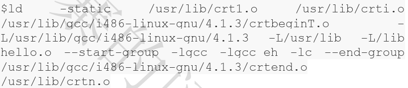

1.  被隐藏了的过程    
    预处理、编译汇编、链接    
    1.  预编译    
        预编译处理后的文件扩展名是.ii，第一部预编译的过程相当于如下命令：   
        ```
        gcc -E hello.c -o hello.i
        // 或者
        cpp hello.c > hello.i
        ```
        预编译过程住院哦处理哪些源代码文件中的以”#“开始的预编译指令。比如"#include"或者”define“等等，主要处理规则如下：   
        + 将所有的”#define“删除，并且展开所有的宏定义。   
        + 处理所有条件预编译指令，比如：”#if", "#ifdef", "elif", "else", "endif".   
        + 处理"#include"预编译指令，将被包含的文件插入到该预编译指令的位置。注意，这个过程是递归进行的，也就是说，被包含的文件可能会包含其他文件。   
        + 删除所有的注释。    
        + 添加行号和文件名标识，比如#2“hello.c"2，以便于编译时编译器产生调试用的行号信息及用于编译时产生编译错误或者警告时能够显示行号。   
        + 保留所有的”#pragma编译器指令，因为编译器需要是用他们。    
        经过预编译后的.i文件不包含任何宏定义，因为所有的宏已经被展开。所以当我们无法判断宏定义是否正确或者头文件包含是否正确的时候，可以查看预编译后的文件来确定问题。   
    2.  编译    
        编译过程就是把预处理完的文件进行一系列词法分析、语法分析、语义分析以及优化后生成相应的汇编代码文件。上面的编译过程相当于如下指令：   
        ```
        gcc -S hello.i -o hello.s
        ```
        现在版本的Gcc把预编译和编译两个步骤合并成一个步骤，是用一个叫做`ccl`的程序来完成这两个步骤。这个程序位于"/usr/lib/gcc/i486-linux-gnu/4.1/"，我们可以直接调用`ccl`来完成它。对于C语言的代码来说，这个预编译和编译的程序是`ccl`，对于C++来说，有对应的程序叫做`cclplus`。所以实际上gcc这个命令只是这些后台程序的包装，他会根据不同的参数要求去调用预编译程序ccl、汇编器as、链接器ld。    
    3.  汇编    
        汇编器是将汇编代码转变成机器可以执行的指令，每个汇编语句几乎都对应一条机器指令。它没有复杂的语法，也没有语义，也不需要做指令优化，只是根据汇编指令和机器指令的对照表一一翻译就可以了。上面的过程我们可以调用汇编器as来完成的：    
        ```
        as hello.s -o hello.o
        ```
        或者使用gcc命令从C源代码文件开始，经过预编译、编译、汇编直接输出目标文件：    
        ```
        gcc -c hello.c -o hello.o
        ```
    4.  链接    
        + 为什么汇编器不直接输出可执行文件而是输出一个目标文件呢？    
        + 链接过程到底包含了什么内容？    
        + 为什么要链接？    
        怎么调用ld才可以产生一个能够正常运行的Hello World程序：   
            
        可以看到，我们需要一大堆文件才能链接得到“a.out"。   
        + 那么上面的.o文件是做什么的呢？有什么用？    
        + 一些”-l“都是什么参数？为什么要是用他们？    
        + 为什么要将他们和hello.o连接起来才可以得到可执行文件？    
2.  从最直观的角度，编译器就是将高级语言翻译成机器语言的一个工具。编译过程一般分为6步：扫描、语法分析、语义分析、源代码优化、代码生成、目标代码优化。   
  ___这些步骤等以后有时间了再说吧。___    
  比如我们有这么个代码：    
  ```
  arra[index] = (index + 4) * (2 + 6);
  ```
  经过了这些扫描、语法分析、语义分析、源代码优化、代码生成和目标代码优化，源代码终于被编译成了目标代码。但是这个目标代码有一个问题：index和array的地址还没有确定。   
  如果我们要把目标代码是用汇编器编译成真正能够在机器上执行的指令，那么index和array的地址应该从哪得到的呢？如果index和array定义在跟上面的源代码同一个编译单元里面，那么编译器可以为index和array分配空间，确定他们的地址；那如果时定义在其他的程序模块呢？    
  目标代码中有变量定义在其他模块该怎么办？事实上，定义其他模块的全局变量和函数在最终运行时的绝对地址都要在最终链接的时候才能确定。所以现代的编译器可以将一个源代码文件编译成一个未链接的目标文件，然后由链接器最终hoi功能讲这些目标文件链接起来形成可执行文件。   
3.  符号：它用来表示一个地址，这个地址可能是子程序(后来发展成函数)的起始地址，也可以是一个变量的起始地址。   
4.  在一个程序被分割成多个模块以后，这些模块之间最后如何组成形成衣蛾单一的程序是需要解决的问题。模块之间如何组合的问题可以归结为模块之间如何通信的问题，最常见的属于静态语言C、C++模块之间通信有两种方式，一种是模块间的函数调用，另外一种是模块间的变量访问。函数访问需要知道目标函数的地址，变量访问也需要知道目标变量的地址。所以这两种方式都可以归结为一种方式，那就是模块间符号的引用。     
5.  模块拼装--静态链接    
    人们把每个源代码模块独立地编译，然后按照穾将他们组装起来，这个组装模块的过程就是链接。链接的主要内容就是把各个模块之间相互引用的部分都处理好，使得各个模块之间能够正确的衔接。从原理上讲，就是把一些指令对其他符号的地址的引用加以修正。链接过程主要包括了地址和空间分配、符号决议、重定位等这些步骤。    
    + 符号决议有时候也叫做符号绑定、名称绑定、名称决议。比如我们在程序模块main.c中，是用另外一个模块func.c中的函数foo()。我们在main.c模块中每处调用foo的时候都必须确切知道foo这个函数的地址，但是由于每个模块都是单独编译的，在编译器编译main.c的时候它并不知道foo函数的地址，所以它暂时把这些调用foo的指令的目标地址搁置，等待最后链接的时候由链接器去将这些指令的目标地址修正。如果没有链接器，需要我们手工把他们每个调用foo的指令进行修正。当func.c模块被重新编译，foo函数的地址有可能改变时，那么我们在main.c中所有是用到foo的地址的指令将要全部重新调整。是用链接器，你可以直接饮用其他模块的函数和全局变量而无需知道他们的地址，因为链接器在链接的时候，会根据你所引用的符号foo，自动去相应的func.c模块查找foo的地址，然后将main.c模块汇总所有引用到foo的指令重新修正，他们的目标地址为真正的foo函数的地址。这就是惊天链接的最基本的过程和作用。    
