目标文件中有什么？    
+ 目标文件中到底存放的是什么？    
+ 源代码在经过编译以后是怎么存储的？    
1.  目标文件从结构上讲，他是已经编译后的可执行文件格式，只是还没有经过链接的过程，其中可能有些符号或者有些地址还没有被调整。其实它本身是按照可执行文件格式存储的，只是跟真正的可执行文件在结构上稍有不同。    
2.  现在PC平台流行的可执行文件的格式：    
    + Windows系统的PE   
    + Linux的ELF    
    他们都是COFF格式的变种，目标文件就是源代码编译后但未进行连接的哪些中间文件。
3.  不光是可执行文件按照可执行文件格式存储。动态链接库、静态链接库文件都是按照可执行文件格式存储。静态链接库稍有各不同，他是把很多目标文件捆绑在一起形成一个文件，再加上一些索引，你可以简单的把它理解为一个包含有很多目标文件的文件包。    
		    
		在linux下是用file命令来查看相应文件格式：		    
		        
4.  目标文件中的内容至少有编译后的机器指令代码、数据。目标文件汇总还包括了链接时所需要的一些信息，比如符号表、调试信息、字符串等等。一般目标文件将这些信息按照不同的属性，以”节“或者”段“的形式存储。唯一的区别是在ELF的链接视图和装在视图的时候。   
5.  源代码编译后的机器指令经常被放在代码段。全局变量和局部静态变量数据经常放在数据段。ELF文件的开头是一个”文件头“，他描述了整个文件的文件属性，包括文件是否可执行、是静态链接还是动态链接、入口地址（如果是可执行文件）、目标硬件、目标操作系统等等信息，文件头还包括一个段表(section table)，段表其实是要给描述文件中各个段的数组。段表描述了文件中各个段在文件中的便宜位置及段的属性，从段表里面可以得到每个段的所有信息。文件头后面就是各个段的内容，比如代码段保存的就是程序的指令，数据段保存的就是程序的静态变量等等。   
6.  一般C语言的编译后执行语句都编译成机器代码，保存在.text段；已经初始化的全局变量和局部静态彼岸娘一般都放在一个.bss段里面。我们知道，未初始化的全局变量和局部静态变量默认值都为0，本来他们也可以放在.data段里面，但是因为他们呢都是0，所以没有必要在.data段里面为他们分配空间。但是程序运行的时候他们的确是要占用内存空间的，并且可执行文件必须记录所有未初始化的全局变量和局部变量的大小的总和，记为.bss段。所以.bss段只是为未初始化的全局变量和局部静态变量预留位置而已，它并没有内容，所以它在文件中不占据空间。   
7.  总体来说，程序源代码被编译以后主要分成两种段：程序指令和程序数据，代码段属于程序指令，而数据段和.bss段属于程序数据。为什么要这么麻烦把程序的指令和数据的存放分开？好处有很多：    
    + 一方面是当程序被装在后数据和指令分别被映射到两个虚存区域。由于数据区域对于进程来说是可读写的，而指令区域对于进程来说是只读的，所以这两个虚存区域的权限可以被分别设置成可读写和可只读。这与昂可以防止程序的执行被有意或者无意的改写。    
    + 另外一个方面对于现在CPPU来说他们有着强大的缓存体系。由于缓存在现代的计算机中地位非常重要，所以程序必须尽量提高缓存的命中率，指令区和数据区的分离有利于提高程序的局部性。现代CPU的缓存一般都被设计成数据缓存和指令缓存分离。    
    + 当系统中运行着多个该程序的副本时，他们的指令都是一样的，所以内存中只需要保存一份该程序的指令部分。当然，每个副本进程的数据区域是不一样的，他们是进程私有的。   
8.  代码举例：    
    ```
    // SimpleSection.c
    int printf(const char* format, ...);
    int global_init_var = 84;
    int global_uninit_var;

    void func1(int i) {
      printf("%d\n", i);
    }

    int main()
    {
      static int static_var = 85;
      static int static_var2;

      int a = 1;
      int b;

      func1(static_var + static_var2 + a + b);

      return a;
    }
    ```
    编译这个代码，得到了一个1104字节的SimpleSection.o目标文件。我们可以是用objdump来查看object内部的结构：   
    ```
    objdump -h SimpleSection.o

    ```
       
    有一个专门的命令叫做size，可以查看ELF文件的代码段、数据段和BSS段的长度：    
       
9.  挖掘各个段的内容，我们还是i离不开objdump这个利器。objdump的`"-s"`参数可以将所有段的内容以十六进制的方式打印出来，“-d”参数可以将所有包含指令的段反汇编。我们将objdump输出中的关于代码段的内容提取出来，分析一下关于代码段的内容：    
    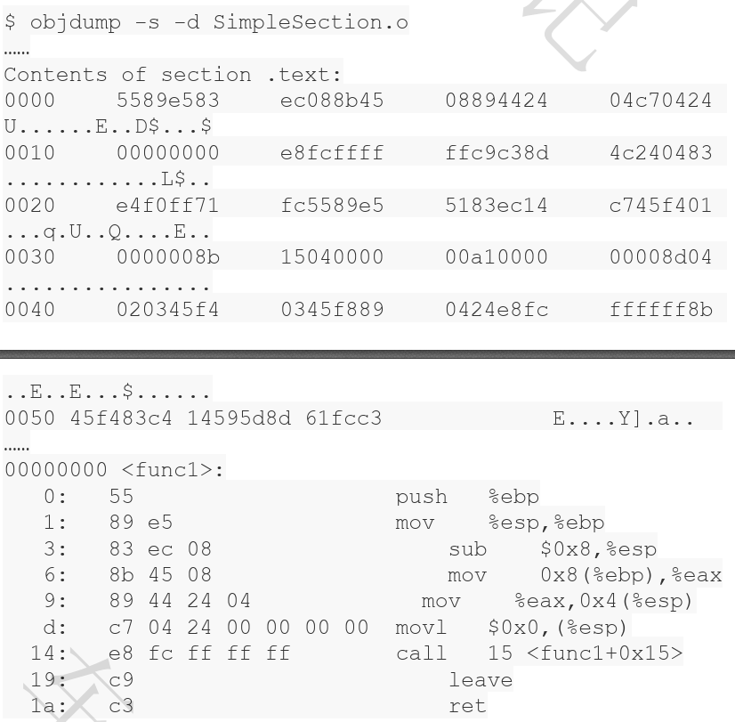   
    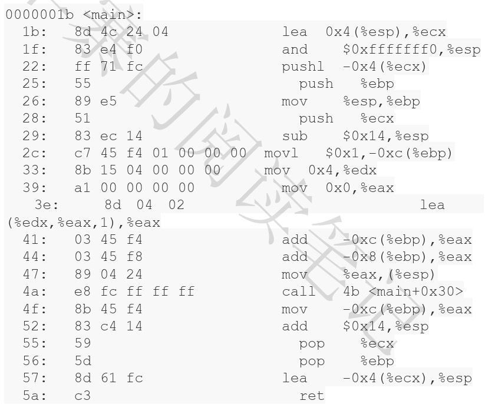   
    "Contents of section .text"就是.text的数据以十六进制方式打印出来的内容，总共0x5b字节。最左面一列是偏移量，中间4列是十六进制内容，最右面是一列.text的ASCII码形式。对照下面的反汇编结果，可以很明显地看到，.text段里面所包含的正式SimpleSection.c里面两个函数`func1()`和`main()`的指令。.text段的第一个字节“0x55”就是`func1()`函数的第一条"push %esp"指令，而最后一个字节0xc3正式main()函数的最后一条指令“ret”。   
10.  数据段和只读数据段   
     .data段保存的是那些已经初始化了的全局惊天变来那个和局部静态变量。前面的SimpleSection.c代码里面一共有两个这样的变量，分别是`global_init_varabal`与`static_var`。这两个变量每个4个字节，一共8个字节，所以“.data”段的大小为8个字节。SimpleSection.c里面我们在调用“printf”的时候用到一个字符串常量“%d\n”，他是一种制度数据，所以他被放在了“.rodata”段，我们可以从输出结果看到“.rodata”这个段的4个字节刚好是这个字符串常量的ASCII字节序，最后以`\0`结尾。“.rodata”段存放的时制度数据，一般是程序里面的制度便来那个（如const修饰的变量）和字符串常来那个。单独设立“.rodata”段有很多好处，不光是在语义上支持了C++const关键字，而且操作系统在加载的时候可以将“.rodata”段的属性映射成只读，这样对于这个段的任何修改操作都会作为非法操作处理，保证了程序的安全性。另外在某些嵌入式平台下，有些存储区域是采用的只读存储器的，如ROM，这样将“.rodata”段放在该存储区域中就可以保证程序访问存储器的正确性。_值得一提的是_，有时候编译器会把字符串常量放到“data”段，而不会单独放在“rodata”段。   
11.  BSS段    
     .bss段存放的时未初始化的全局变量和局部静态变量。如上述代码中的`global_uninit_var`和`static_var2`是被存放在了bss段，其实更准确的说法是bss段为他们预留了空间。但是我们可以看到该段的大小只有4个字节，这与`global_uninit_var`和`static_var2`的大小为8个字节不符合。其实我们可以通过符号表看到，只有`static_var2`被放在了bss段，而`global_uninit_var`却没有被存放在任何段，只是一个未定义的“COMMON”符号，这其实是跟不同语言与不同的编译器有关，有些编译器会将全局的未初始化变量促发囊在目标文件的bss段，有些则不存放，只是预留一个未定义的全局变量符号，__等到最终链接成可执行文件的时候再在bss段分配空间__。原则上将，我们可以简单地把它当作全局未初始化变量存放在bss段。值得一提的是编译单元内容课件的静态便来那个（比如给global_uninit_var加上static修饰）的确是放在bss段的：  
     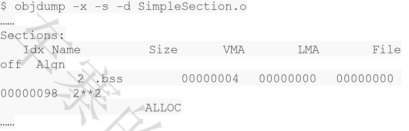    
12.  Quiz变量存放位置     
     以下代码：   
     ```
     static int x1 = 0;
     static int x2 = 1;
     ```
     x1和x2会被存放在什么段中呢？x1会被存放在bss段中，x2会被放在data段中。为什么一个在bss段中，一个在data段？因为x1位0，可以认为是未初始化的，因为未初始化的都是0，所以被优化掉了可以放在bss段中，这样可以节省磁盘空间，因为__bss不占用磁盘空间__。另外一个变量x2初始化之为1，是初始化了的，所以放在data中。
     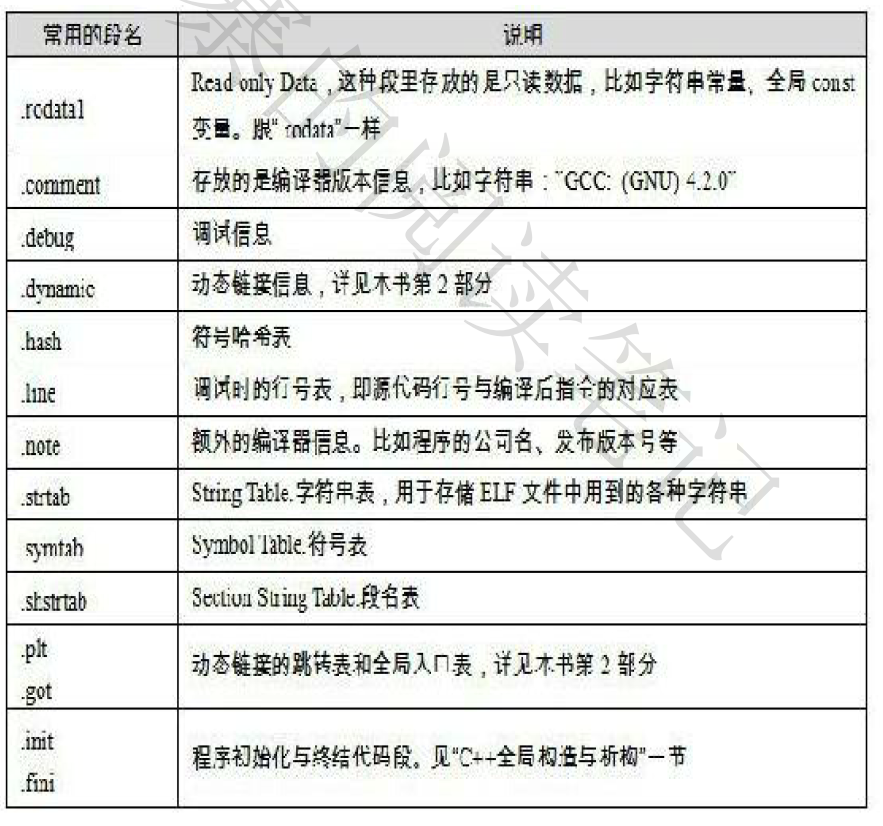    
     这些短的名字都是由“.”作为前缀，表示这些表的名字是系统保留的，应用程序也可以是用一些非系统保留的名字作为段名。比如我可以在ELF文件中插入一个“music”段，里面存放了一首MP3音乐。当ELF文件存放起来以后可以读取这个段播放这首MP3，但是应用程序自定义的段名不能是用“.”作为前缀，否则容易跟系统保留的段名冲突。一个ELF文件也可以拥有几个相同段名的段，比如一个ELF文件中可能有两个或者两个以上叫做“.text”的段。还有一些保留的段名是ELF文件历史遗留造成的。   
     比如我要将一个二进制文件，比如图片、MP3音乐、词典一类的东西作为目标文件中的一个段，该怎么做？    
     可以是用objcopy工具，比如我们有个图片“image.jpg“，大小为0x82100字节：    
     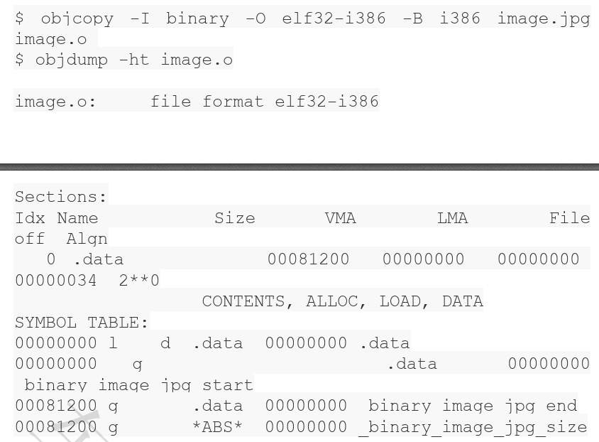    
     符号`_binary_image_jpg_start`、`binary_image_jpg_end`和`_binary_image_jpg_size`分别表示该图片文件在内存中的起始地址、结束地址和大小。我们可以在程序里面直接声明并使用他们。   
13.  自定义段   
     正常情况下，GCC编译出来的目标文件中，代码会被放到text段，全局变量和静态变量会被放到data段和bss段。但有时候你可能希望变量或者某些部分代码能够放到你所制定的段中去，以实现某些特定的功能。比如为了满足某些硬件的内存和I/O的地址布局，或者是像Linux从安坐系统内核中用来完成一些初始化和用户控件复制时出现也错误异常等等。GCC提供了一个扩展机制，使得程序员可以指定变量所处的段：  
     ```
     __attribute__((section("FOO"))) int global = 42;
     __attribute__((section("BAR"))) void foo() {}
     ```
     我们在全局变量或者函数之前加上`__attribute__((section("name")))`属性就可以把相应的变量或者函数放到以”name“作为段名的段中。   
14.  ELF段结构    
     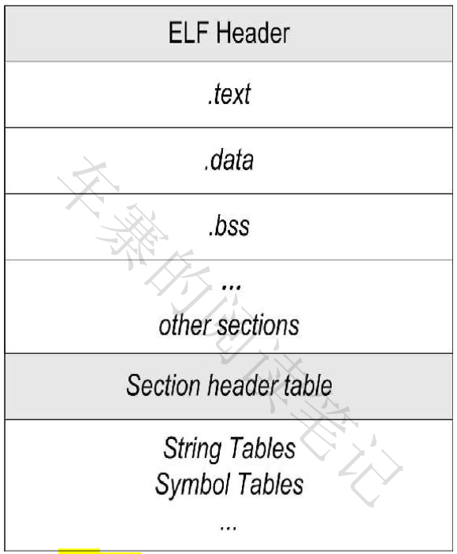    
     ELF目标文件格式的最前部分是ELF文件头，它包含了整个文件的基本属性。比如ELF文件版本、目标机器型号、程序入口地址等等。紧接着是ELF文件的各个段。其中ELF文件中与段有关的重要结构就是段表，该表面熟了ELF文件包含的所有段的信息，比如每个段名、段的长度、在文件中的偏移、读写权限及段的其他属性。    
15.  文件头   
     我们可以是用`readelf`命令来详细查看ELF文件头：   
     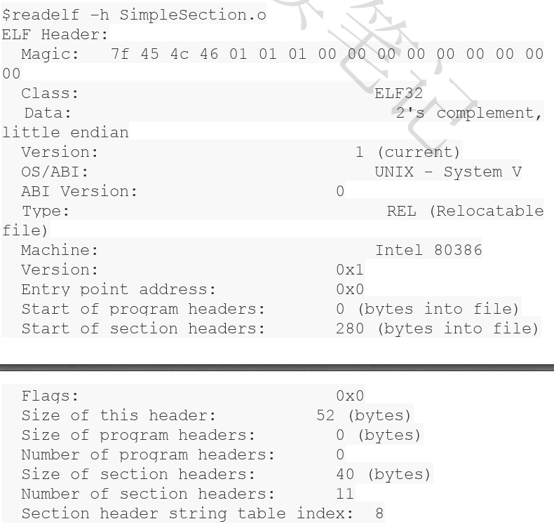    
     从上面的输出可以看到，ELF文件头中定义了ELF魔数、文件机器字节长度、数据存储方式、版本、运行平台、ABILITY版本、ELF重定位类型、硬件平台、硬件平台版本、入口地址、程序头入口和长度、段表的位置和长度以及段的数量等等。这些数值中有关描述ELF目标平台的部分，与我们常见的32位Intel的硬件平台基本一样。    
     在”/usr/include/elf.h“里面，因为ELF文件在各个平台都通用，ELF文件有32位版本和64位版本。所以文件头接哦股也有这两种版本：”Elf32_Ehdr“和”Elf64_Ehdr“。32位版本与64位版本的ELF文件的文件头内容是一样的，只不过有些成员的大小不一样。为了对每个成员的大小做出明确的规定以便于在不同的变异环境下都拥有相同的字段长度，”elf.h“是用typedef定义了一套自己的变量体系：   
     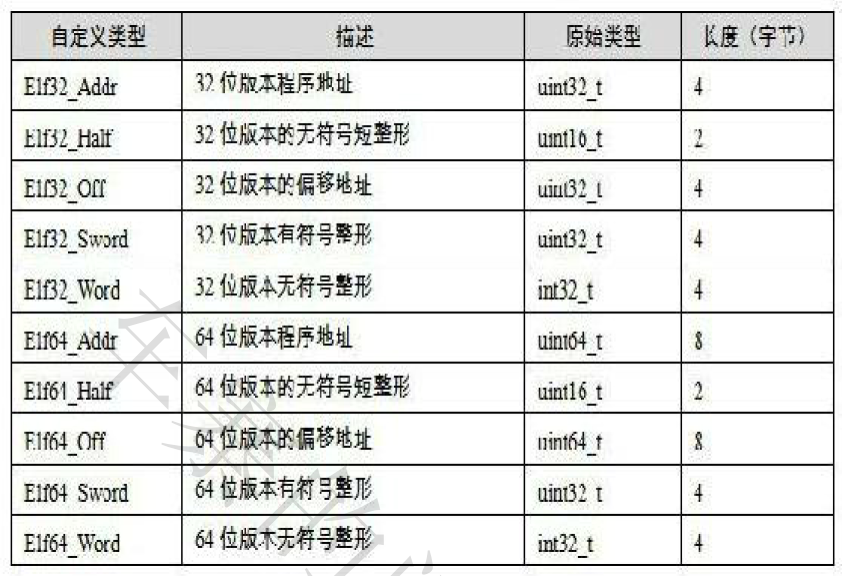    
     以32位版本的文件头结构”Elf32_Ehdr“作为例子描述：     
     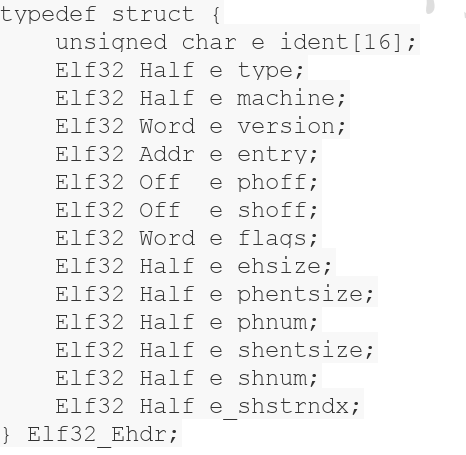    
     很多都是一一对应的，例外的是”Elf32_Ehdr“中的”e_ident“这个成员对应了readelf输出结果中的：Class, Data, Version, OS/ABI, ABI Version这5个参数，剩下的参数都与”Elf_32_Ehdr“中的成员一一对应：    
     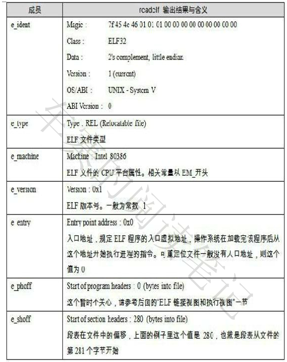    
     最开始的4个字节是所有ELF文件都必须相同的标识码，分别为0x7F, 0x45, 0x4c, 0x46，第一个字节对应ASCII字符里面的DEL控制符，后面3个字节刚好是ELF这3个字母的ASCII码。这4个字节又被称为ELF文件的魔数，几乎所有的可执行文件格式的最开始都是魔数。比如a.out格式最开始两个字节为0x01、0x07，PE/COFF文件最开始两个字节为0x4d、0x4a，即ASCII字节MZ，这种魔数用来确认文件的类型，操作系统在加载可执行文件的时候会确认魔数是否正确，如果不正确会拒绝加载。接下来的一个字节是用来表示ELF的文件类的，0x01表示32位的，0x20表示是64位的；第6个字是字节序，规定该ELF问件事大端还是小端的。第7个字节规定ELF文件的主版本号，一般是1，后面的9个字节ELF标准没有定义，一般填写0，有些平台会是用这9个字节作为扩展标识。   
     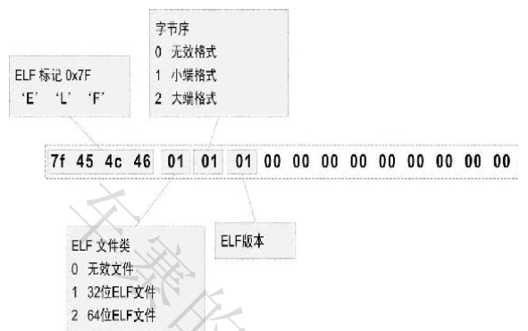   
     _文件类型_ e_type成员表示ELF文件类型，即前面提到过的3中ELF文件类型，每个文件类型对应一个常量。系统通过这个常量来判断ELF的真正文件类型，而不是通过文件的扩展名。相关常量以”ET_“开始：   
     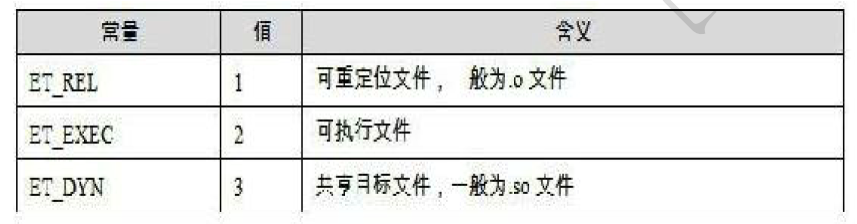   
     _机器类型_ ELF文件格式被设计成可以在多个平台上是用，这并不表示同一个ELF文件可以在不同平台上是用，而是表示不同平台下的ELF文件都遵循同一套ELF标准。e_machine成员就表示该ELF文件的平台属性，比如3表示该ELF文件只能在Intel x86机器下是用。相关的常量以”EM_“开头：   
     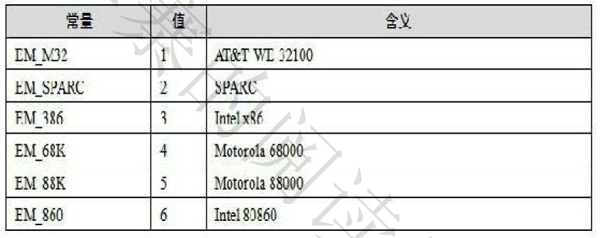    
16.  段表   
     段表就是保存这些段的基本属性的结构。段表是ELF文件中除了文件头一起最重要的机构，他描述了ELF的各个段的信息，比如每个段的段名、段的长度、在文件中的便宜、读写权限以及其他属性。也就是说，ELF文件的段结构就是由段表决定的，编译器、链接器和装载器都是依靠段表来定位和访问各个段的属性的。段表在ELF文件中的位置由ELF文件头的`e_shoff`成员决定。我们可以是用readelf工具来查看ELF文件的段，他显示出的结果才是真正的段表结构：    
     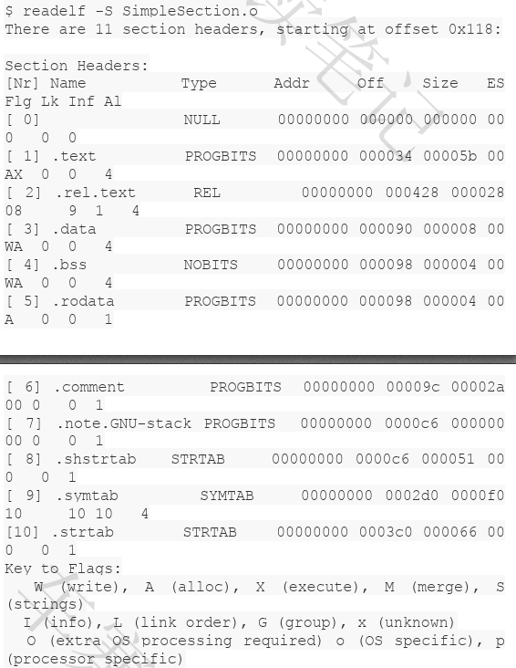   
      readelf输出的结果就是ELF文件段表的内容，段表的结构比较简单，他是一个以”Elf32_Shdr“结构体为元素的数组，数组元素的个数等于段的个数，每个”Elf32_Shdr“结构体对应一个段。”Elf32_Shdr“又被称为段描述符。对于SimpleSection.o来说，段表就是由11个元素的数组。ELF段表的这个数组的第一个i嗯元素是无效的段描述符，他的类型为NULL，除此之外的每个段描述符都对应一个段。 
      
      _数组的存放方式_ ELF文件里面很多地方采用了这种与段表类似的数组方式保存，一般定义一个固定长度的结构，然后一次存放。Elf32_Shdr被定义在”/usr/include/elf.h”:                    
      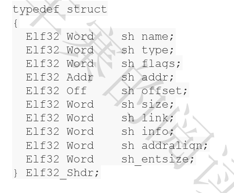    
