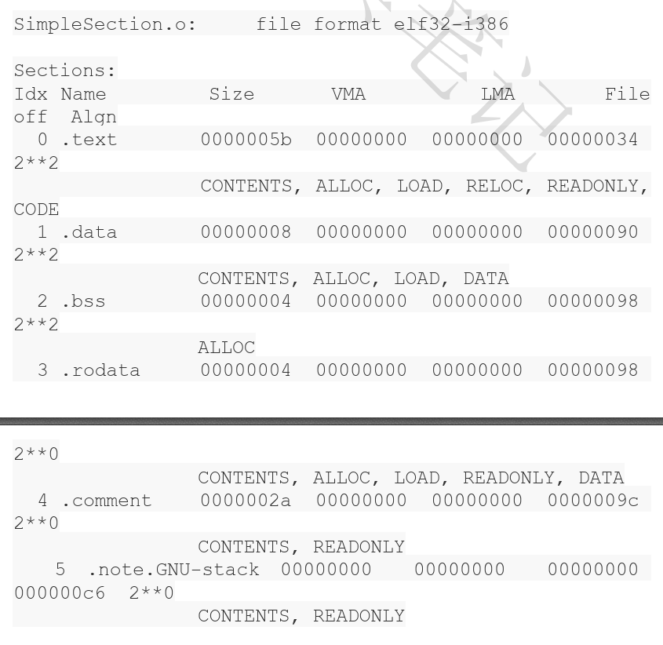
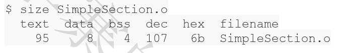

目标文件中有什么？    
+ 目标文件中到底存放的是什么？    
+ 源代码在经过编译以后是怎么存储的？    
1.  目标文件从结构上讲，他是已经编译后的可执行文件格式，只是还没有经过链接的过程，其中可能有些符号或者有些地址还没有被调整。其实它本身是按照可执行文件格式存储的，只是跟真正的可执行文件在结构上稍有不同。    
2.  现在PC平台流行的可执行文件的格式：    
    + Windows系统的PE   
    + Linux的ELF    
    他们都是COFF格式的变种，目标文件就是源代码编译后但未进行连接的哪些中间文件。
3.  不光是可执行文件按照可执行文件格式存储。动态链接库、静态链接库文件都是按照可执行文件格式存储。静态链接库稍有各不同，他是把很多目标文件捆绑在一起形成一个文件，再加上一些索引，你可以简单的把它理解为一个包含有很多目标文件的文件包。    
		    		
		在linux下是用file命令来查看相应文件格式：		    
				        
4.  目标文件中的内容只杀哦呦编译后的机器指令代码、数据。目标文件汇总还包括了链接时所需要的一些信息，比如符号表、调试信息、字符串等等。一般目标文件将这些信息按照不同的属性，以”节“或者”段“的形式存储。唯一的区别是在ELF的链接视图和装在视图的时候。   
5.  源代码编译后的机器指令经常被放在代码段。全局变量和局部静态变量数据经常放在数据段。ELF文件的开头是一个”文件头“，他描述了整个文件的文件属性，包括文件是否可执行、是静态链接还是动态链接、入口地址（如果是可执行文件）、目标硬件、目标操作系统等等信息，文件头还包括一个段表(section table)，段表气势是要给描述文件中各个段的数组。段表描述了文件中各个段在文件中的便宜位置及段的属性，从段表里面可以得到每个段的所有信息。文件头后面就是各个段的内容，比如代码段保存的就是程序的指令，数据段保存的就是程序的静态变量等等。   
6.  一般C语言的编译后执行语句都编译成机器代码，保存在.text段；已经初始化的全局变量和局部静态彼岸娘一般都放在一个.bss段里面。我们知道，未初始化的全局变量和局部静态变量默认值都为0，本来他们也可以放在.data段里面，但是因为他们呢都是0，所以没有必要在.data段里面为他们分配空间。但是程序运行的时候他们的确是要占用内存空间的，并且可执行文件必须记录所有未初始化的全局变量和局部变量的大小的总和，记为.bss段。所以.bss段只是为未初始化的全局变量和局部静态变量预留位置而已，它并没有内容，所以它在文件中不占据空间。   
7.  总体来说，程序源代码被编译以后主要分成两种段：程序指令和程序数据，代码段属于程序指令，而数据段和.bss段属于程序数据。为什么要这么麻烦把程序的指令和数据的存放分开？好处有很多：    
    + 一方面是当程序被装在后数据和指令分别被映射到两个虚存区域。由于数据区域对于进程来说是可读写的，而指令区域对于进程来说是只读的，所以这两个虚存区域的权限可以被分别设置成可读写和可只读。这与昂可以防止程序的执行被有意或者无意的改写。    
    + 另外一个方面对于现在CPPU来说他们有着强大的缓存体系。由于缓存在现代的计算机中地位非常重要，所以程序必须尽量提高缓存的命中率，指令区和数据区的分离有利于提高程序的局部性。现代CPU的缓存一般都被设计成数据缓存和指令缓存分离。    
    + 当系统中运行着多个该程序的副本时，他们的指令都是一样的，所以内存中只需要保存一份该程序的指令部分。当然，每个副本进程的数据区域是不一样的，他们是进程私有的。   
8.  代码举例：    
    ```
    // SimpleSection.c
    int printf(const char* format, ...);
    int global_init_var = 84;
    int global_uninit_var;

    void func1(int i) {
      printf("%d\n", i);
    }

    int main()
    {
      static int static_var = 85;
      static int static_var2;

      int a = 1;
      int b;

      func1(static_var + static_var2 + a + b);

      return a;
    }
    ```
    编译这个代码，得到了一个1104字节的SimpleSection.o目标文件。我们可以是用objdump来查看object内部的结构：   
    ```
    objdump -h SimpleSection.o

    ```
       
    有一个专门的命令叫做size，可以查看ELF文件的代码段、数据段和BSS段的长度：    
       
    
