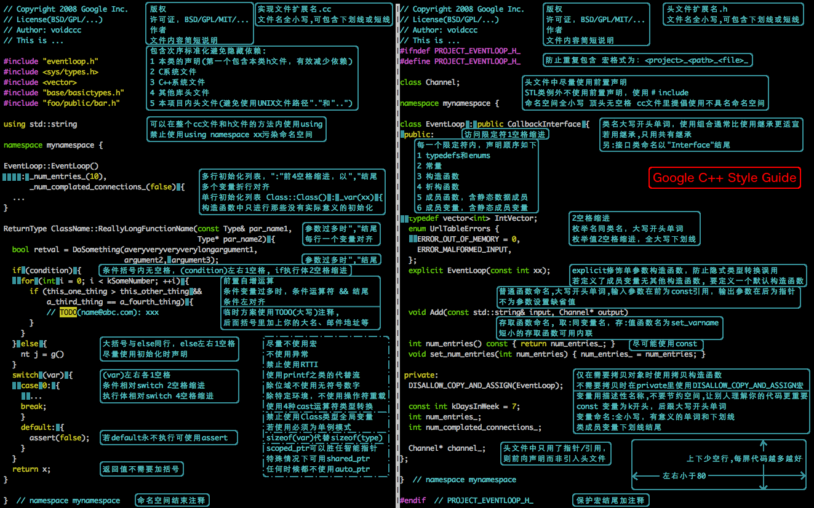

___this dir is just for learning algorithms and data structures___

eh, there are some cpps(two or three?) is wrong in the directory of Array, because i have some trouble about those, but time goes too long so that i can't remeber who they are.

<!-- vim-markdown-toc GFM -->

* [1. DFS ](#1-dfsbr)
* [2. Array ](#2-arraybr)
* [3. Dynamic Programming ](#3-dynamic-programmingbr)
* [4. AVL](#4-avl)

<!-- vim-markdown-toc -->

+ [二分查找](./二分查找.docx)   
+ [哈希表](./哈希表.docx)   
+ [排序算法](./排序算法.docx)   
+ [AVL](https://zhuanlan.zhihu.com/p/34899732)    

# 1. [DFS](./DFS) 
+ [Same Tree](./DFS/SameTree.cpp) 

# 2. [Array](./Array) 
+ [Container With Most Water](./Array/Container\_With\_Most\_Water.cpp)  
+ [Duplicate\_zeros](./Array/Duplicate\_zeros.cpp)  
+ [FlipAndInvertImage](./Array/FlipAndInvertImage.cpp)  
+ [Grumpy\_Bookstore\_Owner](./Array/Grumpy\_Bookstore\_Owner.cpp)  
+ [Height\_Checker](./Array/Height\_Checker.cpp)  
+ [IntToRoman](./Array/IntToRoman.cpp)  
+ [MaxWidthRamp](./Array/MaxWidthRamp.cpp)  
+ [Median of Two Sorted Arrays](./Array/Median\_of\_Two\_Sorted\_Arrays.cpp)  
+ [PancakeSort](./Array/PancakeSort.cpp)  
+ [Previous\_Permutation\_With\_one\_Swap](./Array/Previous\_Permutation\_With\_one\_Swap.cpp)  
+ [SearchRange](./Array/SearchRange.cpp)  
+ [SortArrayByParity](./Array/SortArrayByParity.cpp)  
+ [SortArrayByParityII](./Array/SortArrayByParityII.cpp)  
+ [is_one_bit_character](./Array/is_on_bit_character.cpp)   

+ [SortedSquares](./Array/SortedSquares.cpp)  
+ [String to Integer](./Array/String\_to\_Integer.cpp)  
+ [SubarrayDivByK](./Array/SubarrayDivByK.cpp)  
+ [RemoveElement](./Array/RemoveElement.cpp)  
+ [Reverse Integer](./Array/Reverse\_Integer.cpp)  
+ [Transpose](./Array/Transpose.cpp)  
+ [Two Sum](./Array/Two\_Sum.cpp)  
+ [ZigZag Conversion](./Array/ZigZag\_Conversion.cpp)  
+ [RunningSum](../Array/running_sum.cpp)      

# 3. [Dynamic Programming](./Dynamic_Programming) 
+ [Best Time to Buy and Sell Stock](./Dynamic\_Programming/Best\_Time\_to\_Buy\_and\_Sell\_Stock.cpp)
+ [Climbing Stairs](./Dynamic\_Programming/Climbing\_Stairs.cpp)
+ [Divisor Game](./Dynamic\_Programming/Divisor\_Game.cpp)
+ [House\_Robber](./Dynamic\_Programming/House\_Robber.cpp)  
+ [Maximum Subarray](./Dynamic\_Programing/Maximum\_Subarray.cpp)
+ [Min Cost Climbing Stairs](./Dynamic\_Programming/Min\_Cost\_Climbing\_Stairs.cpp)
+ [Range\_Sum\_Query\_Immutable](./Dynamic\_Programming/Range\_Sum\_Query\_Immutable.cpp)
+ [coin change](./Dynamic_Programming/coin_change.cpp)    
+ [longest_increasing_subsequence](./Dynamic_Programming/longest_increasing_subsequence.cpp)    

# 4. [AVL](./AVL)   
1.  [红黑树简单了解](https://zhuanlan.zhihu.com/p/139907457O)   
