1.  树的定义，呃，就是树      
2.  哪几种树：二叉树、二叉查找树、二叉平衡查找树、递归树      
3.  常用概念      
    + 节点的高度=节点到叶子节点的最长路径（边数）     
    + 节点的深度=根节点到这个节点所经历的边的个数     
    + 节点的层数=节点的深度+1       
    + 树的高度=根节点的高度       
    + 叶子节点：没有子节点的节点      
4.  二叉树    
    + 定义：每个节点理论上最多只有两个子节点      
    + 二叉树不要求每个节点一定要有两个子节点，有的时候只有左节点，有的时候只有右节点，有的时候没有节点  
    + 满二叉树：叶子节点全部都在最底层，除了叶子节点之外，每个节点都有两个子节点    
    + 完全二叉树：叶子节点都在最下面两层，最下一层的叶子节点都靠左排列，并且除了最后一层，其他层的节点个数都要达到最大，我觉得这个解释不够清晰
      + 完全二叉树，就是：
        + 满二叉树在最下面一层从左到右删除节点，但是又不全部删掉最后一层。所以先脑补满二叉树，然后从左到右删除     
    + 存储：基于指针或者引用的二叉链式存储法；基于数组的顺序存储法      
      + 为什么会有完全二叉树这种结构？是因为，它使用的存储方式是数组，父节点的序号是左子节点的 1/2. 所以要求完全二叉树的叶子节点要靠左         
    + 遍历    
      + 前序遍历：先打印此节点，再打印左子树，再打印右子树      
      + 中序遍历：先打印左子树，再打印此节点，再打印右子树      
      + 后序遍历：先打印左子树，再打印右子树，再打印此节点      
      + 前序遍历就是优先深度遍历        
      + 广度优先遍历，就是一层一层的遍历，使用栈或者队列实现。将当前处理过的点入栈/入队列，然后处理完一层，再处理一层        
      [遍历方式](../pictures/遍历方式.PNG)      
        + 前序遍历：      
          ```
          preorder(r) = print r -> preorder(r->left) -> preorder(r->right)

          void pre_order(Node* root)
          {
            print root
            pre_order(root->left);
            pre_order(root->right);
          }
          ```     
        + 中序遍历：      
          ```
          inorder(r) = print r -> inorder(r->left) -> inorder(r->right)

          void in_order(Node* root)
          {
            in_order(root->left);
            print root
            in_order(root->right);
          }
          ```
        + 后序遍历：      
          ```
          postorder(r) = prpostt r -> postorder(r->left) -> postorder(r->right)

          void post_order(Node* root)
          {
            post_order(root->left);
            post_order(root->right);
            print root
          }
          ```
      + 时间复杂度：看上面的图，每个节点最多被遍历两次，所以为O(n)      
5.  二叉查找树      
    + 二叉查找树的最大特点是，支持动态数据集合的快速插入、删除、查找操作      
    + 散列表也是支持这些操作的，并且这些操作比二叉查找树更高效，时间复杂度是O(1)，既然有了这么高效的散列表，为什么还要用二叉查找树？       
    + 二叉查找树要求，在树中的每个节点，其左子树的节点值都要小于这个节点，而右子树的值要大于这个节点的值       
    + 查找操作：先取根节点，如果要等于查找的数据，那就直接返回，如果要查找的数据比根节点值要小，那就在左子树递归查找；如果要查找的数据比根节点值大，那就在右子树中查找：      
      ```
      find(Node root, int data)
      {
        Node p = root;
        while (p != null) {
          if (p->left.data() > data)
            p = p->left;
          else if (p->right.data() < data)
            p = p->right;
          else
            return p;
        }
        return nullptr;
      }
      ```
    + 插入操作：新插入的数据一般都是在叶子节点，所以只需要从根节点开始，一次比较要插入的数据和节点的大小关系。如果要插入的数据比节点的数据大，并且节点的右子树为空，就将数据直接插入到右子节点的位置；如果不为空，就再递归遍历右子树。如果要插入的数据比节点数值小，并且节点的左子树为空，就将数据插入到左子节点的位置，如果不为空，就再递归遍历左子树，查找插入的位置      
      ```
      insert(Node root, int dat)
      {
        if (root == nullptr)
          return;

        Node p = root;
        while (p != nullptr) {
          if (data < p.data) {
            if (p.left == nullptr) {
              p.left = new Node(data);
              return;
            }
            p = p.left;
          } else if (data > p.data) {
            if (p.right == nullptr) {
              p.right = new Node(data);
              return;
            }
            p = p.right;
          }
        }
      }
      ```
    + 删除操作：    
      + 第一种情况：如果要删除的节点没有子节点，我们只需要直接将父节点中指向要删除节点的指针置位nullptr，如下图中的55       
      + 第二种情况：如果要删除的节点只有一个子节点（只有左子节点或者右子节点），我们只需要更新父节点中，指向删除节点的指针，让它指向要删除节点的子节点就可以了，如下图中的33      
      + 第三种情况：如果要删除的节点有两个子节点，我们需要找到这个节点的右子树中的最小节点，把它替换到要删除的节点上。然后删掉这个最小节点，因为最小节点肯定没有左子节点，如下图中的18        
      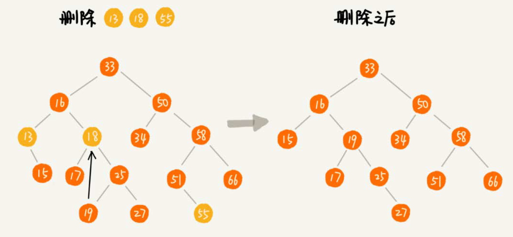        
      ```
      delete(Node root, int data)
      {
        Node p = root; // 指向要删除的节点，初始化指向根节点
        Node pp = nullptr; // 记录的是 p 的父节点

        while (p != nullptr && p.data != data) {
          pp = p;
          if (data > p.data)
            p = p.right;
          else
            p = p.left;
        }

        if (p == nullptr)
          return;

        if (p.left != nullptr && p.right != nullptr) { // 查找右子树的最小节点
          Node min_p = p.right;
          Node min_pp = p; // min_pp 是 min_p 的父节点
          while (min_p.left != nullptr) {
            min_pp = min_p;
            min_p = min_p.left;
          }

          p.data = min_p.data; // 将min_p 的数据替换到p中
          p = min_p;
          pp = min_pp;
        }

        // 删除节点是叶子节点或者仅有一个子节点
        Node child; // p 的子节点
        if (p.left != nullptr)
          child = p.left;
        else if (p.right != nullptr)
          child = p.right;
        else
          child = nullptr;

        if (pp == null)
          root = child; // 删除的是根节点
        else if (pp.left == p)
          pp.left = child;
        else
          pp.right = child;
      }
      ```
      实际上还有一种取巧的方式，单纯的标记要删除的节点，但是并不真正的删除这个节点。这样删除操作就变得简单了     
    + 查找最大节点、最小节点、前驱结点、后继结点      
    + 二叉查找树中序遍历、可以输出有序的数据序列、时间复杂度是O(n)。所以二叉查找树也叫做二叉排序树       
    + 针对有重复数据的数组查找有两种方式：    
      + 二叉查找书中每个节点通过链表和支持动态扩容的数组等结构，可以将值相同的数据存储到一个节点上     
      + 将重复数据放到右子树上      
      + 要查找数据的时候，遇到值相同的节点，我们并不停止查找操作，而是继续在右子树中查找，知道遇到叶子节点才停止。这样才可以将键值等于要查找值的所有节点都找出来    
      + 对于删除操作，我们也需要先查找每个要删除的节点，然后再按照前面讲的删除操作的方法，依次删除     
    + 时间复杂度分析      
      + 想象一下，一个二叉树只有左子树或者右子树，此时就是链表        
      + 对于一棵完全二叉树或者满二叉树。这时候的插入、删除或者查找时间复杂度是多少呢？     
        + 不管是插入、删除或者查找，时间复杂度其实都是和树的高度成正比，也就是O(height)。现在的问题就转向如何求一棵包含n个节点的完全二叉树的高度？树的高度就等于最大层减去一，为了方便计算，我们转换成层来表示。比如说包含n个节点的完全二叉树中，第一层包含一个节点，第二层包含2个人节点，第三层包含4个节点，依次类推，下一层节点的个数是上一层的2倍，第K层包含的节点个数是2^(K-1)。不过对于完全二叉树来说，最后一层的节点个数有点不遵从上面的规律了，它包含的节点个数在1个到2^(L-1)个之间，我们假设最大层数是L，如果我们没一层的节点个数加起来就是总的节点个数n，如果节点的个数是n，那么满足这样一个关系：     
        ```
        n >= 1 + 2 + 4 + 8 + … + 2^(L-2) + 1
        b <= 1 + 2 + 4 + 8 + … + 2^(L-2) + 2^(L-1)
        ```
        借组等比数列的求和公式，L的范围是[log2(n+1), log2n+1]。完全二叉树的层数小于等于log2n+1，完全二叉树的高度小于等于log2n。     
        显然，极度不平衡的二叉查找树，它的查找性能肯定不能满足我们的需求。我们需要构建一种不管删除、插入数据，在任何时候，都能保持任意节点左右子树都比较彭恒的二叉查找树，所以就有了二叉平衡查找树。平衡查找树的高度接近logn，所以插入、删除查找操作的时间复杂度比较稳定，是O(logn)      
  + 所以相对与散列表插入、删除、查找操作的时间复杂度可以做到常量级O(1)，非常搞笑。而二叉查找树在比较平衡的情况下，插入、删除查找操作时间复杂度才是O(logn)，相对散列表好像没有什么优势，那我们为什么还要用二叉查找树呢？      
    + 散列表中的数据时无序存储的。如果要输出有序的数据，需要先进行排序。而对于二叉查找树来说。我们只需要中序遍历，就可以在O(n)的时间复杂度内，输出有序的数据序列     
    + 散列表扩容耗时很多，而且当遇到散列冲突的时候，性能不稳定，尽管二叉查找树的性能不稳定，但是在工程中，我们最常用的二叉平衡查找树的性能非常稳定，时间复杂度稳定在O(logn)     
    + 笼统的说，尽管散列表的查找操作的时间复杂度是常量级的，但是因为哈希冲突的存在，这个常量不一定比logn小，所以实际上查找速度可能不一定比O(logn)。加上哈希函数的耗时，也不一定就比二叉平衡查找树的效率高      
    + 散列表的构造比二叉平衡查找树，散列表装载因子不能太大，特别是给予开放寻址解决冲突的散列表，不然会浪费一定的存储空间         
6.  二叉平衡查找树      
    + 平衡二叉树定义：二叉树中任意一个节点的左右子树的高度相差不大于1，从这个定义来看，完全二叉树、满二叉树其实都是平衡二叉树。但是非完全二叉树也有可能是平衡二叉树     
    + 平衡二叉查找树不仅满足上面平衡二叉树的定义，还满足二叉查找树的特点。最早被发明的平衡二叉树是AVL树，它严格符合平衡二叉查找树的定义，即任何节点的左右子树高度相差不超过1，是一种高度平衡的二叉查找树     
    + 但是很多平衡二叉查找书其实并没有严格符合上面的定义（树中任意一个节点的左右子树的高度相差不能超过1），比如红黑树，它从根节点到各个叶子节点的最长路径，有可能会比最短路径大一倍        
    + 平衡二叉查找树这类数据结构的初衷是，解决普通二叉查找树在频繁的插入、删除等动态更新的情况下，出现时间复杂度退化的问题     
    + 平衡二叉查找树中”平衡“的意思，其实就是让整棵树左右看起来比较对称、比较平衡，不要出现左子树很高，右子树很矮的情况。这样就能让整棵树的高度相对来说低一些，相应的插入、删除、查找等操作的效率高一些      
    + 所以，如果现在设计出一个新的平衡二叉查找树，只要树的高度不比log2n大很多，尽管不符合严格的二叉查找树的定义。但是仍然可以说这是个合格的平衡二叉查找树     
7.  红黑树      
    + 红黑树就不符合严格的平衡二叉查找树的定义      
    + 红黑树中的节点：一类被标记为黑色，一类被标记为红色，一棵红黑树还需满足几个要求：     
      + 根节点是黑色      
      + 每个叶子节点都是黑色的空节点点（NIL），也就是说，叶子节点不存储数据       
      + 任何相邻节点都不能同时共色，也就是说，红色节点是被黑色节点隔开的      
      + 每个节点，从该节点到达其可达叶子节点的所有路径，都包含相同数目的黑色      
    + 第二个要求，叶子节点都是黑色的空节点，稍微有些奇怪，它主要是为了简化红黑树的代码时间而设置的       
    + 二叉查找树很多操作的性能都跟树的高度成正比，一棵极其平衡的二叉树（满二叉树或者完全二叉树）的高度大约是log2n，所以如果要证明红黑树是近似平衡的，我们只需要分析，红黑树的高度是否比较稳定地趋近log2n就好了     
    + 那么将红色节点从红黑树中去掉，那单纯包含黑色节点的红黑树的高度是多少？    
      + 红色节点删除之后，有些节点就没有父节点了，它们会直接拿这些节点的祖父节点作为父节点，所以，之前的二叉树就会编程四叉树。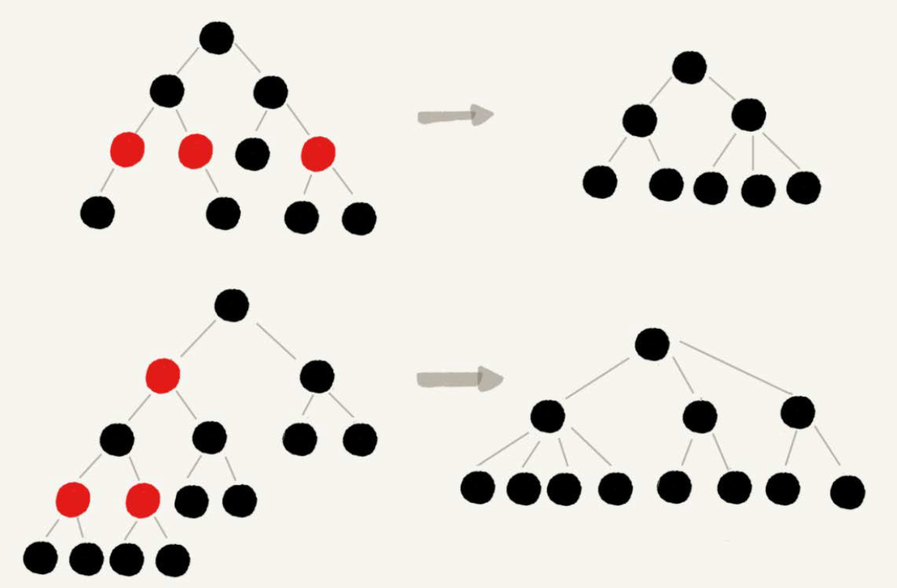         
    + 从任意节点到可达的叶子节点的每个路径包含相同树木的黑色节点。我们从四叉树中取出某些节点，放到叶子节点的位置，四叉树就变成了完全二叉树。所以仅包含黑色节点的四叉树的高度，比包含相同节点个数的完全二叉树的高度还要小，完全二叉树的高度近似log2n，这里的四叉”黑树“的高度要低于完全二叉树，所以去掉红色节点的”黑树“的高度也不会超过log2n。那将红色节点加进去（因为红色节点会被黑色节点隔开，所以有一个红色节点就有一个黑色节点），所以高度近似与2log2n。所以红黑树的高度只比高度萍蓬过的AVL树的高度仅仅大一倍。在性能上，下降的不多。这样推导出的结果不太精确。实际上红黑树的性能更好     
    + AVL树是一种高度平衡的二叉很俗，所以查找的效率非常高，但是有利有弊，AVL树为了维护这种高度的平衡，就要付出更多的代价。每次插入、删除都要做调整，就比较复杂、耗时，所以对于有频繁的插入、删除操作的数据集合，是用AVL树的代价就有点高了     
  + 左旋、右旋：左旋是围绕某个节点的左旋；右旋是围绕某个节点的右旋      
    + 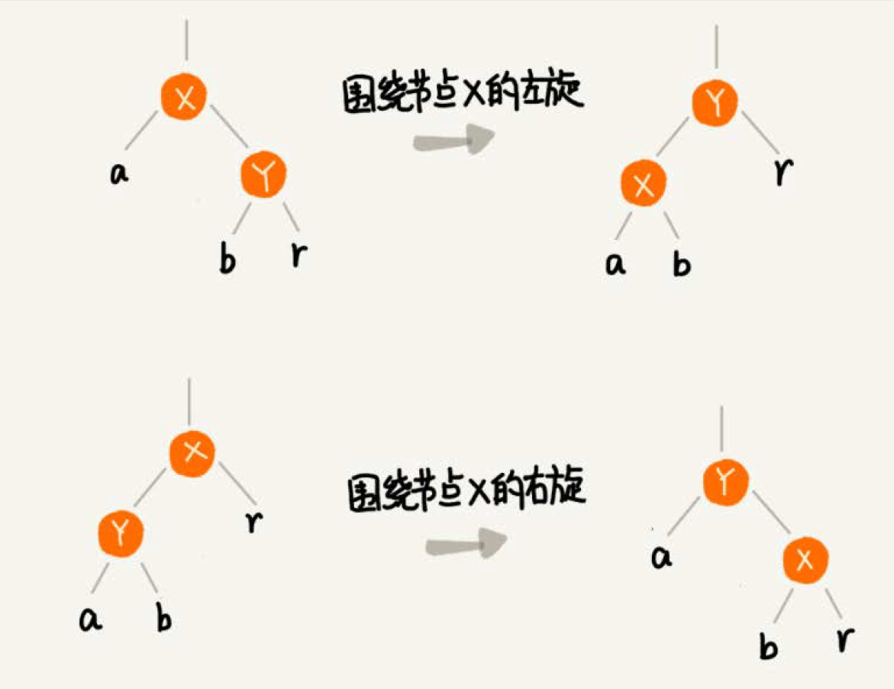：      
      + 1. 我猜，Y在右子树的时候才会左旋      
      + 2. 将Y与X互换     
      + 3. 此时X会将节点a带走，同时仍然保持X以及子树的状态    
      + 4. 因为X会替换原始Y的右子节点，而a是X的左子节点，所以将b替换为X的新节点，r继续跟着r       
    +       
  + 插入      
    + 红黑树规定    
      + 插入的节点必须是红色的        
      + 而且二叉查找树中新插入的节点都是放在叶子节点上      
    + 两种特殊的情况：    
      + 如果插入节点的父节点是黑色，那么我们什么都不用做，它仍然满足红黑树的定义      
      + 如果插入的节点是根节点，那么我们直接改变它的颜色，把它变成黑色就可以了    
    + 调整的过程包含两种基础的操作：      
      + 左右旋转      
      + 改变颜色        
    + 红黑树的平衡调整过程是一个迭代的过程。我们把正在处理的节点叫做关注节点。关注节点会随着不停的迭代处理，而不断发生变化。最开始的关注节点就是新的插入的节点。新的节点插入后，如果红黑树的平衡被打破，那一般会有三种情况，用以下方法不断的调整：     
      + 把父节点的兄弟节点叫做叔叔节点      
      + 父节点的父节点叫做祖父节点        
      + case1：如果关注点是a，它的叔叔节点d是红色       
        + 将关注点a的父节点b，叔叔节点d的颜色都设置成黑色     
        + 将关注节点a的祖父节点c的颜色设置成红色      
        + 关注节点编程a的祖父节点c      
        + 跳到case2或者case3      
        + 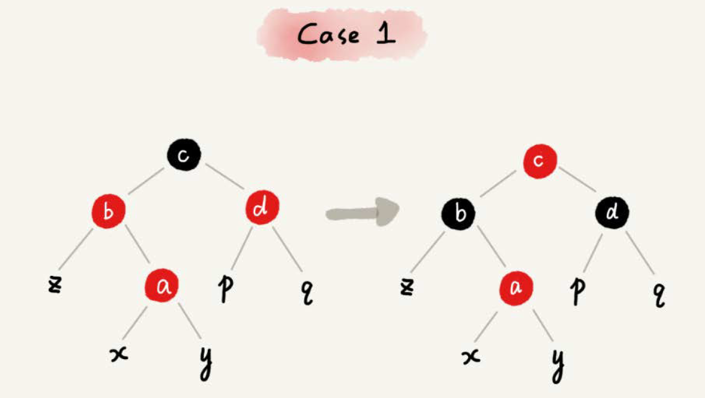     
      + case2: 如果关注节点是a，它的叔叔节点d是黑色，关注节点a是其父节点b的右子节点：  
        + 关注节点变成节点a的父节点b     
        + 围绕新的关注点b左旋     
        + 跳到case3       
        + 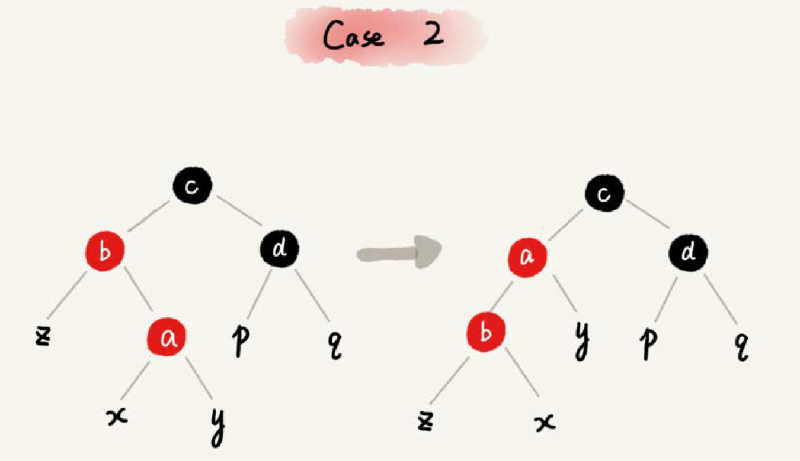     
      + 如果关注节点是a，它的叔叔节点d是黑色，关注节点a是其父节点b的左子节点：    
        + 围绕关注节点a的祖父节点c右旋      
        + 将关注节点a的父节点b、兄弟节点c的颜色互换     
        + 调整结束      
        + 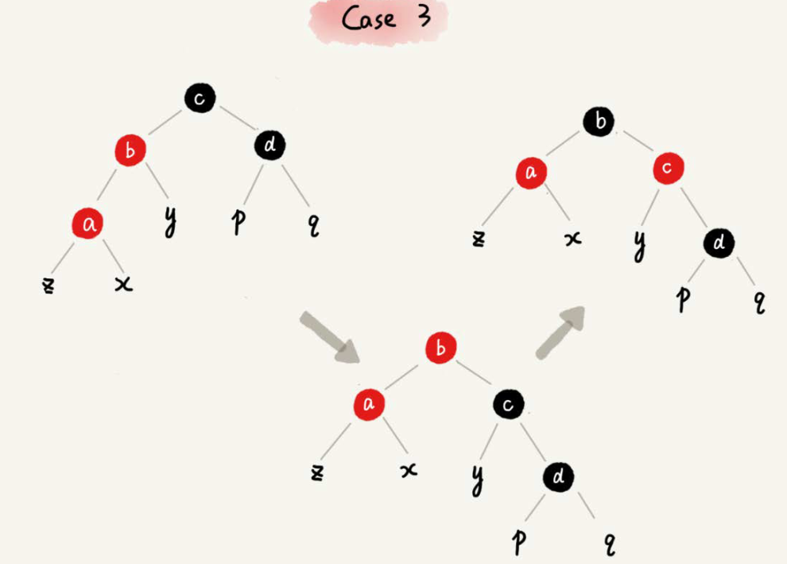     
  + 删除      
    + 删除分两步：    
      + 针对删除节点初步调整，初步调整只是保证整棵红黑树在一个节点被删除后，仍然满足最后一条定义的要求，也就是说，每个节点，从该节点到达其可达叶子节点的所有路径，都包含相同数量的黑色节点      
      + 针对关注节点进行二次调整，让它满足红黑树的第三条定义，即不存在相邻的两个红色节点     
    + 初步调整：红黑树的定义中”只包含红色节点和黑色节点“，经过初步调整后，为了保证满足红黑树定义的最后一条要求，有些节点会被标记为两种颜色，”红-黑“或者”黑-黑“，那么计算黑色节点个数的时候，要算成两个黑色节点      
      + case1: 如果要删除的节点是a，它只有一个子节点b：   
        + 删除节点a，并且把节点b替换到节点a的位置     
        + 节点a只能是黑色，节点b也只能是红色，其他情况均不符合均不符合红黑树的定义，这种情况下，我们把节点b改为黑色      
        + 调整结束，不需要进行二次调整    
        + 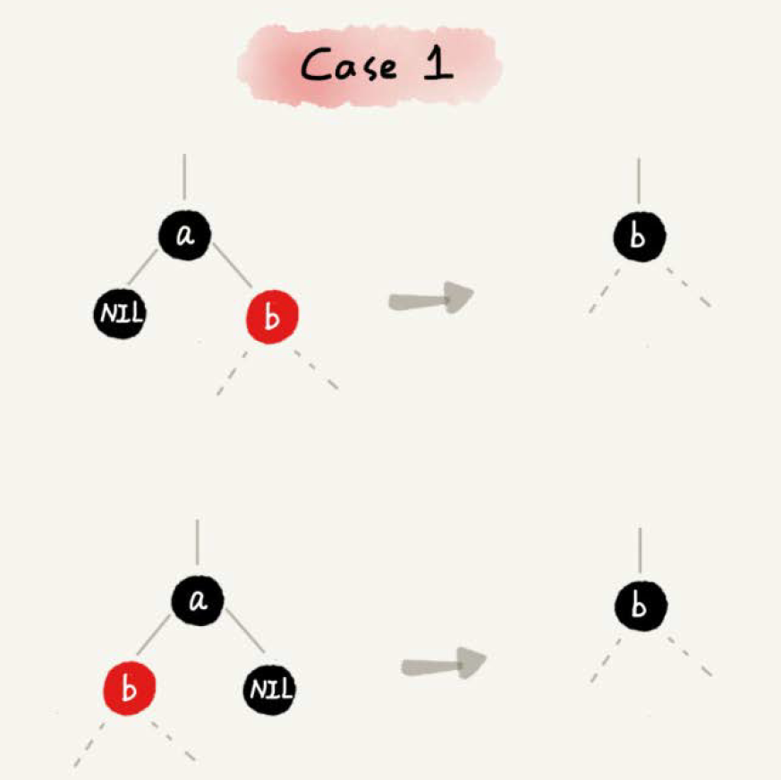       
      + case2: 如果要删除的节点a有两个非空子节点，并且它的后继结点就是节点a的右子节点c      
        + 如果节点a的后继节点就是右子节点c，那右子节点c肯定没有左子树。我们把节点a杀出，并且将节点c替换道节点a的位置        
        + 然后把节点c的颜色设置成跟节点a相同的颜色      
        + 如果节点c是黑色，为了不违反红黑树的最后一条定义，我们给节点c的右子节点d多加一个黑色，这时候节点d就成了”红-黑“或者”黑-黑“        
        + 这个时候关注节点就变成了节点d，第二步的调整就会针对关注节点来做     
        + 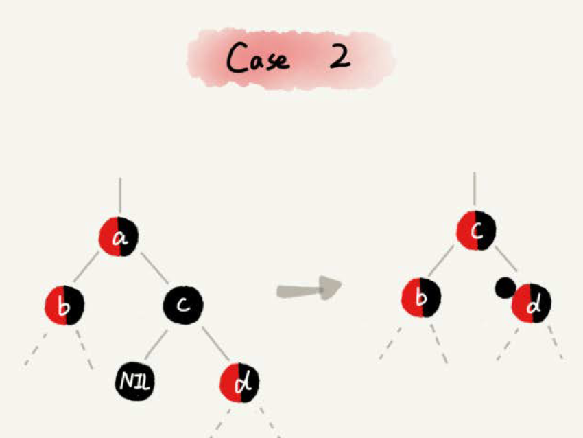       
      + case3: 如果要删除是节点a，它有两个非空子节点，并且节点a的后继节点：     
        + 找到后继节点d并将它删除，删除后继节点过程参考case1      
        + 将节点a替换成后继节点d      
        + 把节点d的颜色设置为跟节点a相同的颜色      
        + 如果节点d是黑色，为了不违背红黑树的最后一条定义，我们给节点d的右子节点c多加一个黑色，这个时候节点c就成了”红-黑“或者”黑-黑“      
        + 关注节点变成了c，第二步的调整操作就会针对关注节点来做       
        + 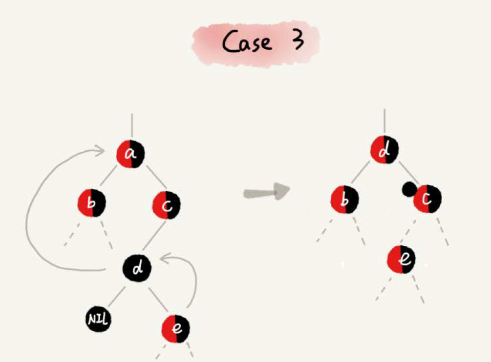       
    + 二次调整，经过初步调整后，关注节点变成了”红-黑“或者”黑-黑“节点，二次调整是为了让红黑树中不存在相邻的红色节点       
      + case1: 如果关注节点是a，它的兄弟节点c是红色的     
        + 围绕关注节点a的父节点b左旋      
        + 关注节点a的父节点b和祖父节点c交换颜色     
        + 关注节点不变      
        + 继续从四种情况汇总选择适合的规则调整      
        + 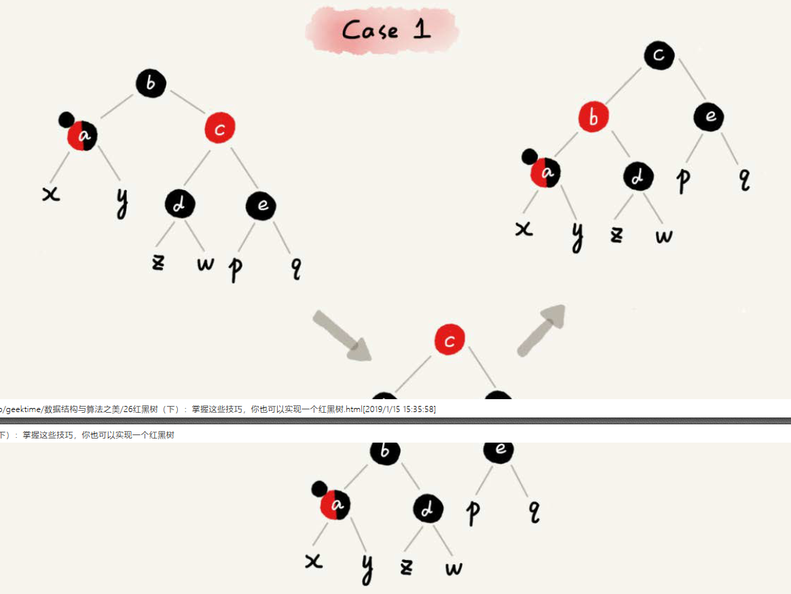     
      + case2: 如果关注节点是a，它的兄弟节点c是黑色的，并且节点c的左右子节点d，e都是黑色的     
        + 将关注节点a的兄弟节点c的颜色就变成红色      
        + 从关注节点a中去掉一个黑色，这个时候节点a就是单纯的红色或者黑色      
        + 给关注节点a的父节点b添加一个黑色，这个时候节点b就变成了”红-黑“或者”黑-黑“      
        + 关注节点从a变成其父节点b      
        + 继续从五四中情况汇总选择符合规则来调整      
        + 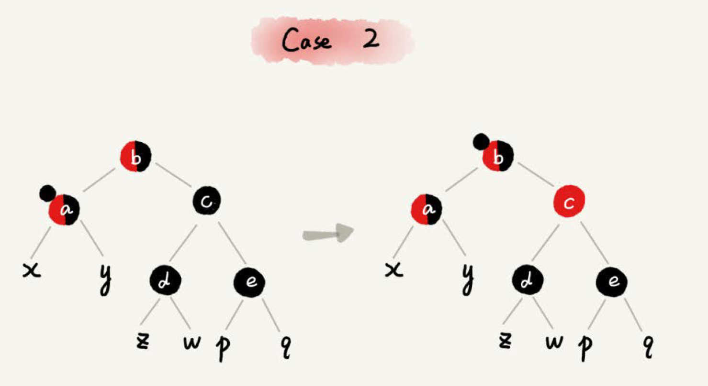       
      + case3: 如果关注节点是a，它的兄弟节点c是黑色，c的左子节点d是红色，c的右子节点e是黑色      
        + 围绕关注节点a的兄弟节点c右旋      
        + 节点c和节点d交换颜色    
        + 关注节点不变      
        + 跳转到case4，继续调整     
        + 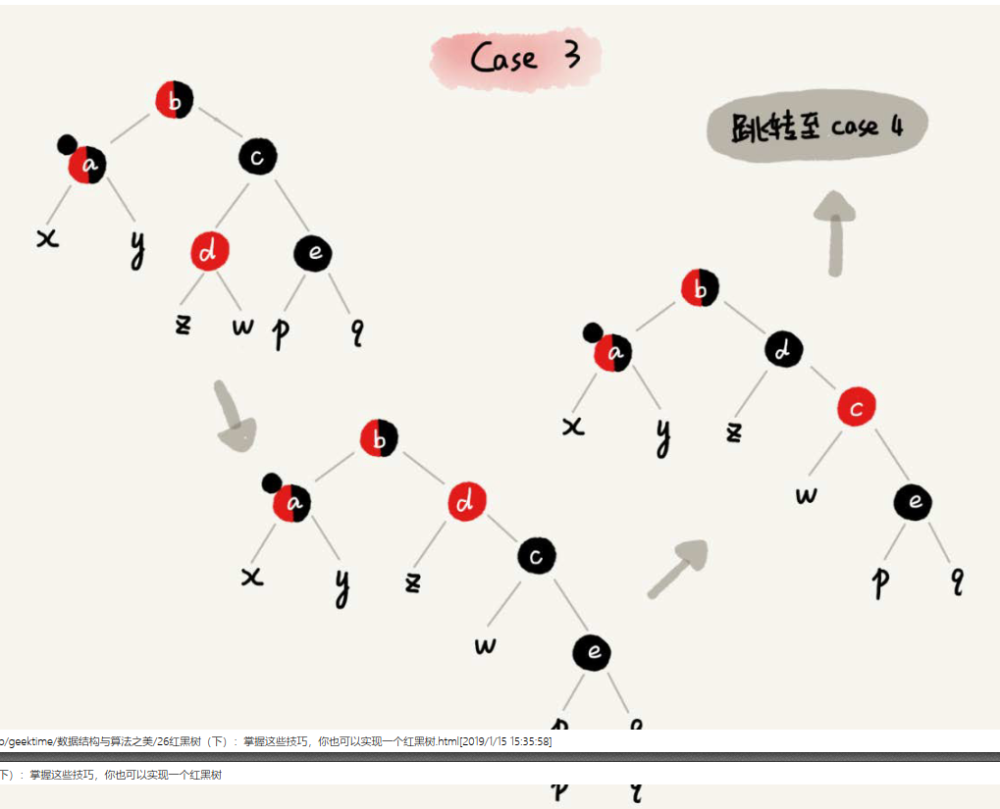     
      + case4: 如果关注节点a的兄弟节点c是黑色的，并且c的右子节点是红色的      
        + 围绕关注点a的父节点b左旋      
        + 将关注节点a的兄弟节点c的颜色，跟关注节点a的父节点b设置成相同的颜色    
        + 将关注节点a的父节点b的颜色设置成黑色      
        + 从关注节点a中去掉一个黑色，节点就编程了淡出的红色或者黑色     
        + 将关注节点a的叔叔节点e设置为黑色      
        + 调整结束
        + 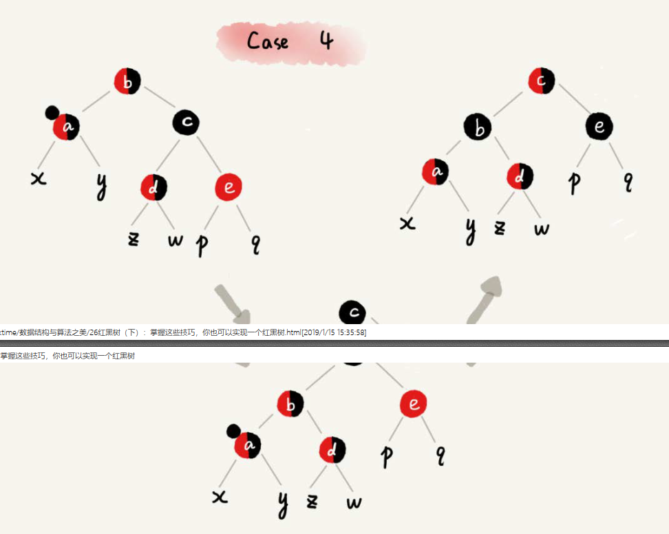       
    + 红黑树的平衡调整完了，所以为什么红黑树的定义中，要求叶子节点是黑色空节点？之所以有这么奇怪的要求，其实就是为了实现起来方便。只要满足这一条要求，那在任何时刻，红黑树的平衡操作都可以归结为以上几种情况        
8.  条款7是王争的《数据结构与算法之美》解释的，但是我感觉解释的不清楚     
    + [红黑树的由来，2-3树](https://blog.csdn.net/zhichaosong/article/details/88844371)     
    + [2-3-4树](https://www.leyafo.com/2014-10-27-a-red-black-tree-implementation/)     
    + [红黑树插入](https://www.cxyzjd.com/article/weixin_41282486/103141225)      
    + [红黑树的测试题](https://blog.csdn.net/liuweiyuxiang/article/details/78828313)      
9.  大顶堆小顶堆        
    + 堆是一种特殊的树。只要满足两点就是堆：    
      + 堆是一个完全二叉树      
      + 堆中的每个节点都必须大于等于（或者小于等于）其子树的每个节点的值      
      + 堆支持的操作：增删改查      
      + 完全二叉树适合是用数组来存储，故堆比较适合使用数组存储      
      + 以大顶堆为例，当插入或者删除的时候，需要对堆重新调整，使其重新满足堆的特性，这就是堆化，堆化不用管叶子节点，就从第一个非叶子节点开始就行了     
      + 大顶堆的插入：从下往上。      
        + 插入节点与其父节点比较大小，如果不满足大顶堆的定义，则进行堆化           
      + 大顶堆的删除：从上往下。      
        + 被删除节点与最后一个节点替换。从被替换的最后一个节点开始(此节点就变成了子树的堆顶，而此节点以上的相对关系不会改变)，依次做堆化      
    + 时间复杂度：
      + 一个完全二叉树，有n个节点，树的高度不会超过logn。堆化是顺着节点所在的路径比较交换的，所以堆化的时间复杂度跟树的高度成正比，也就是O(logn)。插入和删除堆顶元素的主要逻辑就是堆化。        
    + 空间复杂度：堆排序的算法是在原地操作的，故空间复杂度很小      
    + 如何实现堆排序呢？主要有两个过程，建堆和排序      
      + 建堆：两种方式，从下到上，从上到下，就像插入和删除操作一样      
      + 排序，就像删除一样，将堆顶元素与最后一个叶子节点交换，此时最后一个节点就是最大值。但是剩下的n-1个节点不满足大顶堆的特性，需要重新堆化，然后再找出第2大的位置，然后循环往复   
      + [例子](https://leetcode-cn.com/problems/zui-xiao-de-kge-shu-lcof/submissions/)      
      + [参考资料](https://www.cnblogs.com/sunshineliulu/p/12995910.html)     
    + 实际开发中，为什么快排比堆排序性能要好？    
      + 堆排序数据分访问的方式没有快速排序友好，顺序访问对CPU cache友好     ` `
      + 对于同样的数据，在排序过程中，堆排序算法的数据交换次数要多于快速排序      
      + 应用：
        + 优先级队列:       
          + 定义，不再是先进先出了，而是优先级最高的，优先出列      
          + 用堆实现是最直接最高效的，因为堆于优先级队列非常相似。堆甚至就可以看作是优先级队列，很多时候只是概念上的区别。往优先级队列中插入一个元素，就相当于往堆中插入一个元素。从优先级队列中取出一个元素，就相当于取出堆顶元素      
          + 应用参考 《王争的数据与算法之美》     
        + Top K       
          + 参考 《王争的数据与算法之美》     
        + 中位数        
          + 参考 《王争的数据与算法之美》     
10. [二叉平衡树](https://zhuanlan.zhihu.com/p/56066942)     
11. 红黑树      
12. Trie 树     
13. 线状树      
