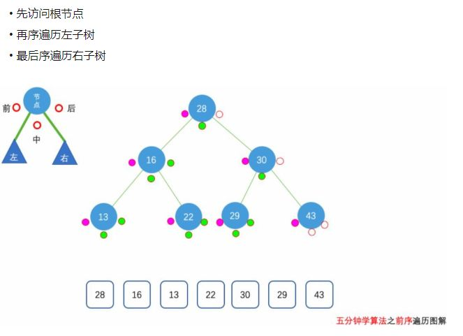
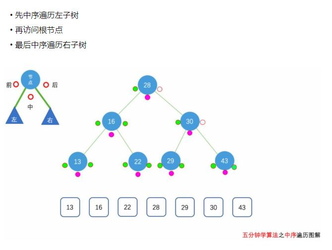
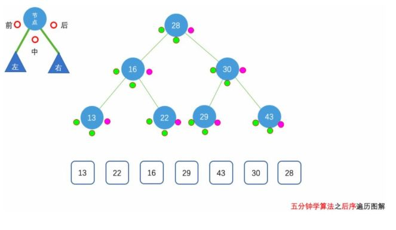

___for tree___

## 1.树的基本知识(https://www.cnblogs.com/amou/p/9058393.html)
> 
> 
> 
> [二叉树的遍历](http://data.biancheng.net/view/195.html)   

```
struct Tree
{
    int value;
    
    Tree *left_child;
    Tree *right_child;

    Tree(int val) : value(val) {}
};

//打印一个节点的数据
void visit(Node* node)
{
    if(node!=NULL)
        cout << node->data;
}

//递归-前序遍历，先访问跟节点，然后访问左节点，最后访问右节点，每一个节点都要准守这样的规则
void preTraversal(Node* root)
{
    //访问跟节点
    if (root != NULL)
    {
        visit(root);
        preTraversal(root->lchild);
        preTraversal(root->rchild);
    }

}

//递归-中序遍历，先访问跟左节点，然后访问中节点，最后访问右节点，每一个节点都要准守这样的规则
void midTraversal(Node* root)
{
    if (root != NULL)
    {
        midTraversal(root->lchild);
        visit(root);
        midTraversal(root->rchild);
    }
}

//递归-后序遍历，先访问左节点，然后访问右节点，最后访问根节点，每一个节点都要准守这样的规则
void postTraversal(Node* root)
{
    if (root != NULL)
    {
        postTraversal(root->lchild);
        postTraversal(root->rchild);
        visit(root);
    }
}

//非递归-前序遍历
/*
思想：用栈来实现。首先访问根节点，然后将根节点入栈，接着访问当前节点的左节点，然后入栈，当左节点访问完后，
出栈，并依次访问右节点
*/
void un_preTraversal(Node* root)
{
    stack<Node*> stack;
    //当前节点
    Node* p = root;
    while (p != NULL || stack.size() != 0)
    {
        if (p != NULL)
        {
            visit(p);//访问p之前一定要保证p不为空
            stack.push(p);
            p = p->lchild;
        }
        else
        {
            p = stack.top();
            stack.pop();
            p = p->rchild;
        }

    }

}

//非递归-中序遍历
/*
思想：用栈来实现。从根节点开始依次遍历当前节点的左节点，并依次入栈，当左节点遍历完成后，获取
栈顶元素并出栈，然后访问该节点，并依次遍历其右节点
*/
void un_midTraversal(Node* root)
{
    stack<Node*> stack;
    Node* p = root;
    while (p != NULL || stack.size() != 0)
    {
        if (p != NULL)
        {
            stack.push(p);
            p = p->lchild;
        }
        else
        {
            p = stack.top();
            stack.pop();
            visit(p);
            p = p->rchild;
        }
    }
}

//非递归-后序遍历
/*
思想：用栈来实现。先根节点开始依次遍历左节点，已经遍历过了的标记为'l'，然后依次遍历右节点，遍历过的标记为'r'，
只有当标记为'r'时才能访问该节点。
*/
//定义一个有标记的结构体
typedef struct TNode
{
    Node* node;//树的节点的指针
    char tag;//标记
}TNode;


void un_postTraversal(Node* root)
{
    //当前节点
    Node *p = root;
    TNode *n;
    stack<TNode*> stack;
    while (p != NULL || stack.empty() == false)
    {
        //遍历左节点并标记
        while (p != NULL)
        {
            n = new TNode;
            n->node = p;
            n->tag = 'l';
            stack.push(n);
            p = p->lchild;
        }

        //出栈
        n = stack.top();
        stack.pop();
        
        //遍历当前节点的右子树
        if (n->tag == 'l')
        {
            n->tag = 'r';
            //再次入栈
            stack.push(n);
            //此时p==NULL,一定要给p当前的节点
            p = n->node;
            p = p->rchild;
        }
        //左右子树遍历完成后访问该节点
        else
        {
            visit(n->node);
            //并把p置空防止
            p = NULL;
        }
    }
}

//树的层次遍历
//思想：使用队列queue。先将根节点入队列，循环判断当前队列不为空时，将头元素出队列并访问头元素，然后在将它的左节点和右节点入队列
void levelTraversal(Node* root)
{
    queue<Node*> q;
    Node* p = root;
    q.push(p);
    while (q.empty() == false)
    {
        p = q.front();
        q.pop();
        visit(p);
        if (p->lchild != NULL)
            q.push(p->lchild);
        if (p->rchild != NULL)
            q.push(p->rchild);
    }
}
```
